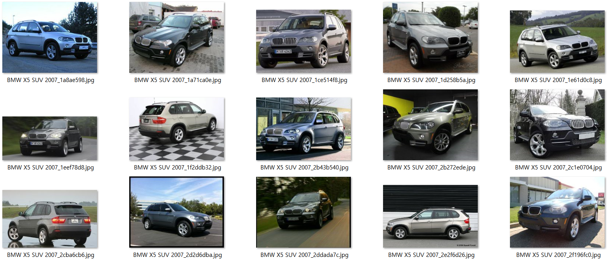
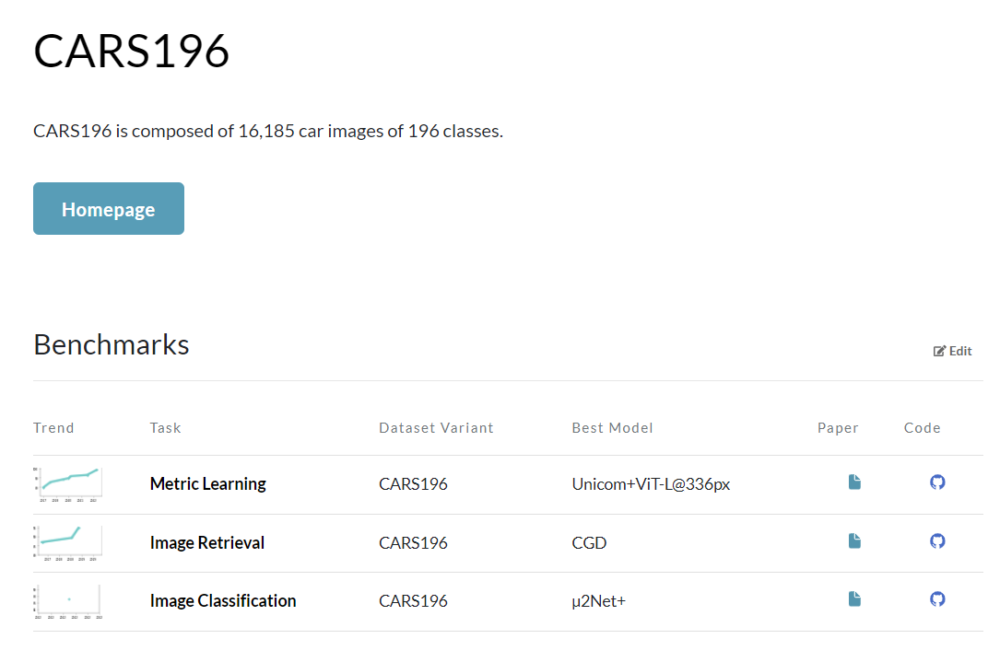
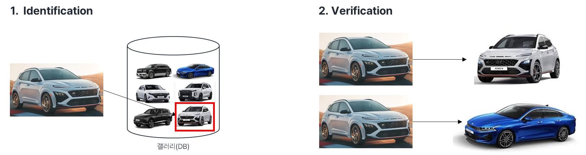
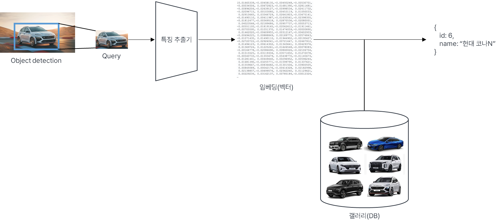
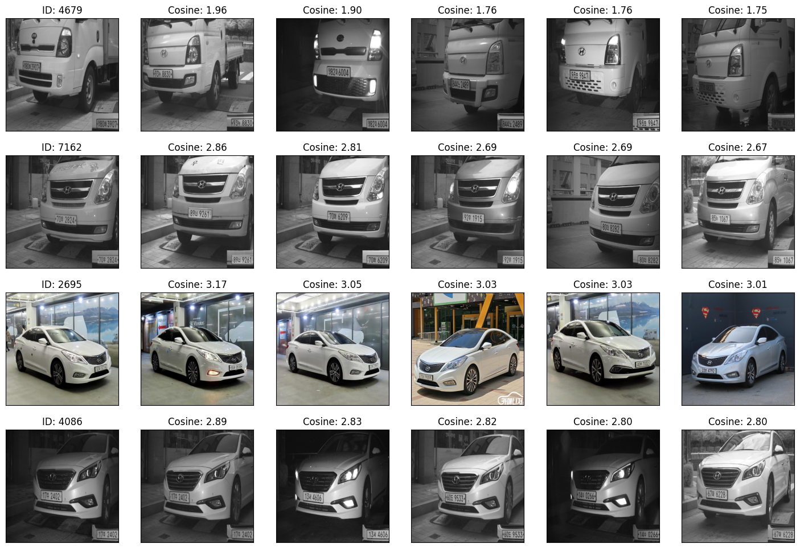

# 차종 분류의 새로운 접근

|||
|:---:|:---:|
|발표장소|대구 스마트시티센터|
|작성자|최승환|
|발표일|2023.10.23|

&nbsp;

# 1. 기존 ML/DL 방법론의 한계

1. 대량의 데이터가 있어야 좋은 성능을 보장
2. 데이터 불균형에 취약하다.
    - 학습 횟수가 낮아져 예측의 신뢰도가 떨어진다.
    - 흔하지 않은 차량 이미지가 모일 때까지 계속 기다려야 할까?
3. 하나의 Task에 대해서만 적용 가능
    - 차종 분류를 위해 학습된 모델은 다른 Task에서 사용할 수 없다.
    - 새로운 인스턴스가 추가되거나, 변경이 자주 일어나면 다시 학습해야 한다.
    - 신형 차량이 출시될 때마다 개발자는 데이터 수집과 클래스 확장을 꾸준히 해야 한다.

&nbsp;

**어떻게 하면 변화에 쉽게 적응하며, 안정적인 분류를 이뤄낼 수 있을까?**

&nbsp;

# 2. 관련 연구 검색

차종 분류에 대해 진행된 연구를 확인하기 위해서 papers with code에 [**Cars196**](https://paperswithcode.com/dataset/cars196) 데이터셋을 검색하였다.

### Cars196

- Cars196은 총 **16,185장**의 차량 이미지와 **196개**의 클래스로 구성되어 있다. (이전 현대차 분류보다 좋은 데이터셋이다.)
- Cars196은 우리가 진행하고 있는 동일한 디렉토리 구조로 데이터셋이 구축되어 있다.
- Object detection에 대한 Task가 아니므로, 각 이미지에 대해서 정답 레이블은 따로 존재하지 않다.
- 이미지는 단일 차량에 대해 Crop한 이미지가 저장되어 있으며, 차량 전면/측면/후면 등 다양한 각도로 촬영되어있다.

```bash
/cars196
├── Audi A5 Coupe 2012
│   ├── 001.jpg
│   ├── 002.jpg
│   └── ...
├── BMW 1 Seriese Coupe 2012
│   ├── 001.jpg
│   ├── 002.jpg
│   └── ...
├── Chevrolet Cobalt SS 2010
│   ├── 001.jpg
│   ├── 002.jpg
│   └── ...
└── ...
```

<div align="center">
    
</div>

### 관련 연구

<div align="center">
    
</div>

총 3개의 Task로 진행된 연구가 눈에 띄었다. 각 Task에 대해 Cars196 데이터셋을 사용하여 훌륭한 성능을 보인 Best model은 아래와 같다.

1. **Metric Learning** - Unicom+ViT-L@336px
2. **Image Retrieval** - CGD
3. **Image Classification** - u2Net+

&nbsp;

Image Retrieval은 사실상 Metric learning의 개념이기 때문에 하나의 Task로 생각하면 된다.

Image classification은 대충 감이 잡히는데, **Metric learning이 뭐지?**

&nbsp;

## Metric Learning

> Metric learning은 입력 데이터 간 거리를 학습한다. 
즉, 입력 데이터가 존재하고, 이 둘 간의 거리(유사도)를 알고 있다면, 이를 맞추어나가는 과정을 통해 **입력 데이터를 잘 설명하는 임베딩을 학습**하는 것이다.
> 

Metric Learning은 아래와 같은 상황에 쓰이기 적합하다.

1. 카테고리가 아닌, 하나의 인스턴스를 맞춰야 한다. (**자동차-자전거**가 아닌 **현대차-기아차** 문제이다.)
    - 지금 출입한 사람이 우리 회사 사람인가?
    - 이 상품이 무엇인가?
2. 새로운 인스턴스가 추가되거나, 변경이 자주 일어난다.
    - 새로운 상품이 추가되거나, 과거 상품이 단종될 수 있다.
3. 적은 데이터만을 가지고도 새로운 개념과 기술을 빠르게 학습할 수 있다.
4. 기존의 경험 만으로도 여러 개의 개념을 빠르게 학습할 수 있다.

&nbsp;

일반적인 **Classification**은 학습한 이미지에 대해서만 인식이 가능하지만, 
**Metric learning**은 학습하지 않은 이미지도 DB로 구축만 해둔다면 인식이 가능하다!

<div align="center">
    
</div>

&nbsp;

### Metric Learning 원리

1. CNN 모델을 활용하여 검색하려는 이미지의 Feature를 추출한다.
2. 추출한 Feature를 사전에 구축된 DB에서 검색한다.
    - DB에는 Object 별로 묶여서 저장되어 있다.
    - 검색에 쓰일 이미지들은 미리 DB에 구축되어 있어야 한다.
3. 찾고자 하는 object가 존재하는지 검증한다.

<div align="center">
    
</div>

&nbsp;

# 3. Unicom+ViT

ViT(Vision Transformer)는 자연어 처리에 많이 사용되는 Transformer 원리를 비전 분야에 적용한 알고리즘이다.

Transformer는 계산 효율성과 확장성 면에서 우월하고, 데이터셋이 크면 클수록 모델을 키워도 되며, 성능이 포화될 걱정도 없다.

데이터셋을 더 많이 키울수록 더 높은 성능을 기대할 수 있다.

데이터셋이 적으면 train하기 어렵기 때문에 구글에선 대용량 데이터셋으로 사전 학습을 수행한 모델들을 공유하고 있다.

| 데이터셋 | ViT-B/32 | ViT-B/16 | ViT-L/14 | ViT-14@336px |
| --- | --- | --- | --- | --- |
| Cars196 | 95.27% | 96.99% | 97.17% | 97.51% |
| Hyundai131 | 89.55% | 91.11% | 91.11% | 91.23% |
| Aihub67 | 82.48% | 81.76% | 89.98% | 86.68% |
| All | 81.61% | - | - | 86.73% |

&nbsp;

### 출력 결과

<div align="center">
    
</div>

&nbsp;

# 4. 벡터(임베딩) 데이터베이스

하나의 query 이미지는 gallery에 있는 이미지들과 비교하여 가장 유사한 이미지를 내림차순으로 정렬하여 리스트를 출력한다.

이러한 계산 과정은 실시간성을 보장받기 어렵기 때문에 검색 최적화가 필요하다.

벡터 DB는 데이터를 고차원 벡터 형태로 변환하여 저장하는 DB이다.

N 차원 공간에서 가장 가까운 이웃을 효율적이고 빠르게 조회할 수 있는 추가적인 기능을 제공한다.

일반적으로 KNN 인덱스로 구동되며 계층적 탐색 가능한 HNSW 및 IVF 알고리즘과 같은 알고리즘으로 구축된다.

[Image Similarity Search](https://milvus.io/docs/image_similarity_search.md)

### 벡터 DB 종류

- Elastic Search
- Faiss
- Milvus
- Qdrant
- Weaviate
- Vespa
- pgvector
- Vald
- ScaNN
- Pinecone

&nbsp;

# 4. 도전 과제

1. **실시간 영상에서 효율적인지 검증이 필요하다.**
2. **Image Retrieval는 네트워크에 의존하고 있다.**
    
    원격 DB를 만들지 않는다고 하면, 각 기기마다 로컬 DB를 사용해야 한다.
    
3. **DB를 구축하기 위한 최소한의 데이터가 필요하다.**
    
    얼굴 인식의 경우,  동일한 촬영 각도와 엄격한 조건으로 수행되기 때문에 비교적 높은 정확도를 얻을 수 있다.
    
    A주차장에서 확보된 데이터들로만 DB를 구축한다면, A주차장에서의 차종 검색은 잘 수행될 수 있다고 기대하고 있다.
    
    하지만 A주차장 이외에 다른 각도로 촬영되는 곳의 경우, 촬영된 사진이 DB에 저장되어 있지 않으면 일부 부정확할 수 있다. 
    그렇기 때문에 설치된 각 주차장마다 클래스별로 최소 1장씩은 필요하며, 클래스 내부 유사도 계산을 수행하도록 해야 한다.
    
    유사한 이미지 검색은 이론적으로 클래스별 1장으로도 충분하다고 하지만, 이번 Task(최대한 동일한 이미지 검색)에서는 촬영각도가 다양하기 때문에 얼마나 많은 데이터가 필요한지 검증이 필요하다.
    
4. **DB에 존재하지 않은 신형(희귀) 차량의 등장은 어떻게 대처할 것인가**
    
    동일하지 않은 객체에 대한 판별법은 아직 지식이 부족하지만 유사도에 임계값을 지정하여 해결할 수 있다고 기대된다.