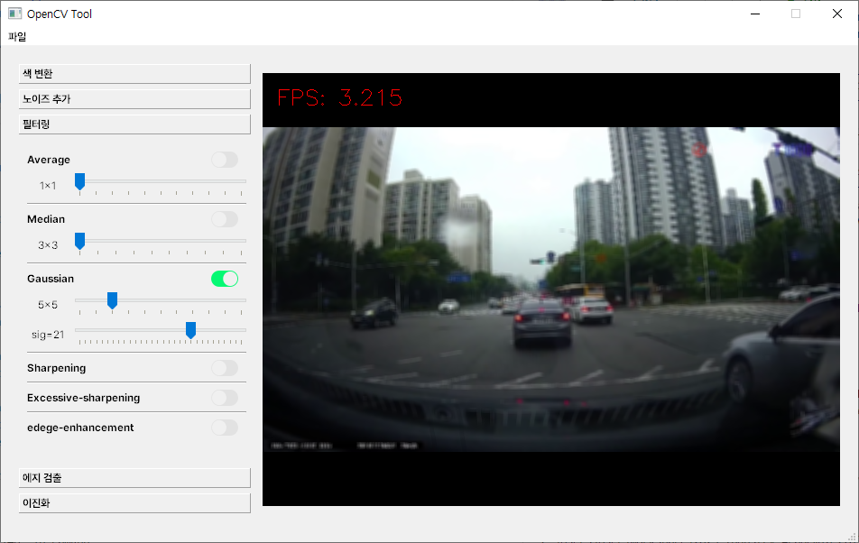
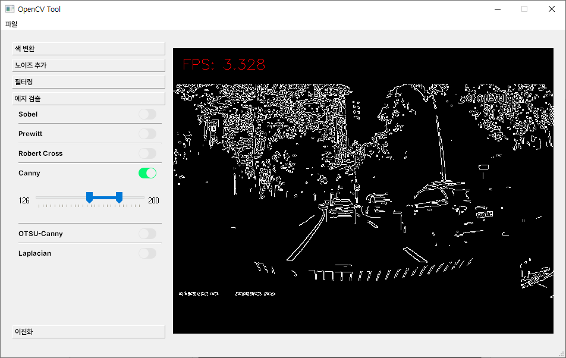
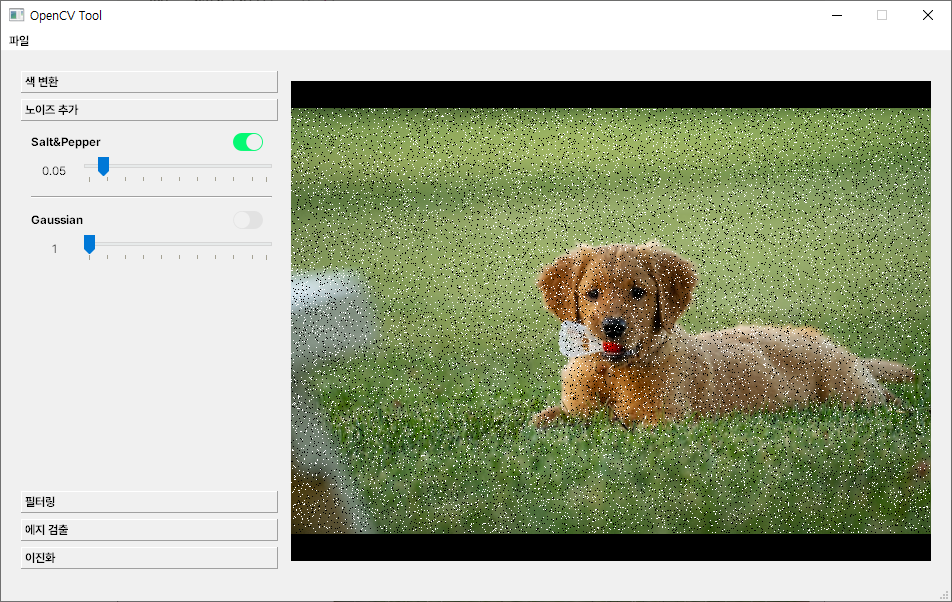
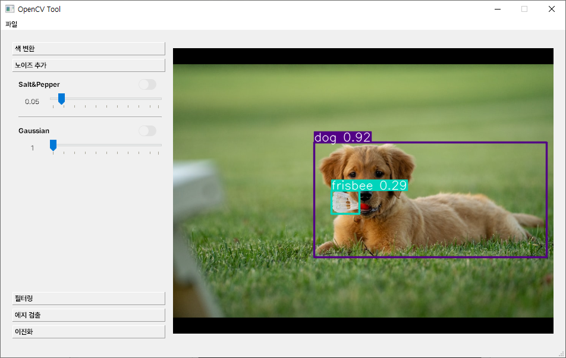
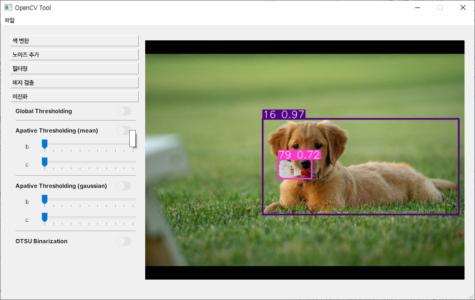
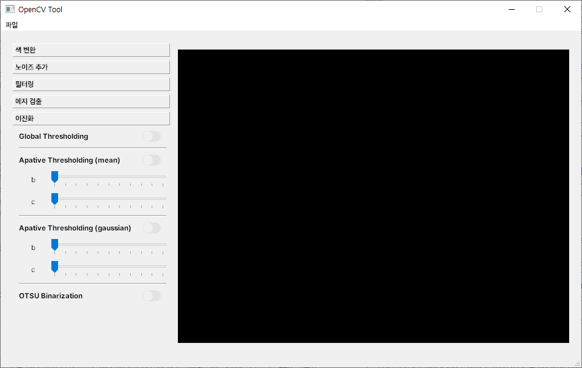

# 13일차

📅 2023년 7월 19일

## **📌 오늘 목표**

- ✅ 각 기능별 파라미터 상세 조정
- ❌ YOLOv8 매뉴얼 작성

## **📌 파라미터 상세 조정**

- 슬라이더 위젯을 추가하여 파라미터를 상세 조정할 수 있도록 하였다.

<p align="center">
  
</p>

- Canny 알고리즘의 최적의 임계값 지정을 위한 범위 지정 슬라이더를 적용했다.
    - 범위 지정 슬라이더는 Qt에서 지원하지 않기 때문에 라이브러리를 설치해야 한다.

```bash
pip install qtrangeslider[pyqt5]
```

```python
from qtrangeslider import QRangeSlider

range_slider = QRangeSlider()
```

<p align="center">
  
</p>

## **📌 이미지 불러오기**

- 비디오가 아닌 단일 이미지에 대한 영상처리를 위해 코드를 수정했다.

```python
ext = path.split(".")[-1]

if ext in ["avi", "mp4", "mkv", "mov"]:
    cap = cv2.VideoCapture(/my/file/dir)
    cap.set(cv2.CAP_PROP_FRAME_WIDTH, size[0])
    cap.set(cv2.CAP_PROP_FRAME_HEIGHT, size[1])
else:
    img = cv2.imread(/my/file/dir)

while True:
	...
```

<p align="center">
  
</p>

- 이미지에 대한 객체 인식도 가능하도록 수정했다.

<p align="center">
  
</p>

## **📌 [RT-DETR](https://docs.ultralytics.com/models/rtdetr/#python-api)에 대해서**

- ultralytics의 YOLO-NAS에 대해서 알아보다가 RT-DETR라는 새로운 모델을 발견했다.
- 높은 정확도를 유지하면서 실시간 성능을 제공하는 object detector 이다.
- TensorRT를 사용하는 CUDA와 같은 가속화된 백엔드에서 탁월하며 기존 모델보다 성능이 뛰어나다.

```python
import cv2
from PIL import Image
from ultralytics import RTDETR

model = RTDETR("rtdetr-l.pt")

frame = cv2.imread(path)
pil_image = Image.fromarray(frame)
results = model(pil_image)
frame = results[0].plot()

frame = cv2.cvtColor(frame, cv2.COLOR_BGR2RGB)
cv2.imshow("frame", frame)
```
<p align="center">
  
</p>

## **📌 목표 설정**

1. Binarization 기능 추가

<p align="center">
  
</p>

1. 히스토그램 그래프 출력 및 히스토그램 스트레칭, 평활화 기능 추가
2. YOLOv8 매뉴얼 작성