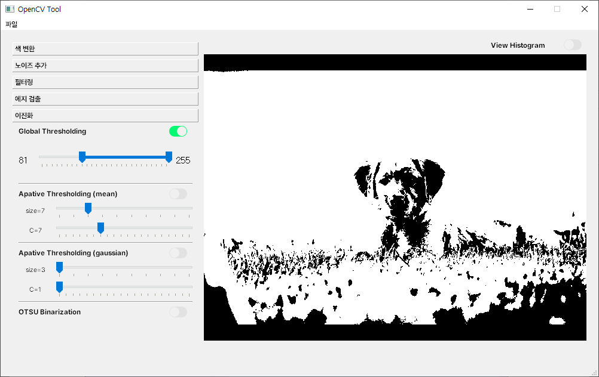
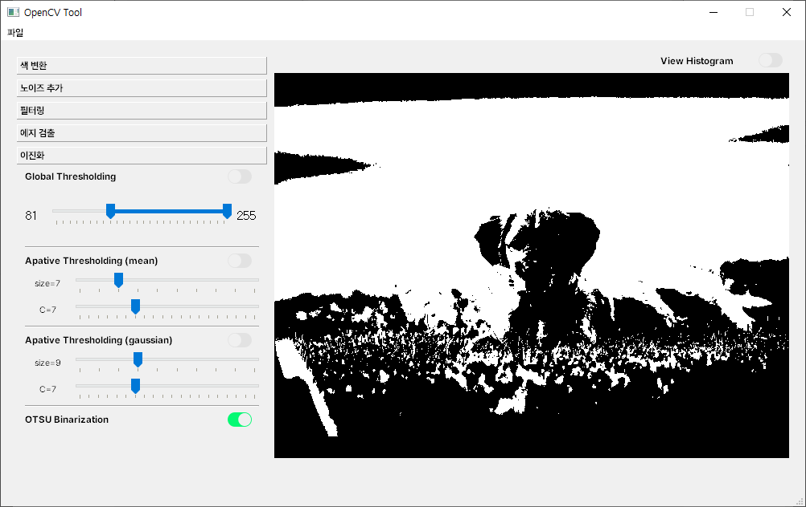
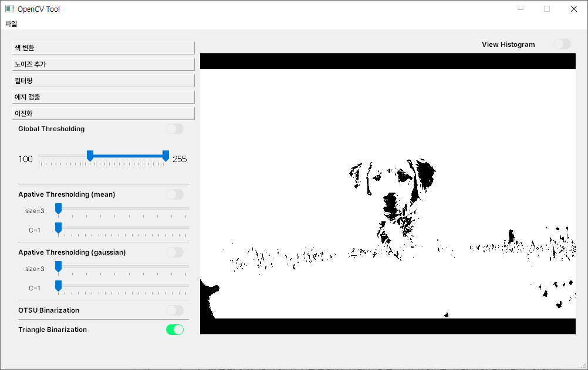
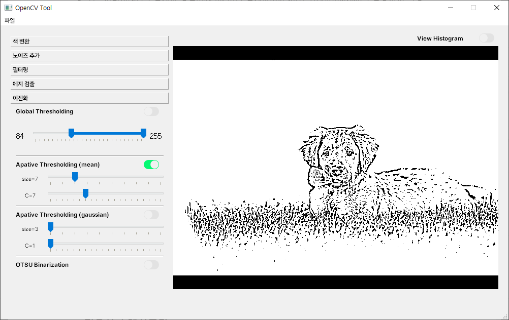
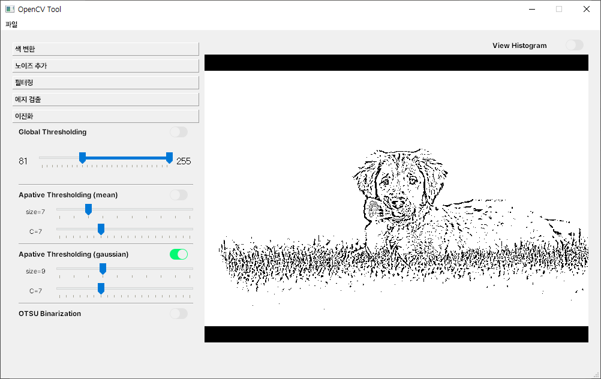
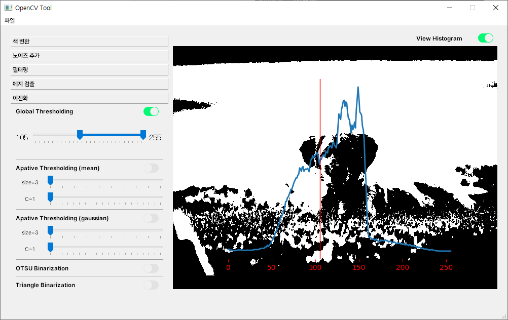
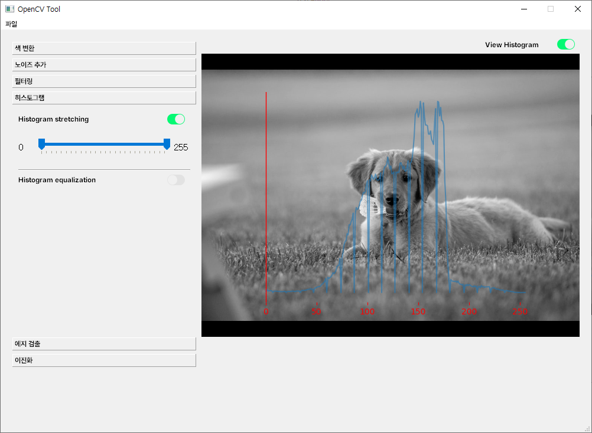
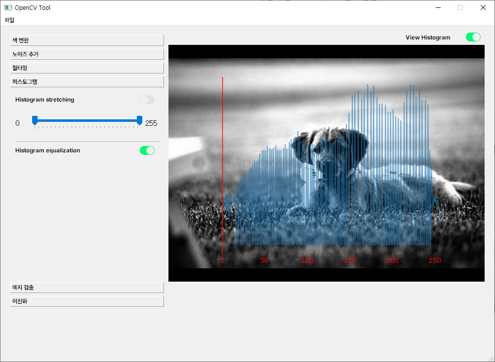

# 14일차

📅 2023년 7월 20일

## **📌 목표 설정**

1. ✅ 이진화(binarization) 기능 추가
2. ✅ 히스토그램 그래프 출력 및 히스토그램 스트레칭, 평활화 기능 추가
3. ❌ YOLOv8 매뉴얼 작성

## **📌 [Binarization]((https://docs.opencv.org/4.x/d7/d4d/tutorial_py_thresholding.html)) 기능 추가**

- 이진화는 가장 간단한 세그멘테이션 방법이다. 세그멘테이션이란 이미지를 분할하여 원하는 부분 혹은 물체를 검출하는데 많이 사용되는 기법이다.
- 이진화는 영상을 두 가지(0 혹은 1)로만 분류하는 것이다.
    - threshold 값을 지정하여 배경과 물체를 분리해낼 수 있다.
- 이진화 연산을 수행하기 전에 반드시 그레이스케일 변환이 선행되어야 한다.

### 🔗 전역 스레시홀딩

- 입력이미지(src)를 임계값 형식(type)에 따라 임계값(thresh)과 최대값(maxval)을 활용하여 설정 임계값(retval)과 결과이미지(dst)를 반환한다.

```python
# retval, dst = cv2.threshold(src, thresh, maxval, type)
ret, dst = cv2.threshold(gray_img, 100, 255, cv2.THRESH_BINARY)
```

<p align="center">
  
</p>

### 🔗 자동 스레시홀딩

- 이진화 이미지를 만들 때 가장 중요한 것은 임계값을 얼마로 정하냐 하는 것이다.

- **OTSU의 알고리즘**은 임계값을 임의로 정해 픽셀을 두 부류로 나누고 두 부류의 명암 분포를 구하는 작업을 반복한다. 모든 경우의 수 중에서 두 부류의 명암 분포가 가장 균일할 때의 임계값을 선택한다.
- 이미지의 밝기 분포가 양쪽으로 뚜렷하게 나뉘어져 있을 때 잘 작동한다.
- 영상의 **전역적**인 특성을 반영하는 경향이 있다.
- 컴퓨터가 최적의 임계값을 계산해주는 알고리즘으로 OTSU 외에 Triangle 알고리즘도 존재한다.

```python
th, dst = cv2.threshold(gray_img, -1, 255,  cv2.THRESH_BINARY | cv2.THRESH_OTSU)
```

<p align="center">
  
</p>

- **Triangle 알고리즘**은 영상의 히스토그램을 삼각형으로 근사하여, 그 삼각형의 밑변과 높이의 비율이 최대가 되는 스레시홀드를 선택하는 방법이다.
- 삼각형 근사를 이용하기 때문에 히스토그램 분포의 불균형이 크더라도 잘 작동한다.
- 이미지의 밝기 분포가 양쪽으로 뚜렷하게 나뉘어져 있지 않을 때에도 상대적으로 성능이 좋다.
- 영상의 **지역적**인 특성을 반영하는 경향이 있다.

```python
th, dst = cv2.threshold(gray_img, -1, 255,  cv2.THRESH_BINARY | cv2.THRESH_TRIANGLE)
```

<p align="center">
  
</p>

### 🔗 적응형 스레시홀딩

- 입력 이미지에 따라 임계값이 스스로 다른 값을 할당할 수 있도록 구성된 알고리즘이다.
- 이미지를 여러 영역으로 나눈 다음 각각의 임계값을 구하는 과정을 거친다.
- 조명의 변화나 반사가 심한 경우 이미지 내의 밝기 분포가 달라 국소적으로 임계값을 적용해야 하는 경우에 사용된다.
- 영상 내 조명이 균일하지 않거나 배경색이 여러가지인 경우 정확한 이진화가 어렵다.

```python
"""
cv2.adaptiveThreshold(
	입력 이미지, 
	최댓값, 
	적응형 이진화 플래그(cv2.ADAPTIVE_THRESH_MEAN_C, cv2.ADAPTIVE_THRESH_Gaussian_C, ...), 
	임곗값 형식(cv2.THRESH_BINARY, cv2.THRESH_BINARY_INV, ...), 
	블록 크기, 
	감산값
)
"""
binary = cv2.adaptiveThreshold(gray_img, 255, cv2.ADAPTIVE_THRESH_MEAN_C, cv2.THRESH_BINARY, 467, 37)
```

<p align="center">
  
</p>

<p align="center">
  
</p>

## **📌 히스토그램 그래프 출력**

- 히스토그램 그래프는 이미지의 픽셀 값 분포를 시각화하는 데 사용된다.
- 이미지의 밝기 분포를 확인하여 밝기 조절, 색상 보정, 이미지 임계처리, 배경제거 등의 이미지 전처리 작업을 수행할 수 있다.

### 🔗 임계처리

- 히스토그램의 분포를 보고 이미지 분리가 가장 잘 일어날 수 있도록 하는 적절한 임계값을 찾을 수 있다.

<p align="center">
  
</p>

### 🔗 히스토그램 스트레칭

- 적당한 명암비를 갖는 것이 이미지를 더 보기 좋게 만든다.
    - 명암비(Contrast)는 완전한 흰색과 완전한 검정색의 밝기(휘도) 차이이다.
- 이를 위해 Histogram Stretching 기법을 사용하여 특정 밝기 영역에 영상 픽셀의 밝기 값이 집중되어 있는 것을 퍼트려 가시도를 개선한다.

```python
frame = cv2.normalize(
	src=frame, 
	dst=None, 
	alpha, 
	beta, 
	mask=cv2.NORM_MINMAX
)
```

<p align="center">
  
</p>

### 🔗 히스토그램 평활화

- 히스토그램이 영상 전체에서 균일한 분포가 되도록 변경하는 기법이다.
- 이미지의 밝기가 알맞지 않은 경우 히스토그램을 전체 영역에 고루 펴져 있도록 바꿈으로써 이미지를 개선한다.

```python
frame = cv2.equalizeHist(frame)
```

<p align="center">
  
</p>

## **📌 [YOLO-NAS](https://docs.ultralytics.com/models/yolo-nas/)에 대해서**

- ultralytics 라이브러리를 사용하여 쉽게 모델을 불러올 수 있으며, YOLOv8에서 작성한 코드와 비슷하다.

```python
from ultralytics import YOLO, RTDETR, NAS

# model = YOLO("/my/weights.pt")
model = NAS("/my/weights.pt")
# model = RTDETR("/my/weights.pt")

results = model.predict('ultralytics/assets/bus.jpg')
```

- 그런데 이미지 경로를 파라미터로 넣어야 하는데 이 프로젝트에서는 배열 형태로 이미 변환되어 있기 때문에 오류가 발생한다.

## **📌 목표 설정**

1. YOLOv8 매뉴얼 작성
2. YOLO-NAS 적용하기
3. 딥러닝 성능 분석 방법에 대해서 알아보기