# 23일차

📅 2023년 8월 2일

## **📌 오늘 목표**

- [새로운 프로젝트: 운전자석 높이 추정 방법에 대해](../report/week4_weekly_report.pdf)
    

## **📌 운전자석 높이 추정 방법**

### 차종 분류에 따른 운전자석 높이 추정

- 운전자석 높이를 추정하기 위한 방법 중에 차량의 높이를 알아내는 방법이 있다.
- 차량의 높이를 알아내기 위한 척도로 차종을 확인하는 방법이 있다.
- 아래 그림과 같이 차종마다 일정한 규칙의 크기를 가지기 때문에 운전자석 높이 추정에 중요한 척도가 될 수 있다.

  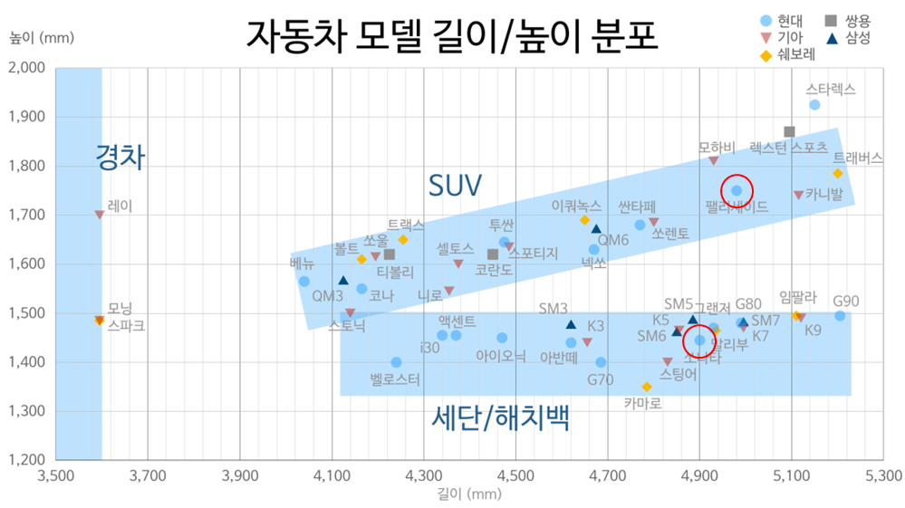

&nbsp;

- 하지만 경험 상으로 세단과 SUV는 크기 차이가 있지만 운전자석 높이는 불편을 끼칠 만한 큰 차이는 없었다.
- 따라서 운전자석 높이에 따른 새로운 분류가 필요하다.
- 아래와 같이 3개 단계로 얼마나 잘 분류할 수 있는지에 따라 달려있다.
    1. 1단계: 모든 승용차, 소형 승합차
    2. 2단계: 중형 승합차, 소형 화물차
    3. 3단계: 대형 승합차, 중형~대형 화물차

&nbsp;

- 차종 분류에 있어 필요한 입력 데이터로써 차량의 본체를 모두 담도록 하는 것이 좋겠지만 현재 주어진 데이터로는 촬영 장소와 근접 촬영의 영향으로 특징을 추출해내기에 제한적이다.

  

- 그래서 유일하게 구분할 수 있는 차량 전면 부분 만을 통해 차종을 분류할 수 있다면 원하는 바를 이뤄낼 수 있다고 기대된다.

  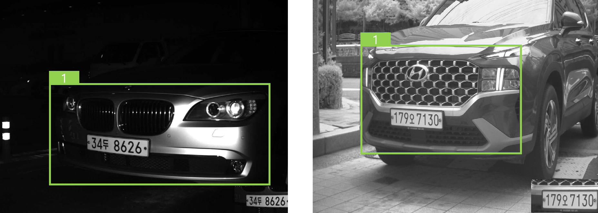

  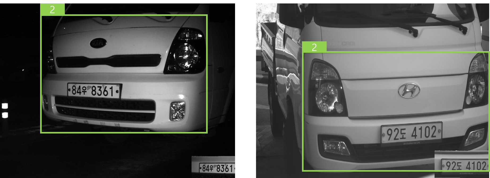

### Training

- 학습은 Colab에서 진행하였으며, 1000개 학습 데이터를 대상으로 학습을 진행한다.
    - img-size: 640x640
    - batch-size: 16
    - epoch: 30

  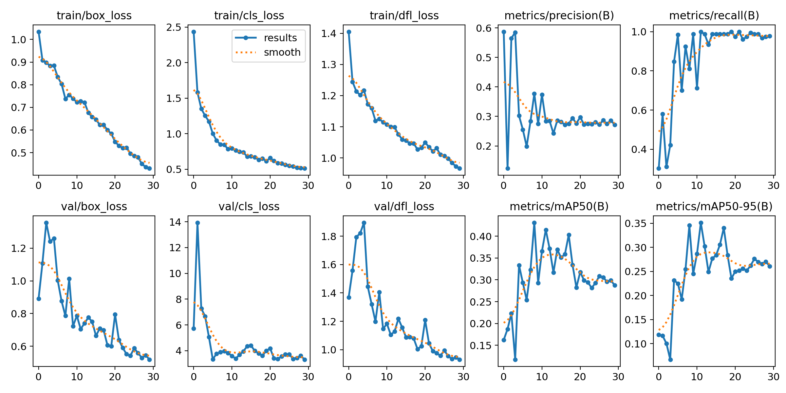

### Predict

- confidence는 낮지만 분류는 해내는 것을 볼 수 있다.
- 낮은 confidence는 데이터양을 증가시켜 해결해볼 만하다고 판단된다.

  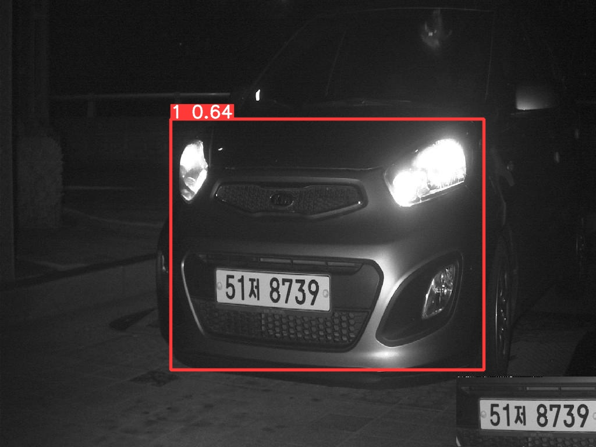
  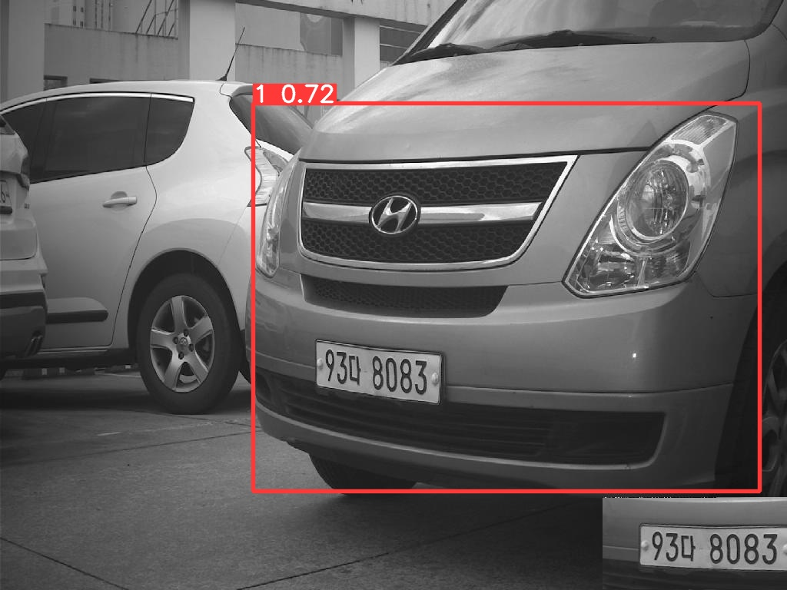

  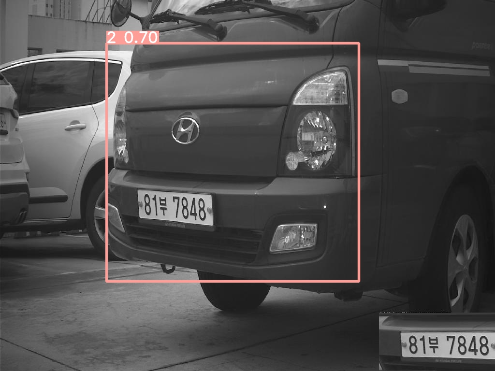
  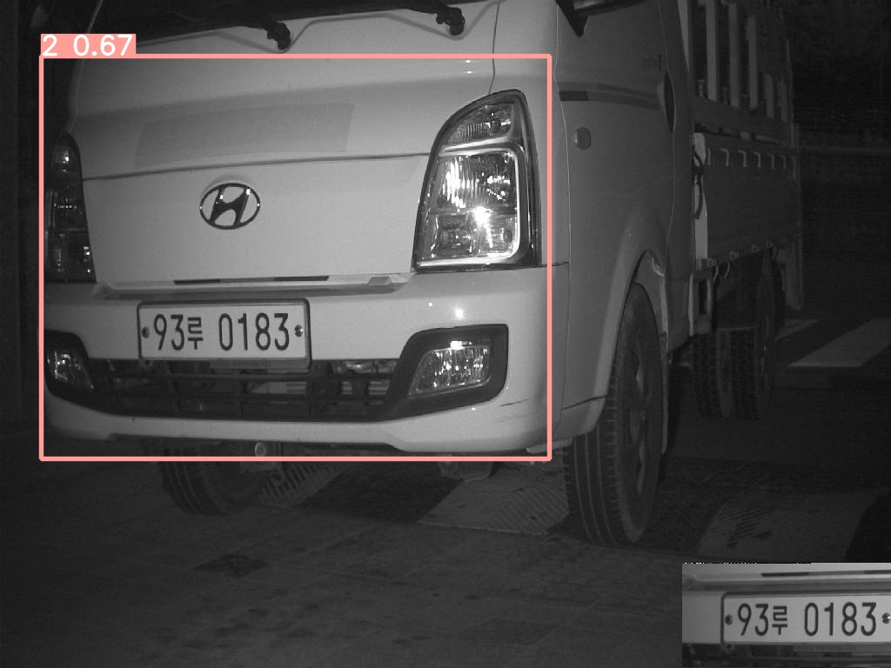

### Problems

- 불필요한 바운딩 박스가 다수 존재한다.
- 바운딩 박스가 다수 존재할 때, 바운딩 박스의 confidence 임계값을 높여 정확한 것만 검출해낼 수 있도록 할 수 있다.
- 바운딩 박스가 다수 존재할 때, 가장 높은 하나의 바운딩 박스만 그리도록 하는 방법도 생각할 수 있다.

  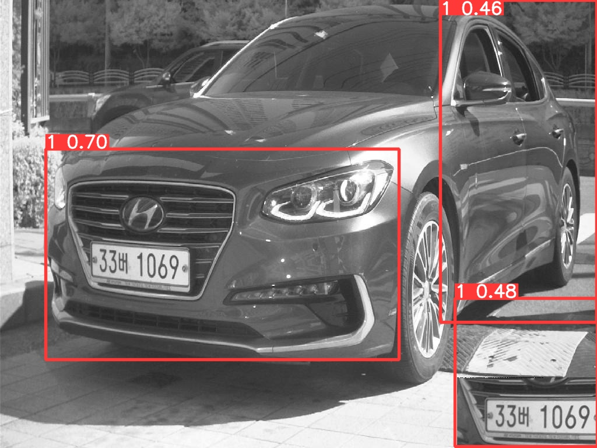
  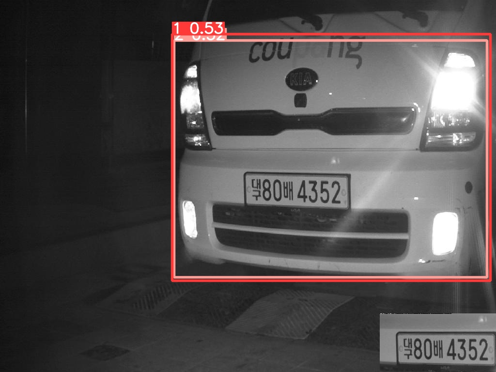

&nbsp;

- F1-score를 볼 때, ‘1단계’와 ‘2단계’ 간의 **데이터 불균형**이 발생한 것을 볼 수 있다.
- ‘1단계’ 데이터를 줄여서 불균형을 해소하거나 ‘2단계’ 데이터를 추가하여 문제를 해소한다.
- 지금은 1000개 가량 밖에 안되는 데이터를 학습하였기 때문에 줄이기 보다는 ‘2단계’ 데이터를 추가하도록 해야할 것 같다.

  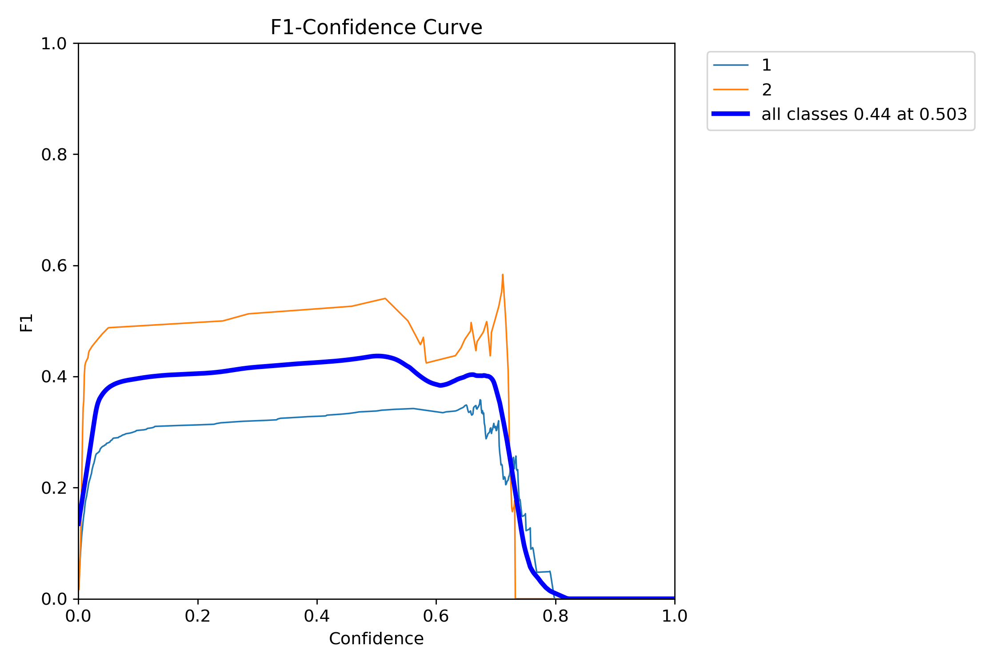

&nbsp;
## **📌 목표 설정**

- 운전자석 높이 추정 방법에 대해서 발표