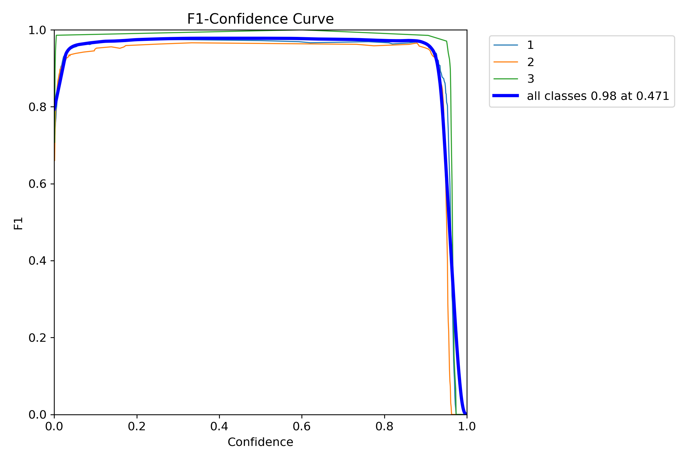

# 28일차

📅 2023년 8월 9일

## **📌 목표 설정**

- 차량 전면 라벨링 처음부터 시작

&nbsp;
## **📌 처음부터…**

### 라벨링

- 승용차 중에서도 바닥 높이가 긴 SUV와 같은 차량에 대해서 세부적으로 라벨링을 해보았다.
- Google lens를 사용하여 정확한 모델명을 검색하고 각 모델마다 전고를 기록했다.
- 단계 분류는 특정 임계값에 따라 나뉜다.
    - 1단계: 1400mm~1599mm
    - 2단계: 1600mm~1900mm
    - 3단계: 1900mm~
- 스타렉스나 다마스 같은 차량은 전고에 따른 분류로 3단계는 너무 높다고 판단해서 예외적으로 2단계로 지정했다.
- 3단계는 오로지 트럭과 버스의 형상만 허용하기로 했다.

| 제조사 | 모델명 | 전고(mm) | 단계 |
| :---: | :---: | :---: | :---: |
| 미니 | 쿠퍼 | 1414 | 1 |
| 현대 | 아반떼 | 1420 | 1 |
| BMW | BMW 3시리즈 | 1429 | 1 |
| 벤츠 | CLA | 1435 | 1 |
| … | … | … |  |
| 기아 | 쏘울 | 1600 | 2 |
| 쌍용 | 티볼리 | 1600 | 2 |
| 기아 | 셀토스 | 1605 | 2 |
| 현대 | 스타리아 | 1990 | 2 |
| … | … | … |  |
| 현대 | 포터 | 1970 | 3 |
| 기아 | 봉고 | 1995 | 3 |

### 학습 및 결과

- 약 2,400개의 학습 데이터를 생성하여 학습을 진행시켰다.
    - batch-size: 16
    - epochs: 30
    - img-size: 640

  

  
  

### 문제점

- 얼핏 보기에는 문제 없어보이지만 과적합의 문제를 배재할 수 없다.
- 하나의 클래스 안에 모델의 형상이 너무 다양하게 하게 묶여 있어 3개 단계로 분류해낼 수 있을지는 미지수이다.
- 새로운 환경에서 아래 그림처럼 2단계인데 1단계로 분류하는 경우가 많았다.
    - 2,400개의 학습한 것으로만 판단하기에는 아직 이를 수 있다.
    - 어두운 환경에 대한 학습 데이터는 아직 생성하지 않았기 때문에 그럴 수도 있다.

  

&nbsp;
## **📌 목표 설정**

- 학습 데이터 3,000개 추가 후 차종 분류 가능성 판단하기