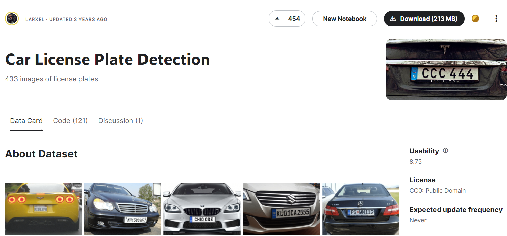
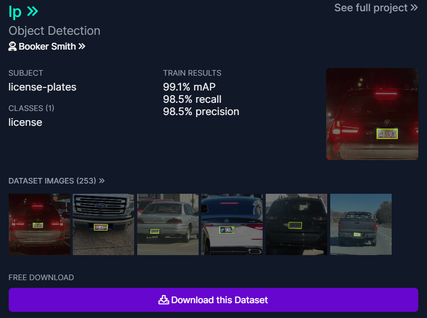
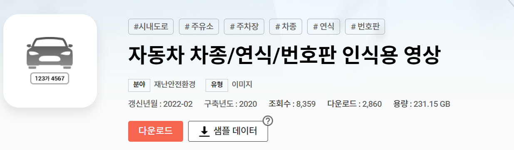
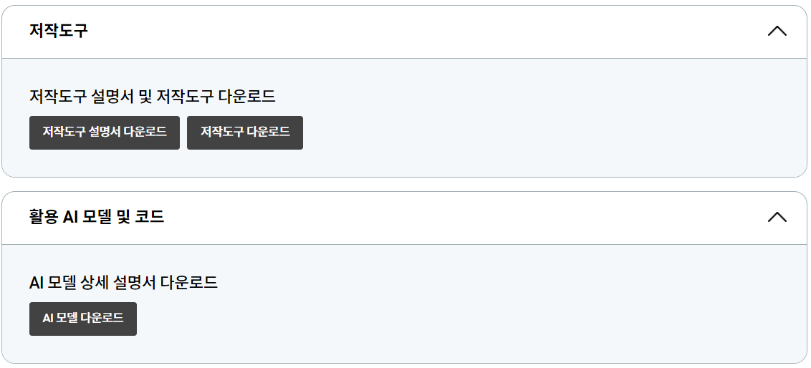

# 📷 데이터 수집

머신러닝 모델을 학습시키기 위해 데이터를 수집해야 한다. 데이터는 학습용 데이터와 테스트용 데이터로 나뉘며, 학습용 데이터는 모델을 학습하는 데 사용되고, 테스트용 데이터는 학습된 모델의 성능을 평가하는 데 사용된다.

데이터의 양과 품질은 모델의 성능에 직결되기 때문에 데이터 수집은 머신러닝 프로젝트에서 가장 중요한 단계이다.

- 공개 데이터셋 활용
    - 정부 기관, 연구소, 대학, 기업 등이 데이터를 공개하는 경우가 많다.
    - UCI Macine Learning Repository나 Kaggle과 같은 플랫폼에서 무료로 데이터셋을 다운로드 할 수 있다.
- 웹 스크래핑/크롤링
    - 인터넷에서 웹 페이지의 내용을 수집하는 웹 스크래핑 기술을 사용하여 데이터를 수집할 수 있다. 자동화된 크롤링 도구를 사용할 수도 있다.
- 센서나 기기로 데이터 수집
    - 센서를 사용하여 환경 데이터(온도, 습도 등)를 수집하거나, 스마트폰의 센서를 활용하여 위치 데이터, 가속도 데이터 등을 수집하는 경우가 있다.
- 외부 데이터 공급 업체 이용
    - 데이터 수집이 어려운 경우, 외부 데이터 공급 업체를 이용하여 필요한 데이터를 구매하거나 제공받을 수 있다.

## 🌐 [Kaggle](https://www.kaggle.com/)

[Kaggle: Your Machine Learning and Data Science Community]

  

- 데이터 분석 및 머신러닝에 대한 학습 플랫폼이자, 경쟁할 수 있는 플랫폼이다.
- 사용자들이 생성한 데이터셋들과 사전 학습된 모델들을 공개되어 있어 간단한 머신러닝을 수행할 수 있다.

## 🌐 [Roboflow](https://universe.roboflow.com/)

  

- Roboflow는 컴퓨터 비전 기술을 이용해 다양한 애플리케이션을 만들 수 있도록 지원해주는 서비스이다.
- 다양한 무료 데이터셋을 지원하고 있으며, 데이터 라벨링, 데이터 증강, 데이터 학습, 학습 결과까지 볼 수 있도록 되어 있다.
- 하지만 학습 데이터는 1000장 까지만 무료이고, 그 이상은 유료이다.
- 데이터 라벨링의 경우에는 브라우저에서 진행하다 보니 개수가 많아질수록 버벅거림이 있을 수 있다.

## 🌐 [AI-Hub](https://aihub.or.kr/)

  

  

- AI-Hub는 한국지능정보사회진흥원이 운영하는 AI 통합 플랫폼이다.
- AI 기술, 서비스 개발에 필수적인 인공지능 학습용 데이터, 소프트웨어, 컴퓨팅 자원 등 AI 인프라를 지원함으로써 누구나 활용하고 참여할 수 있다.

## 🌐 [웹 스크래핑/크롤링](https://www.snugarchive.com/blog/python-web-scraping/)

- 웹 크롤링은 웹상을 돌아다니며 방대한 양의 정보를 수집하여 실시간 정보 수집을 위해 계속해서 작동하므로 자주 변화하는 데이터를 파악하기 좋다.
    - 동일한 콘텐츠에 대한 중복제거가 필요하다.
- 웹 스크래핑은 특정 사이트나 페이지에 대한 정보를 찾는데 집중하므로 데이터 포인트를 정확히 잡고 확실한 정보만을 수집할 수 있다는 점에서 유용하다.