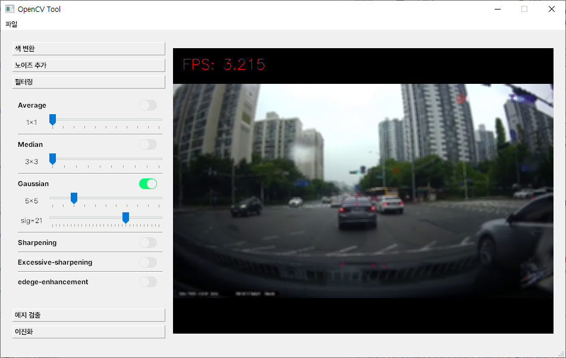
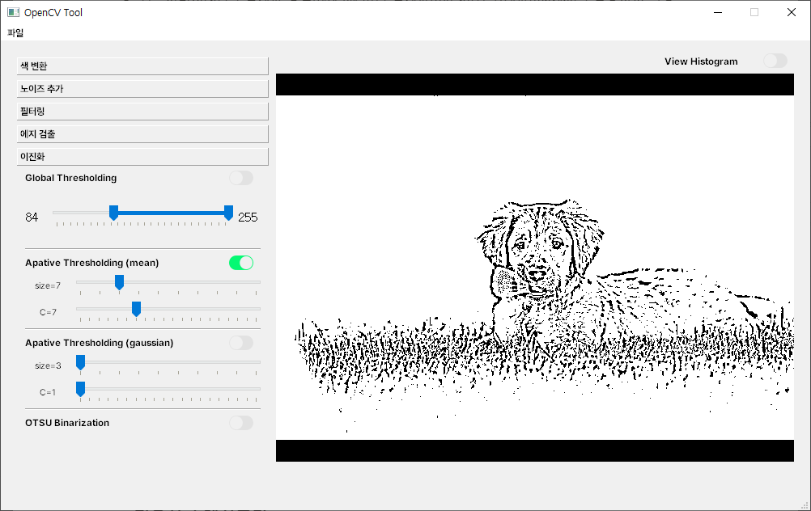
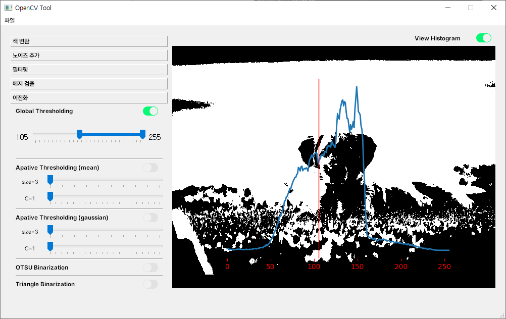
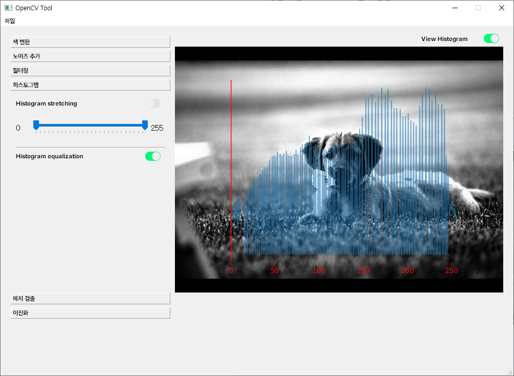
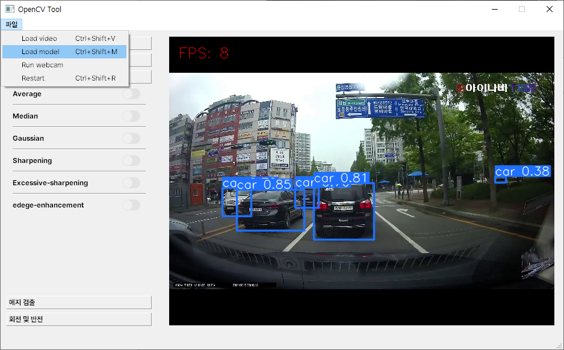

# 🌐 Opencv on PyQt5
- OpenCV 기능들을 PyQt5에서 실시간으로 확인하고자 하여 제작하였습니다.
- [이전 프로젝트](../opencv_on_pyqt/README.md)보다 기능과 성능이 개선되었습니다.
- 자세한 설명: [12일차](/ShortTerm-Internship/diary/0718.md), [13일차](/ShortTerm-Internship/diary/0719.md), [14일차](/ShortTerm-Internship/diary/0720.md)

### 🛠️ Requirements
```python
python=3.8
PyQt=5.15.9
opencv-python=4.8.0.74
Pillow=9.3.0

# YOLO: object detection
ultralytics=8.0.133
```

### 🛠️ Qt designer
- Using Qt designer embedded in [Anaconda](https://www.anaconda.com/)
<p align="center">
  
</p>

### 🛠️ How to run 

```shell
python main.py
```

### 📷 OpenCV Functions

<p align="center">
  
  
</p>

<p align="center">
  
  
</p>

<p align="center">
</p>


### 📷 Applying the model

<p align="center">
  
</p>

### ⚠️ Problems
- 히스토그램 출력 전에 임계값 설정 바람.
- 히스토그램 출력 상태에서 임계값 슬라이더 조작 시 팅김 현상 종종 발생.