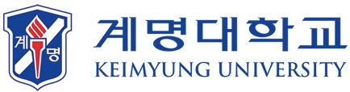

    
    &emsp;&emsp;&emsp;
    

&emsp;

    
    
    
    
    
    

&emsp;

## 📢 지역산업 SW인재양성 기반조성사업
- 지역 SW산업 집적단지를 중심으로 한 산학관 협력 기반의 SW교육 인프라 구축 및 지역기업 맞춤형 SW인재 선순환 생태계 조성
- **사업기간**: 2023.1 ~ 2023.12
- **전담기관**: 정보통신산업진흥원, 대구광역시(벤처혁신과)
- 산학협력 프로젝트 지원(20개사)
- 장/단기 현장실습 프로그램 지원(25개사)
- 산학관 협력 네트워킹 연계 (지역SW기업 - 학부생 간 프로젝트 공유)

&emsp;

## 📢 SW마스터과정 연계 산학협력 프로젝트
- **산학협력 프로젝트란?** 기업이 제안한 SW개발 과제 중심, 기업(멘토)-학생(멘티)이 현업하는 산학협력프로젝트 과정을 수행하여 현장실무+SW개발 역량 강화 및 조기 취업 달성을 위한 프로그램
- 학기 중에 프로젝트 팀을 구성하여 기업에서 제안한 SW개발 과제 프로젝트 공동 수행
- **기획형 마스터과정**: 
    1. ✅ (03월~06월) 프로젝트 공동기획 및 기업 설명회
    2. ❌ (07월~08월) 하계 단기 현장실습
    3. ❌ (09월~12월) 산학협력 프로젝트(2학기)

&emsp;

## 💼 하계 단기 현장실습

|📅 활동기간|🏬 근무지|💻 직무 내용|
|:---:|:---:|:---:|
|2023.07.03 ~ 2023.08.31|(주)라온에이치씨|AI기반의 영상(객체) 처리기술을 통한 인식·분석시스템 개발|

<b>직무 자세히보기</b>

- **직무명**
    - 영상(객체)인식 프로그램 개발 및 데이터 분석
- **교육목표**
    - 차량 출입 동영상을 캡쳐 후 번호판 식별 및 미·오인식된 이미지 보정 식별
    - Deep learning 기반의 객체 인식 기술을 활용한 영상 분석
    - DB 분류 관리 및 Testing
    - 영상 분석 오류에 대한 사례 수집 및 해결 방안 모색
- **직무개요**
    - Deep learning와 Auto Labeling 기술에 대한 개념 숙지
    - 기존 개발(보유)프로그램(객체인식)에 대한 분석 및 기술 숙지
    - 수집 데이터 분석 및 분류 작업 수행
    - 데이터별 라벨링, 학습 검지 테스트, 결과 분석 등 업무 수행
    - 미·오인식에 대한 원인 분석 및 인식률 향상 방안 모색 
- **운영/지도계획**
    - 수행시간: 월-금(주 5일, 공휴일 제외) 09:00-18:00 (점심시간 12:30-13:30)
    - 개인별 수행과제 부여(업무 파트별, 실습자의 수행 능력에 따라 차등 부여)
    - 주 1회 멘토와의 면담을 통해 수행 평가 및 변경사항 등을 체크
    - 주 3회 이상 기업 참여 인력과의 면담을 통해 프로젝터 진행 사항 체크
    - 주 1회 전체 회의를 통해 수행 업무별 의견 수렴 및 개선 사항 도출

### 📖 활동기록

|주차|📅 날짜|📝 근무일지|📋 주간보고서|
|:---:|:---:|:---:|:---:|
|1주차|07.03 ~ 07.07|**[1일차](./ShortTerm-Internship/diary/0703.md)**, **[2일차](./diary/0704.md)**, **[3일차](./diary/0705.md)**, **[4일차](./diary/0706.md)**, **[5일차](./diary/0707.md)**|**[1주차 보고서](./ShortTerm-Internship/report/week1_weekly-report.pdf)**|
|2주차|07.10 ~ 07.14|**[6일차](./diary/0710.md)**, **[7일차](./diary/0711.md)**, **[8일차](./diary/0712.md)**, **[9일차](./diary/0713.md)**, **[10일차](./diary/0714.md)**|**[2주차 보고서](./ShortTerm-Internship/report/)**|
|3주차|07.17 ~ 07.21|**[11일차]()**||
|4주차|07.24 ~ 07.28||
|5주차|07.31 ~ 08.04||
|6주차|08.07 ~ 08.11||
|7주차|08.14 ~ 08.18||
|8주차|08.21 ~ 08.25||

&emsp;

## 📊 산학협력 프로젝트 (변동가능)

|연번|일시|내용|
|:---:|:---:|:---:|
|1|2023.08.|참여기업 모집 및 과제선정|
|2|2023.09.05 ~ 09.08|프로젝트 팀 구성(팀 구성: 학부생 3-5명)|
|3|2023.09.|참여 학생 모집을 위한 설명회 실시|
|4|2023.09.|킥오프미팅(Kickoff meeting)|
|5|2023.09.|원활한 팀프로젝트 수행을 위한 팀리더교육 실시|
|6|2023.09. ~ 12.xx|프로젝트 수행|
|7|2023.11.|프로젝트 중간 발표회|
|8|2023.12.|프로젝트 결과보고 및 결과발표회 참가|

