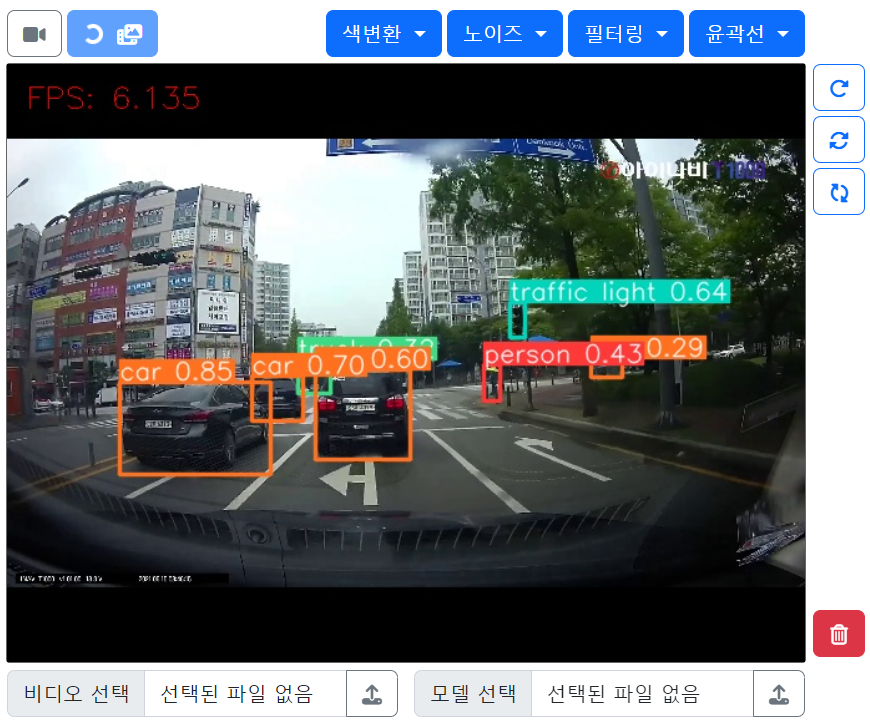

# 10일차

📅 2023년 7월 14일

## **📌** 오늘 목표

- 추론 속도를 향상시킬 수 있는 대책 마련

## **📌 기능 추가**

  

- 업로드된 파일 초기화
    - 비디오의 경우 현재 재생 중일 경우 삭제가 안되기 때문에 스트리밍 영상이 꺼져있는 상태에서 삭제해야 한다.
    - 클릭 시 저장되어 있는 비디오와 가중치 파일이 삭제되고 브라우저가 새로고침 된다.
- 동영상(.mp4, .avi 등)만 업로드할 수 있도록 input 태그를 수정하였다.
- YOLOv8 모델만 업로드할 수 있도록 input 태그를 수정하였다.
    - 이전 버전의 모델을 사용하려면 더 복잡한 코드를 작성해야 한다.
    - 잘 만들어진 YOLO 라이브러리를 통해 간편하게 bounding box를 그릴 수 있다.

## **📌 추론 속도 향상에 대해서**

1. 하드웨어 가속기 사용
    - GPU나 TPU와 같은 전용 하드웨어 가속기를 사용하여 추론 속도를 향상시킬 수 있다.
    - 클라우드 기반의 고성능 하드웨어 인스턴스를 활용할 수 있다.
2. 모델 최적화
    - 모델 크기를 줄이고 연산량을 감소시킴으로써 추론 속도를 향상시킬 수 있다.
    - 모델 압축, 가중치 양자화, 가벼운 아키텍처 선택 등의 기술을 사용하여 모델을 최적화할 수 있다.
3. 배치 처리
    - 추론 시에 여러 입력 데이터를 한 번에 처리하는 배치 처리를 사용하여 속도를 향상시킬 수 있다.

### 모델 최적화 방법

→ 학습하는 입장에서 가장 현실성이 있는 것은 모델 최적화 하는 방법이다.

1. 모델 크기 축소
    - 모델의 파라미터 수를 줄인다.
    - 가중치의 양자화, 가중치 잘라내기, 모델 구조 단순화 등의 기법을 사용한다.
2. 가중치 양자화
    - 모델의 가중치 정밀도를 낮추는 방식으로 표현하는 기법
    - 정밀도를 낮추면 모델의 크기가 줄어들고 연산이 빨라진다.
    - 16비트 또는 8비트로 양자화하여 사용
3. 가중치 잘라내기
    - 모델에서 불필요한 연결을 제거하여 희소성을 도입하는 기법
    - 작은 가중치를 제거하고 희소한 모델을 만들어 모델 크기와 연산량을 줄일 수 있다.
4. 모델 압축
    - 모델 파라미터를 저장하고 전달하는 방식을 최적하하는 기법
    - 모델의 가중치를 압축하여 저장하고, 추론 시에 압축된 가중치를 해제하여 사용한다.
5. 경량화된 모델 아키텍쳐 사용
    - MobileNet, EfficientNet과 같은 작은 크기와 연산량을 가지는 경량화된 모델 아키텍처를 사용한다.
6. 프루닝
    - 모델에서 불필요한 연결을 제거하여 모델 크기를 줄이는 방법
    - 작은 가중치를 제거하거나 절대값이 작은 가중치를 0으로 만들어 모델을 희소화시킨다.

## **📌 PyQt5로 마이그레이션**

- 현재 파이썬 웹 프레임워크(Flask)을 사용하여 브라우저에서 Opencv 기능 적용하는 작업을 해왔다.
- 클라이언트와 서버 간의 데이터 교환 방식과 부가적인 프로그래밍이 워낙 많고 까다롭기 때문에 기능 추가에 대해서 생각보다 많은 제약이 따랐다.
- 심지어 HTML/CSS 구조에 대해서도 생각해야 했기 때문에 작업량이 늘어날 수 밖에 없었다.
    - 클라이언트에서 발생하는 이벤트를 서버에서 알 수 있도록 하는 로직 추가 등으로 인해 Opencv 기능을 알기 위한 취지에 비해 부가적인 작업량이 많은 것이 문제였다.
- Opencv 기능에 대해서 배우는 취지에 있어 가장 효율적인 것은 브라우저가 아닌 로컬에서 실행하는 것이라고 생각했기 때문에 PyQt5로 마이그레이션하여 기능을 재구현할 것이다.

### [PyQt5](https://wikidocs.net/35478)

- PyQt란, Qt의 레이아웃에 Python의 코드를 연결하여 GUI 프로그램을 만들 수 있게 해주는 프레임워크를 의미한다.

## **📌 목표 설정**

- Flask에서 PyQt5로 마이그레이션
    - 실습생들과 함께 PyQt5에 대해서 알아가 보고 필요한 기능들에 대해서 어떤 이벤트가 필요한지 컨테이너 배치 구조를 어떻게 하면 좋을지 설계 및 분석을 진행한다.
    - 7/21 까지 목표로 진행한다.