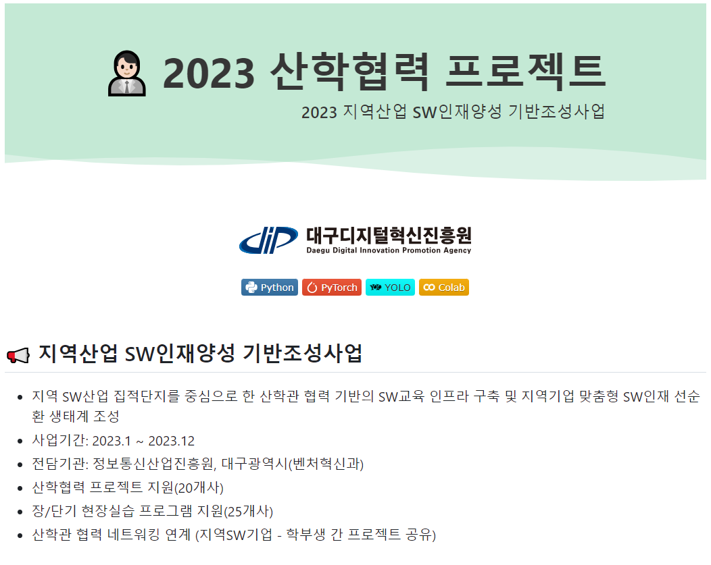
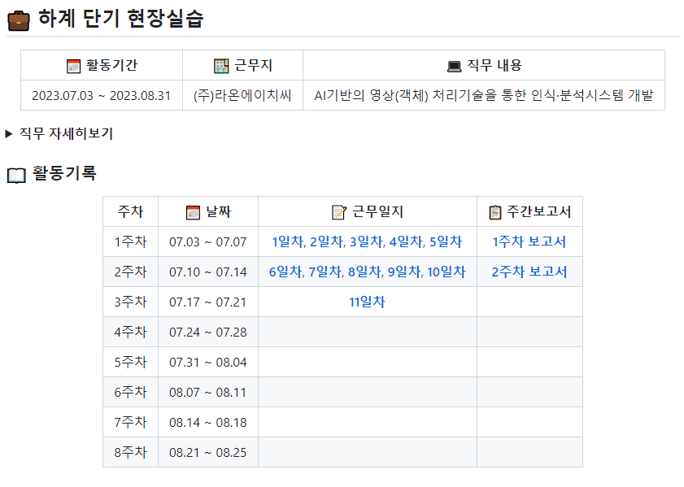
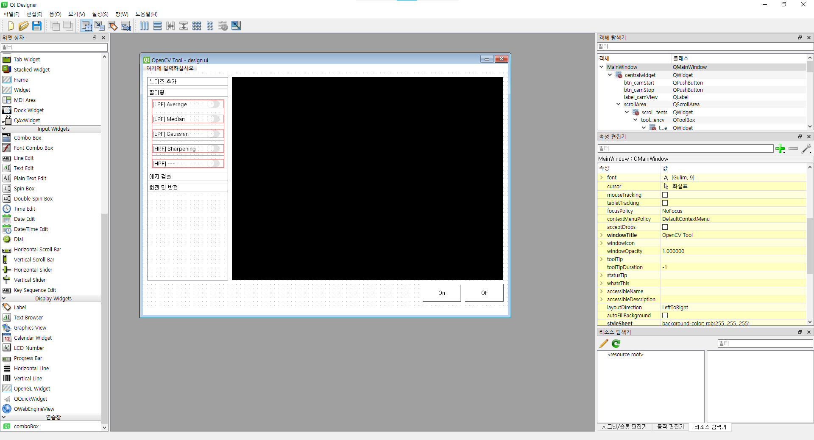
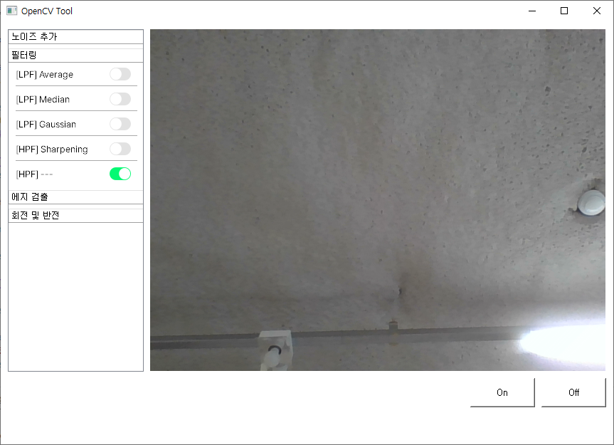

# 11일차

📅 2023년 7월 17일

## **📌 목표**

1. Github [README.md](/README.md) 수정
2. Flask → PyQt5 마이그레이션 설계

## **📌 Github [README.md](/README.md) 수정**

- 진행 중인 하계 단기 현장실습은 2023 지역산업 SW인재양성 기반조성사업의 일부분이기 때문에 구조를 재구성할 필요가 있었다.
- 현재 진행 중인 사업과 현장실습 기관에 대한 간략한 소개와 추후 진행하게 될 산학협력 프로젝트에 대한 카테고리를 마련하여 독자가 읽기 쉽게 구성하였다.

  

  

## **📌 PyQt5 디자인 설계**

- Qt Designer 도구를 사용하여 디자인을 설계했다.
- 이벤트 관리를 위해 각 위젯 객체마다 특정할 수 있는 이름을 부여했다.
- 웹에서 설계한 디자인 비슷하게 각 기능 카테고리의 하위 기능들은 하나씩만 적용될 수 있도록 라디오 버튼을 활용했다.

  

- 웹캠을 실행을 테스트하고 버튼 토글링과 라디오 버튼 기능을 확인했다.
- 뷰 사이즈는 640x480으로 설정하였다.
- [On] 버튼을 클릭하면 캠이 켜지고, [Off] 버튼을 클릭하면 캠이 꺼진다.

  

- 해당 디자인은 계속 변경될 수 있다.

## **📌 목표 설정**

1. PyQt5 디자인 및 기능 구현
    - 배치 구조 변경
    - 각 기능별 적용 테스트
2. 2 주차 주간 보고서 작성 및 발표
    - 07.11 ~ 07.17 활동 보고