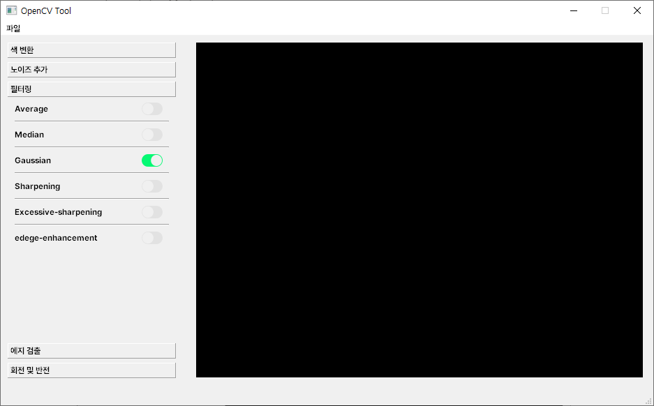
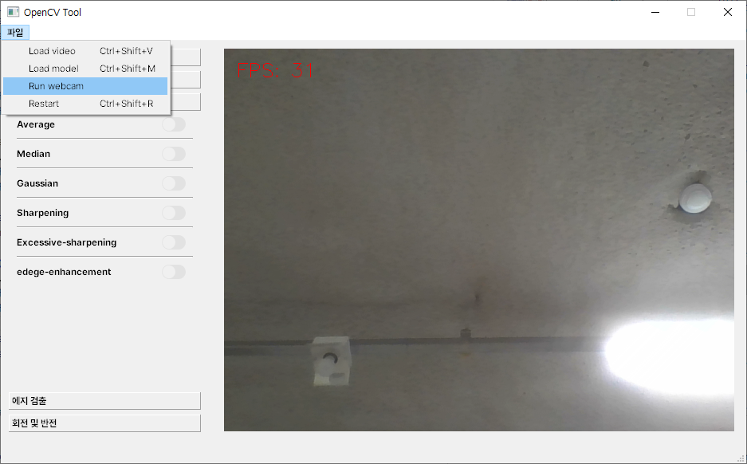
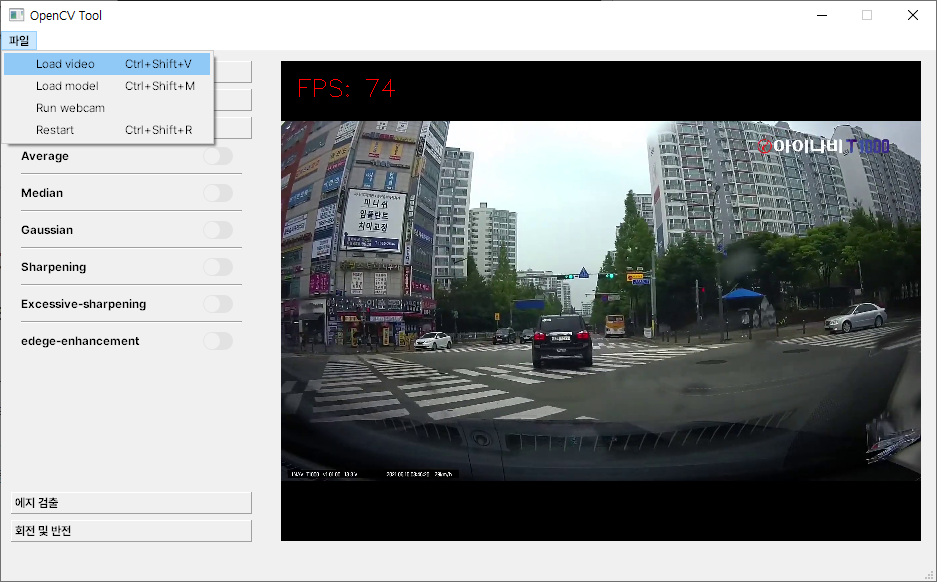
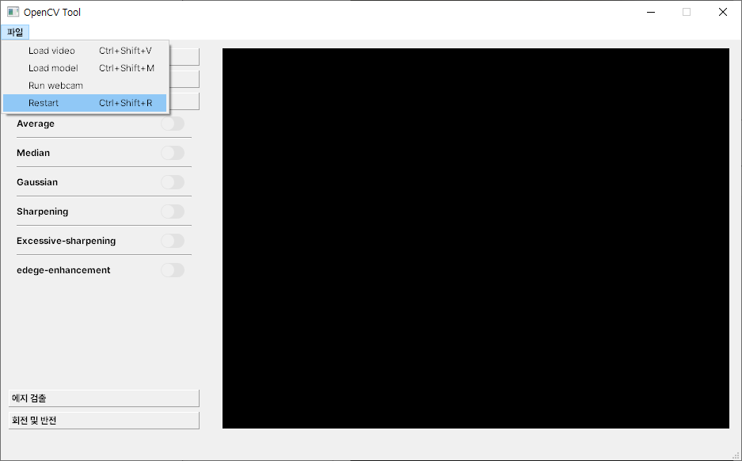
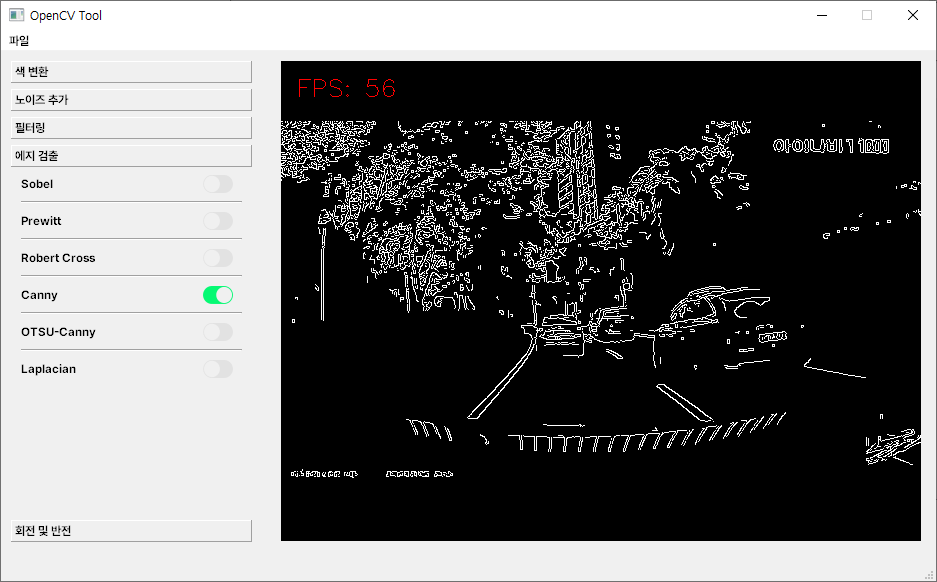
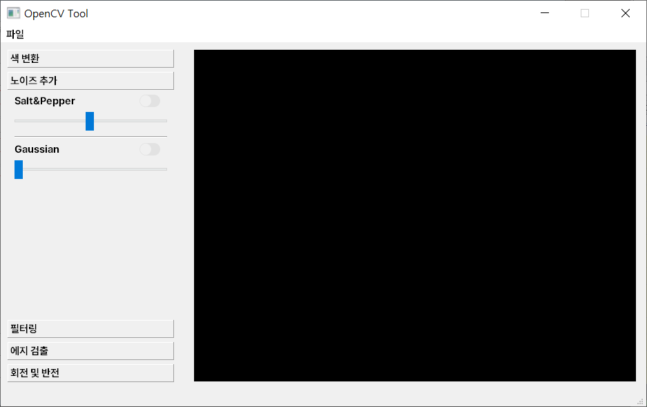

# 12일차

📅 2023년 7월 18일

## **📌 오늘 목표**

1. PyQt5 디자인 및 기능 구현
    - 배치 구조 변경
    - 각 기능별 적용 및 테스트
2. 2주차 주간 보고서 작성 및 발표
    - 07.11 ~ 07.17 활동 보고

## **📌 PyQt5 디자인 확정**

- 브라우저에 설계했던 기능 카테고리 형식들을 그대로 사용하였다.
    - Qt의 QToolBox 컨테이너를 사용하여 간편하게 디자인했다.
- 각 카테고리의 하위 기능들은 라디오 버튼으로 한 번에 하나씩만 적용될 수 있도록 하여 동일한 종류의 기능들이 중복되는 것을 방지했다.
- 비디오 혹은 웹캠 실행은 상단 메뉴바에서 수행할 수 있다.

<p align="center">
  
</p>

<p align="center">
  
</p>


## **📌 상세 기능**

- PyQt의 실시간 영상 부분은 스레드로 처리하기 때문에 조심해야 한다.

```python
def camRun(self):
	cap = cv2.VideoCapture(/my/video/path)

  while self.thread_is_running:
		h,w,c = frame.shape
    qImg = QImage(frame.data, w, h, w*c, QImage.Format_RGB888)
    pixmap = QPixmap.fromImage(qImg)
    self.label_camView.setPixmap(pixmap)

	cap.release()
  self.label_camView.setPixmap(QPixmap.fromImage(QImage()))

def camStart(self):
  self.thread_is_running = True
  self.th = threading.Thread(target=self.camRun)
  self.th.start()

def camStop(self):
  self.thread_is_running = False
```

- 특히, 스레드 재시작 하는 부분은 `join()` 메소드를 사용하여 스레드가 완전히 종료될 때까지 기다려 줘야한다.

```python
if self.thread_is_running:
  self.camStop()
  self.th.join()

self.camStart()
```

### 비디오와 모델 불러오기

- 이전까지는 서버에 업로드하는 방식이었다면 지금은 로컬에 저장되어 있는 영상의 절대 경로를 찾아내서 실행하는 방식이다.

<p align="center">
  
</p>

<p align="center">
  
</p>

### 프로그램 재시작

- 현재 사용 중인 비디오와 모델을 초기화하기 위한 기능이다.

<p align="center">
  
</p>

### OpenCV 기능

- 이전에 구현한 것과 동일하다.
    - 색 변환 → 그레이스케일 변환
    - 노이즈 추가 → Salt&Pepper, Gaussian
    - 필터링 → Average, Median, Gaussian, Sharpening
    - 에지 검출 → Sobel, Prewitt, Rober cross, Canny, OTSU-canny, Laplacian

<p align="center">
  
</p>

## **📌 2주차 주간보고서**

- [주간보고서](../report/week2_weekly-report.pdf)

## **📌 목표 설정**

1. 파라미터 상세 조정을 위한 기능 구현

<p align="center">
  
</p>

1. YOLOv8 매뉴얼 작성