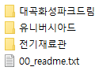
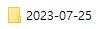

# 16일차

📅 2023년 7월 24일

## **📌 오늘 목표**

1. [머신러닝 매뉴얼](../project/manual/machine-learning.md)  작성하기
2. 딥러닝 모델 성능 분석에 대해서 발표
3. 3주차 주간보고서 작성

## **📌 모델 성능 분석 발표 및 3주차 주간 보고**

- [모델 성능 분석](../project/manual/list/7.md)

- [발표자료 보기](../report/week3_weekly-report.pdf)

## **📌 데이터 라벨링**

  

- 내일부터 유니버시아드 폴더 아래에 있는 33,709장의 이미지를 라벨링 자동화 프로그램을 통해 라벨링을 진행한다.

- 해당 폴더 아래에는 각 날짜별 시간별로 촬영된 이미지들이 존재한다.
- 라벨링된 결과물들은 라벨링을 수행한 각 날짜별로 보관해야 한다.
    
    

    
    

    
- 라벨링 툴은 labelImg를 사용한다.
- 라벨링 자동화 프로그램은 회사에서 제공해주었다.
    - 차량번호판을 대상으로 사전 학습된 모델을 사용하여 바운딩 박스의 위치를 추측해주기 때문에 라벨링 속도를 혁신적으로 줄일 수 있다.

## **📌 목표 설정**

1. [머신러닝 매뉴얼](../project/manual/machine-learning.md) 작성하기
2. 차량번호 데이터 라벨링