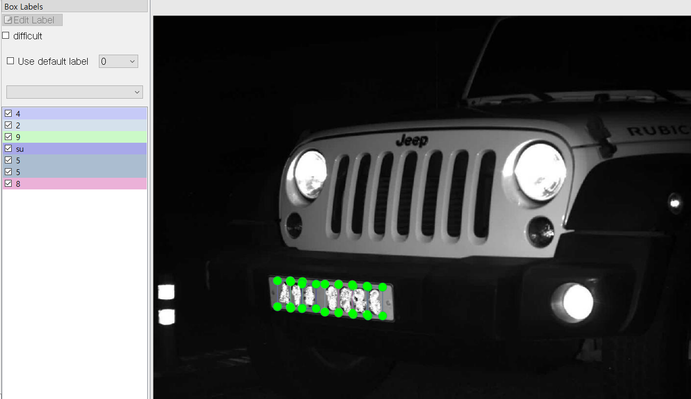

# 17일차

📅 2023년 7월 25일

## **📌 오늘 목표**

- 3,060개의 차량번호 데이터 라벨링 작업 (완료)

## **📌 라벨링 수행 과정**

- 3일차에서 사용했던 라벨링 툴인 [labelImg](https://github.com/HumanSignal/labelImg)을 사용하여 라벨링을 수행한다. ([3일차](https://www.notion.so/3-93dc0efdc4644a9dbab3b624c895e229?pvs=21))
- 회사에서 사용하고 있던 차량번호 인식에 대한 라벨링 자동화 프로그램을 사용하여 수고로움을 덜었다.
    - 이 프로그램은 yolov8로 학습된 가중치 파일을 사용하는 듯하다. (pt → onnx)
- 라벨링할 이미지 파일은 약 6만장이며, 구분할 클래스는 80개이다.
    - 숫자(10개), 한글(69개), 전기차(1개)
    - 해당 데이터는 회사 소유이며, 각 이미지는 그레이스케일로 변환되어 있다.
- 나의 역할은 모델이 예측한 차량번호가 실제와 일치하는지 확인하는 것이고, 만약 틀렸다면 수정하면 된다.
    - 간간히 틀린 부분이 많기도 하고, labelImg 툴이 다소 불편한 부분이 있어서 하루에 약 3천개의 라벨링 작업이 최선이다.

  

&nbsp;

## **📌 목표 설정**

- 2,857개 라벨링 수행