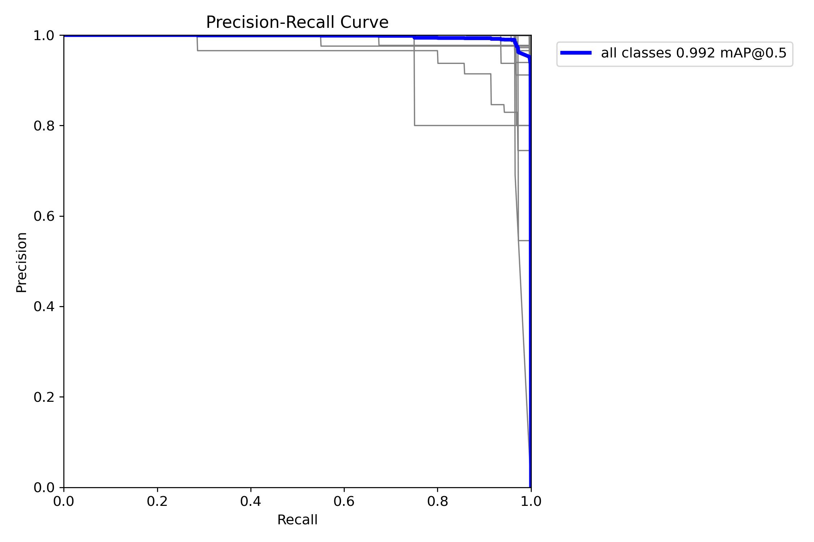
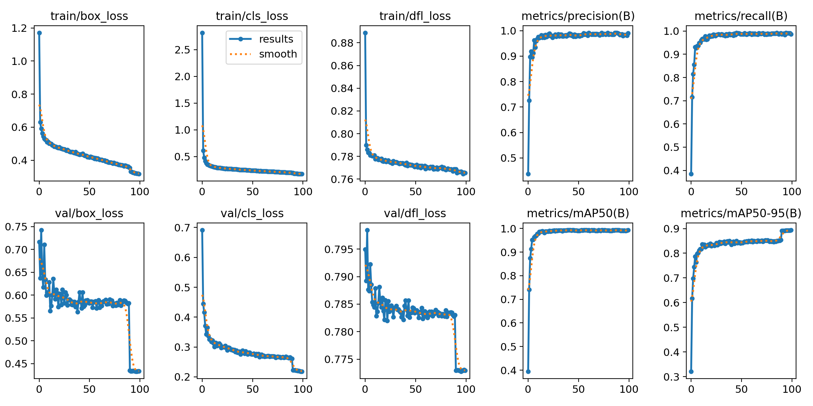
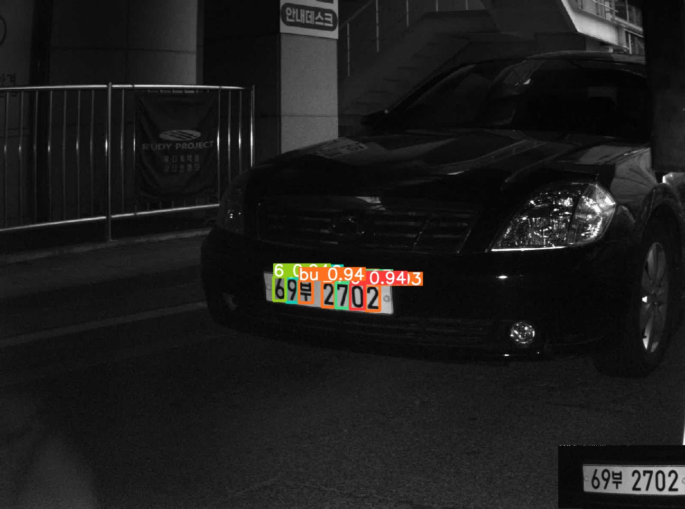

# 18일차

📅 2023년 7월 26일

## **📌 목표 설정**

1. 2,857개 라벨링 수행 (완료)
2. 5,917개 데이터 학습시켜보기 (완료)

## **📌 데이터 학습**

- YOLOv8 모델로 약 6000개의 차량번호 데이터를 학습시킨다.
1. 2일차 라벨링 작업
2. YOLOv8 파일 구조와 맞게 폴더 나누기
    - train:val:test = 7:2:1

```bash
input
├── images
└── labels

```

```bash
output
├── test
│   ├── images
│   └── labels
├── train
│   ├── images
│   └── labels
└── valid
    ├── images
    └── labels
```

```bash
pip install split-folders
```

```python
import splitfolders

splitfolders.ratio(input="input", output="output", seed=1337, ratio=(.7,.2,.1))
```

1. YOLov8m.pt 모델 사용하여 학습 진행
    - epochs=100, batch=32, imgz=640, patience=50
    - 약 5시간 소요

```yaml
test: ./dataset/test/images/
train: ./dataset/train/images/
val: ./dataset/val/images/

names: ['0', '1', '2', '3', '4', '5', '6', '7', '8', '9', ... , 'E']
nc: 80
```

```bash
from ultralytics import YOLO

model = YOLO('yolov8m.pt')
model.train(data="./dataset/data.yaml", batch=32, epochs=100)
```

1. 학습 결과

```bash
results = model.predict(source='./dataset/test/images', save=True)
```
<p align="center">
  
</p>

<p align="center">
  
</p>

<p align="center">
  
</p>

&nbsp;

## **📌 목표 설정**

- 3일차 라벨링 작업 계속