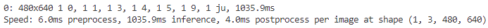
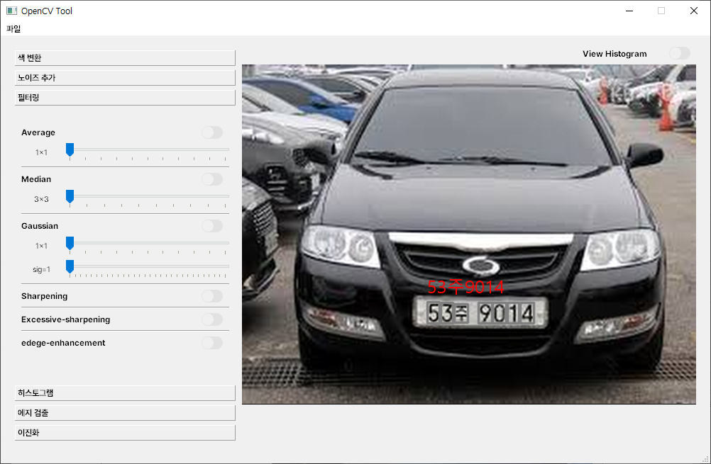
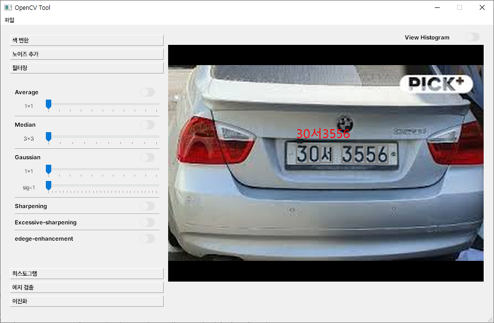

# 19일차

📅 2023년 7월 27일

## **📌 오늘 목표**

- 3일차 라벨링 작업 계속
- 어제 학습시킨 모델로 LPR 테스트

## **📌 LPR 테스트**

- LPR(License Plate Recognition)은 자동차 번호판을 카메라로 촬영한 이미지로부터 차량번호 데이터를 추출해 내주는 장치를 가리킨다.
    - 과거에 진행했던 [라즈베리파이에서 동작되는 간단한 LPR 시스템](https://github.com/hwan1625/Parking-Barrier-using-ANPR-on-RaspberryPi)을 구현한 적이 있다.
- 오늘은 어제 학습시킨 모델을 가지고 로컬 환경에서 잘 동작하는지 확인하였다.
- 기존 코드를 수정하여 원하는 출력 결과물이 나올 수 있도록 커스터마이징하였다.

### 수정 전 코드

```python
from ultralytics import YOLO

# YOLOv8
model = YOLO("best.pt")
results = model.predict(frame)   # results = model(frame)
frame = results[0].plot()
```

- 기존 코드는 bounding box와 탐지된 객체와 이름을 자동으로 매칭 해주는 형태였다.
- 독립적인 객체에 대해선 plot 메소드는 편리하지만 검출되는 차량번호는 일정한 순서에 따라 나열되어야 하는 서로 종속적인 형태를 가지고 있기 때문에 각 클래스에 대한 부가적인 코멘트를 제거하고 보다 보기 편한 bounding box를 그릴 필요가 있었다.

### Return results

- [**predict**]((https://docs.ultralytics.com/modes/predict/)) 메소드는 추론 결과를 반환한다.

```python
results = model(frame)

for result in results:
    boxes = result.boxes  # Boxes object for bbox outputs
    masks = result.masks  # Masks object for segmentation masks outputs
    keypoints = result.keypoints  # Keypoints object for pose outputs
    probs = result.probs  # Class probabilities for classification outputs
```

- boxes 내부에는 검출된 여러 bounding box들의 좌표들이 배열 형태로 저장되어 있으며, 이를 나타내는 좌표들은 여러가지 방법으로 표현되고 있다.

```python
boxes.xyxy  # box with xyxy format, (N, 4)
boxes.xywh  # box with xywh format, (N, 4)
boxes.xyxyn  # box with xyxy format but normalized, (N, 4)
boxes.xywhn  # box with xywh format but normalized, (N, 4)
boxes.conf  # confidence score, (N, )
boxes.cls  # cls, (N, )
boxes.data  # raw bboxes tensor, (N, 6) or boxes.boxes
```

### Bounding box 함수

- bounding box 기본 옵션을 커스터마이징 하기 위해 Annotator 클래스를 사용하였다.

```python
from ultralytics.utils.plotting import Annotator

for r in results:
	annotator = Annotator(frame)

	boxes = r.boxes
	for box in boxes:
    b = box.xyxy[0]
    c = box.cls
    annotator.box_label(b)
	
frame = annotator.result()
```

### 차량번호 정렬

- 차량번호는 검출된 bounding box의 left-top의 x 좌표를 중심으로 오름차순 정렬을 진행한다.
- 배열 형태로 정렬되기 때문에 마지막 연산으로 join 메소드를 사용하여 하나의 문자열로 합친다.

```python
classes = ['0','1','2','3','4',...,'E']

# 차량번호 정렬 - left_top, x축 중심으로 오름차순
data = results[0].boxes.cpu().numpy().data
sorted_data = data[data[:,0].argsort()]
sorted_clsIdx = [int(row[5]) for row in sorted_data]

# 차량번호 출력 - 클래스 매칭
car_number = ''.join(classes[idx] for idx in sorted_clsIdx)
print(car_number)
```

### 결과 화면

<p align="center">
  
</p>

- 추론 속도는 CPU 환경에서 750ms~1100ms 사이로 다소 느린 편이다.

<p align="center">
  
</p>

<p align="center">
  
</p>

&nbsp;

## **📌 목표 설정**

- 4일차 라벨링 작업 계속
- 실시간 영상에 대해서 LPR 테스트
- GPU 환경에서 학습 및 테스트 해보기