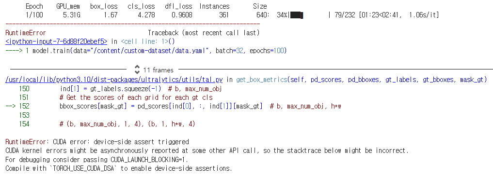
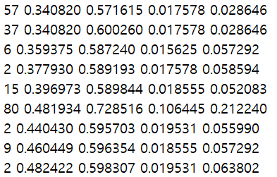
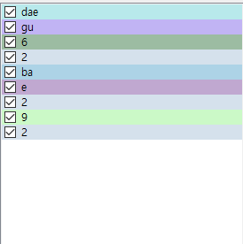
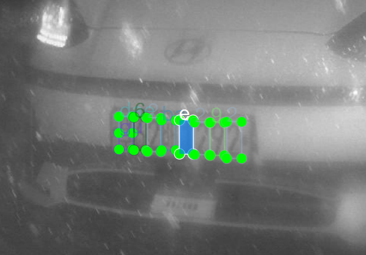
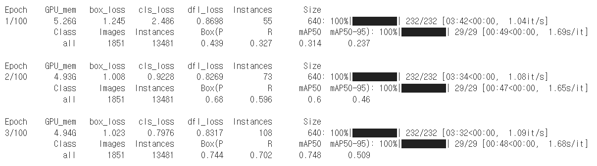

# 20일차

날짜: 2023년 7월 28일

## **📌 목표 설정**

- 4일차 라벨링 작업 계속
- GPU 환경에서 학습 및 테스트

## **📌 GPU 환경에서 학습**

- 실습생 3명이 지금까지 라벨링한 약 3만 장을 가지고 학습을 진행시켰다.
- 보급받은 노트북은 연산 속도가 낮기 때문에 회사 컴퓨터로 원격 접속하여 진행하였다.
    - CPU인 노트북에 비해 GPU를 사용하는 컴퓨터가 좋다.
- 일전에 [Colab](https://colab.research.google.com/drive/167cAbM_SpyiFLjmKhRr3IYI9fVLD5R6M?hl=ko)에서 진행했던 방식대로 진행하면 된다.

### 문제점 발생

<p align="center">
  
</p>

1. 학습 코드를 실행시켰더니 이유를 알 수 없는 오류만 나올 뿐이었다. 
분명 Colab에서는 잘 써왔는데 아무래도 코드의 문제가 아닌 듯하다.
2. 처음에는 torch + CUDA toolkit의 버전이 맞지 않아서 그런가 싶었지만 그 역시 아니었다.
 그런 것이었다면 회사에서 사용하고 있는 환경 설정이 잘못됐다는 것인데 지금 GPU를 잘 사용하고 계시기 때문에 이것도 원인이 아닐 것이다. (Anaconda 가상환경의 차이라고 생각했지만 그 역시 아니었다.)
3. 데스크톱 환경에서 안되니 Colab에서 3만 장을 학습시켜보기로 했다. 
이럴 수가? 지난 번과 다르게 1epoch이 채워지기 전에 에러가 떠버렸다. 
이 에러 문구는 데스크톱에서와 같았다.

### [해결 방법](https://brstar96.github.io/devlog/shoveling/2020-01-03-device_error_summary/)

- 그래서 구글링을 통해 여러가지 원인을 찾아보는 도중 아래 블로그에서 잘 정리한 글을 발견했다.
- 이 글을 읽는 순간 머리 속에서 훅 지나가는 상황이 그려졌다.


<h3 align="center">
    “혹시 라벨링을 잘못한 것 아닌가?”
</h3>

- 혹시나 하는 마음에 오라벨링을 검증해 보았다.
- 아래 코드는 클래스 개수를 초과하는 라벨이 기입되었을 때 파일 명을 출력해준다.

```python
import os

def check_files_in_folder(folder_path, n):
    # 폴더 내의 파일들을 확인
    for filename in os.listdir(folder_path):
        if filename.endswith(".txt"):  # 확장자가 .txt인 파일만 처리
            file_path = os.path.join(folder_path, filename)

            # 파일 내용을 읽어오기
            with open(file_path, 'r') as file:
                for line in file:
                    # 각 줄을 공백으로 분리하여 컬럼 값들을 리스트로 저장
                    columns = line.split()
                    # 첫 번째 컬럼의 값이 오버 인덱스이면 파일명 출력
                    if int(columns[0]) >= n:
                        print(filename)
                        break  # 파일 전체를 읽지 않고 다음 파일로 넘어감

# 클래스 개수
cls_num = 80
folder_path = "./lp30000/train/labels/"  # 폴더 경로를 실제 폴더 경로로 대체해야 합니다.
check_files_in_folder(folder_path, cls_num)
```

- 현재 프로젝트는 80개의 클래스로 구분되지만, 인덱스를 기입할 때는 0~79의 값만이 들어와야 한다.
- 이 파일에서 80번의 클래스는 존재하지 않기 때문에 오라벨링된 것임을 확인할 수 있다.

<p align="center">
  
</p>

- 뭐라고 라벨링 했길래 직접 알아보니 1을 e라고 라벨링 한 것이 문제였다…

<p align="center">
  
  
</p>

- 오라벨링된 파일을 제거하니 문제 없이 잘 동작했다.

<p align="center">
    
</p>

### 결론

- labelImg 프로그램은 classes.txt에 존재하지 않는 클래스를 라벨링했을 때 인덱스 범위를 초과하여 라벨링되도록 설계 되어있는 것 같다.
- 1 epoch은 모든 파일을 한 번씩 순회했다는 것을 의미하는데 잘 진행하다가 도중에 오류가 발생한다는 것은 해당 파일에 문제가 있다는 것을 암시한다.

## **📌 목표 설계**

- 5일차 라벨링 계속
- GPU 환경에서 학습시킨 모델 성능 확인하기