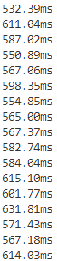
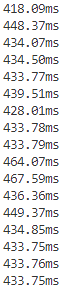
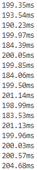
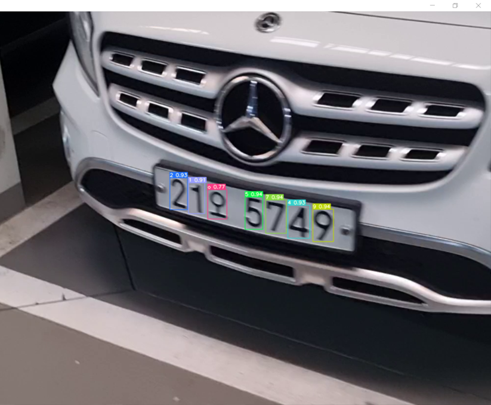

# 22일차

📅 2023년 8월 1일

## **📌 오늘 목표**

- GPU 환경에서 학습시킨 모델 성능 확인하기

## **📌 GPU 환경에서 객체 인식**

- 보급받은 PC는 Intel GPU를 사용하기 때문에 CUDA toolkit을 사용할 수 없다.
- 따라서 intel device에서 GPU를 사용하여 inference를 할 수 있도록 하는 openVINO 모델을 사용한다.
    - openVINO는 intel에서 제공하는 딥러닝 최적화 및 하드웨어 가속화 기능을 가진 툴킷이다.
    - intel의 GPU device를 활용하여 CPU보다 더 나은 추론 성능을 뽑아낼 수 있다.
    - 뿐만 아니라 intel의 CPU device를 사용하더라도 딥러닝의 작동에 기존보다 최적의 성능을 뽑아낼 수 있다.
    - 다양한 딥러닝 프레임워크의 모델들을 openVINO 모델로 변환하여 intel device에 최적화된 inference를 할 수 있도록 한다.
- 아래 그림은 각각 original CPU / openVINO CPU / openVINO GPU를 사용하여 FPS를 계산한 결과이다.
    - OpenVINO-CPU를 사용할 때, 사용하지 않았을 때보다 24.7% 정도 속도가 향상되었다.
    - OpenVINO-GPU를 사용할 때, 사용하지 않았을 때보다 66.2% 정도 속도가 향상되었다.
    - OpenVINO-GPU를 사용할 때, OpenVINO-CPU 보다 55.7% 정도 속도가 향상되었다.

  
  &emsp;&emsp;&emsp;&emsp;
  
  &emsp;&emsp;&emsp;&emsp;
  

|  | Original CPU | OpenVINO CPU | OpenVINO GPU |
| --- | --- | --- | --- |
| 평균(ms) | 582ms | 438ms | 196ms |

&nbsp;

  

&nbsp;
## **📌 목표 설정**

- 새로운 프로젝트: 차량 높이 검출 방법에 대해