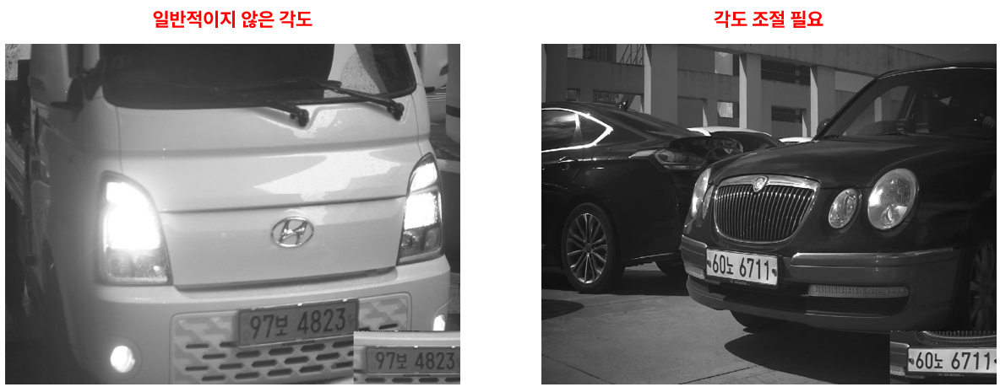
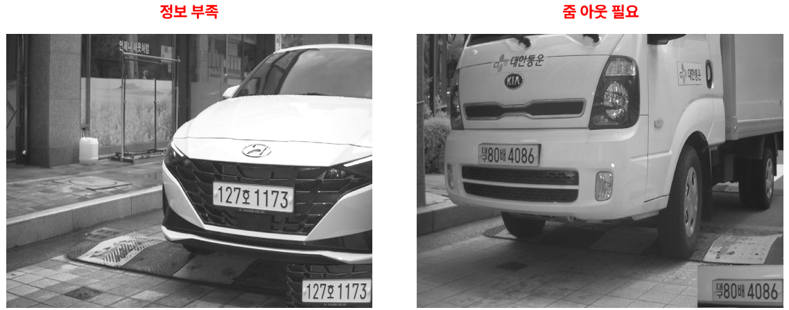
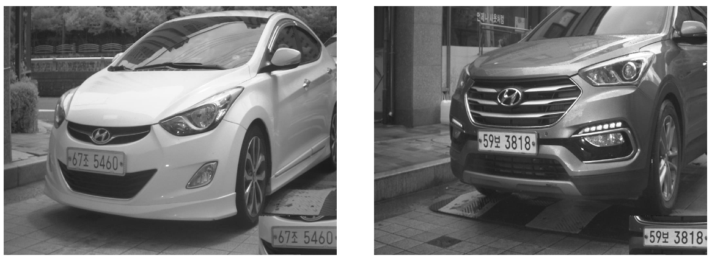

# 24일차

📅 2023년 8월 3일

## **📌 오늘 목표**

- 운전자석 높이 추정 방법에 대해서 발표

## **📌 [운전자석 높이 추정 방법에 대해서](../report/week4_weekly_report.pdf)**

### 📷 카메라 위치 변경

- 기존 데이터 만으로는 한계가 있다.
- 어제는 한정적인 데이터(차량 전면)만을 가지고 수행해야 했다.
- 따라서 더 많은 정보를 수집할 수 있도록 카메라 위치를 변경한다.
- 장소와 관계없이 촬영된 이미지는 SUV 기준으로 차량 전체를 볼 수 있도록 카메라를 설치한다.
- 변경된 카메라 위치로 얻은 이미지는 바퀴 크기, 백미러 위치, 전면 유리의 위치 등의 정보를 얻을 수 있다.
- 하지만 차량 번호 식별이 가장 먼저 보장 받아야 한다는 것을 명심해야 한다.

&nbsp;
- 아래 그림은 설치 조건에 만족하지 않는 사진이다.

  

  

&nbsp;

- 아래 그림은 설치 조건에 만족하는 사진이다.

  

### 📷 카메라 추가

- 지금까지는 추가 설치 비용을 들이지 않고 할 수 있는 방법들을 생각했었다.
- 하지만 정확한 운전자석 높이를 추정하기 위해서는 카메라를 추가하는 것이 좋다고 판단된다.
- 기존 차량번호 인식기는 차량번호를 목적으로 배치되어 있기 때문에 변경사항에 제한적일 수 있다.
- 따라서 카메라를 요금 정산기 부근에 설치하여 운전자 식별을 통한 높이 추정을 할 수 있다.

### 📑 그 외 논문에서

> 정재호, 김정주, 신동민.(2021).딥러닝 기반 이미지 처리를 이용한 통행 차량 높이검출 시스템.한국산학기술학회 논문지,22(7),621-626.
> 

> 황석영, 이상윤 , 최용수.(2020).단안 카메라 취득 영상의 차량 전면 유리 특징 추출에 의한 높이 분류 알고리즘.대한전자공학회 학술대회,(),1854-1857.
> 

> 최용수.(2022).Drive-Thru매장 Touch Panel의 편의성을 위한 주문자 높이 검출 시스템.한국소프트웨어감정평가학회논문지,18(1),89-94.
> 

&nbsp;

## **📌 목표 설정**

- 어제 진행했던 차량 전면을 통한 차종 분류를 하는 아이디어가 가장 현실적이라는 피드백을 받았다.
- 따라서 이제부터는 1만장 정도의 학습 데이터 생성 및 학습을 통해 실현 가능성을 판단한다.