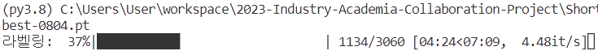
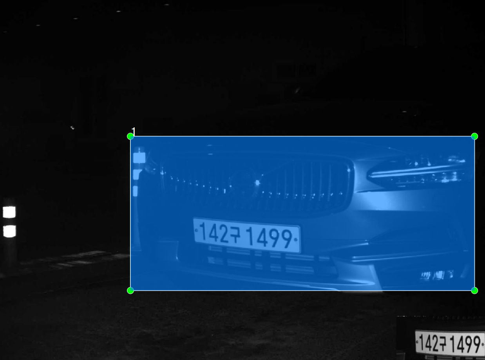
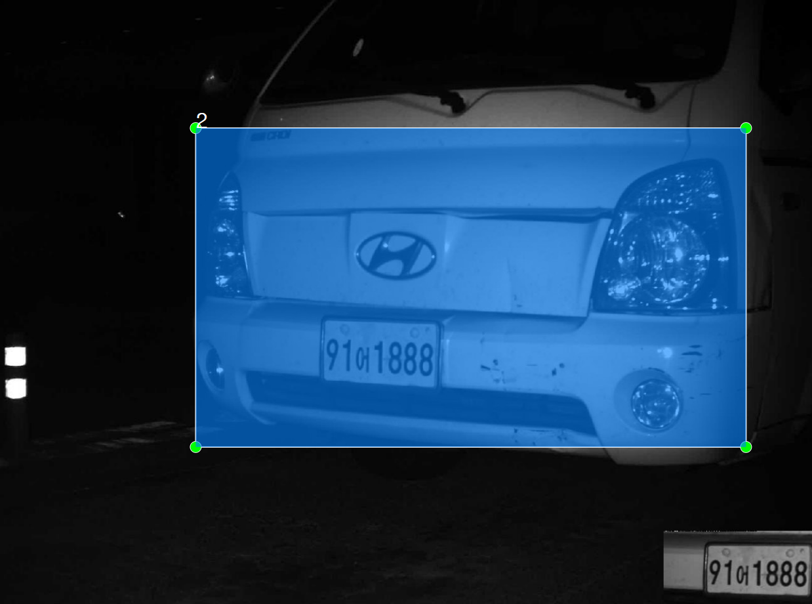
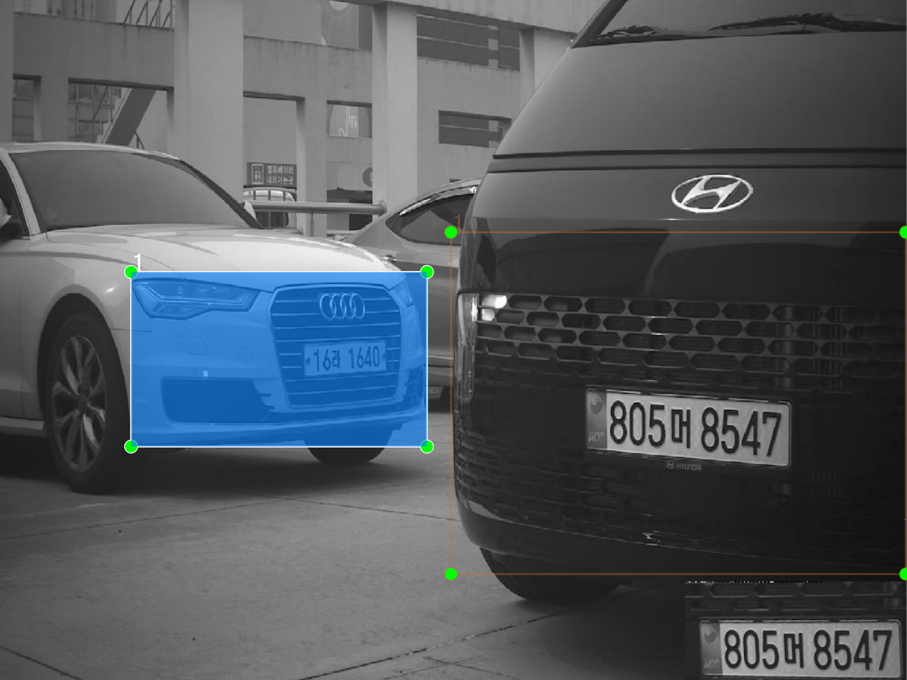

# 25일차

📅 2023년 8월 4일

## **📌 오늘 목표**

- 3단계 차종 분류를 위한 차량 전면 라벨링

## **📌 오토라벨링**

- 회사에서 제공한 오토라벨링 프로그램은 차량번호를 대상으로 하였다.
- 지금은 차량번호가 아닌 차량 전면을 라벨링 해야하기 때문에 오토라벨링에 사용되는 가중치 파일을 바꿔줘야 한다.
- 일전에 1,000개 가량으로 학습시킨 가중치 모델을 사용하여 오토라벨링을 수행하였다.

### 새로운 오토라벨링 제작

- 가중치 파일을 전환하였지만 제대로 동작하지 않았다.
- 따라서 새로운 오토라벨링 프로그램을 제작했다.
- YOLO의 데이터 라벨 .txt 파일 내부 구조는 클래스번호, x, y 좌표, 너비, 높이의 조합으로 이루어져 있다.
- YOLO 모델의 predict 수행 후 반환되는 results를 통해 검출된 클래스 번호와 바운딩박스의 좌표를 구할 수 있다.

```python
# 0 0.6821153163909912 0.6356258988380432 0.6357693672180176 0.4138396680355072
results = pt_model.predict(source=img, verbose=False)
for r in results:
    table = []
    boxes = r.boxes
    for box in boxes:
        row = []
        row.append(int(box.cls))
        for xywh in box.xywhn.squeeze().tolist():
            row.append(xywh)
        table.append(row)
```

<p align="center">
  
</p>

### 라벨링 수행

- 제작한 오토라벨링을 사용하여 1,000장 정도의 학습 데이터를 추가 생성하였고, 오토라벨링의 정확도를 높이기 위해 총 2,000장 정도를 다시 학습시켜 새로운 가중치 파일을 생성하였다.
- 더 높은 정확도를 가진 가중치 파일 덕분에 수정해야 할 이미지의 개수를 확실히 낮출 수 있었다.

<p align="center">
  
  
</p>

&nbsp;

## **📌 운전자석 높이에 따른 단계 분류에 대해서**

<p align="center">
  
</p>

- 차량 번호 앞자리의 정보로 차종의 카테고리를 구분할 수 있다.
    - 01~69: 승용차
    - 70~79: 승합차
    - 80~97: 화물차
- 지금까지 모든 승용차는 1단계의 높이를 가지며, 모든 화물차는 2단계 이상의 높이를 가진다고 생각했다.
- 하지만 소형 화물차는 트럭 뿐만 아니라 **승용차와 비슷한 외형**을 가질 수 있음을 목격했고, 1단계와 2단계 사이의 높이에 위치하고 있을 수 있다는 것을 알았다.
- 따라서 이와 같은 경우에 승용차와 같은 1단계로 분류를 진행하고, 만약 1단계 차량이 화물차 번호에 해당된다면 B라는 새로운 단계에 위치시킨다.
    - 높이 순으로 A < B < C 로 구분하였다. (3단계는 D)
    - 차량 번호를 더 신뢰하도록 한다.

<div align="center">

|  | not(80~97) | in(80~97) |
|:---:|:---:|:---:|
| **1단계** | A | B |
| **2단계** | C | A |

</div>

&nbsp;

## **📌 목표 설정**

- 1만 장 가량의 학습 데이터를 확보하여 학습을 진행한 후 결과를 보고한다.