# 26일차

📅 2023년 8월 7일

## **📌** 오늘 목표

- 단계별 높이 분류에 대해서
- 약 1만개 가량 차량 전면 라벨링 및 데이터 학습

&nbsp;
## **📌** 단계별 높이 분류

  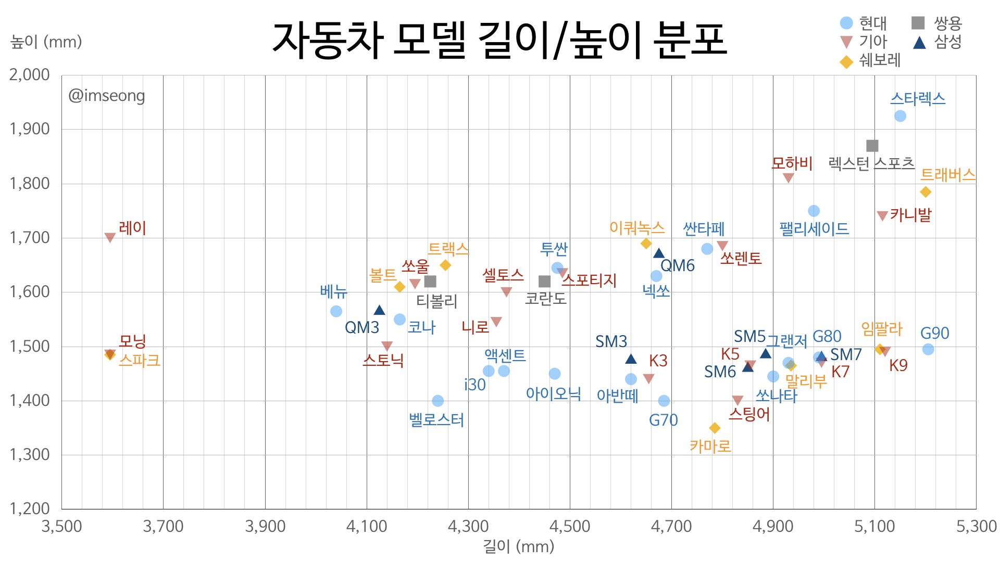

### 🚗 승용차 (01~69)

- 대부분의 키오스크는 승용차의 운전자석 높이에 맞춰져 있기 때문에 A 단계로 분류한다.

|  | 전고(cm) | 단계 | class |
| --- | --- | --- | --- |
| 모든(세단~SUV) | 135~180 | 1 | A |

### 🚌 승합차 (70~79)

- 소형 승합차는 스타렉스와 같은 일반 승용차와 비슷한 외형을 가지지만 승합차의 평균 높이를 고려하여 B단계로 분류한다.
- 중형버스~대형버스는 전고의 차이가 크더라도 운전자석의 높이 위치는 일정하다.
- C단계의 승합차를 아직 발견하지 못했다.

|  | 전고(cm) | 단계 | class |
| --- | --- | --- | --- |
| 스타렉스 | 190~200 | 1 | B |
| 중형버스 | 280 | 2 | D |
| 대형버스 | 330 | 2 | D |

### 🚚 화물차 (80~97)

- 승용차에 비해 화물차는 바닥 높이가 더 높기 때문에 전고가 같더라도 더 높은 단계를 부여한다.
- 스타렉스, 픽업트럭, 다마스, 라보는 일반 승용차와 비슷한 외형을 가진다.

|  | 전고(cm) | 단계 | class |
| --- | --- | --- | --- |
| 스타렉스, 픽업트럭 | 180~190 | 1 | B |
| 0.5톤 (다마스, 라보) | 200 | 1 | B |
| 1~1.4톤 | 220~230 | 2 | C |
| 2.5~3.5톤 | 260~270 | 2 | C |
| 5톤 | 300~320 | 2 | D |
| 11톤 이상 | 330 | 2 | D |

### 💡 class 최종 정리

|  | 01x~69 (승용차) | 70~79 (승합차) | 80~97 (화물차) | 98~99 (특수차) |
| --- | --- | --- | --- | --- |
| 1단계 | A | B | B | B |
| 2단계 | A | C~D | C~D | C~D |

- 모든 승용차는 A class이기 때문에 2단계로 검출되더라도 오류로 판단한다.
- 가장 작은 승합차/화물차는 대표적으로 스타렉스와 같이 대형 SUV와 비슷한 외형을 가지기 때문에 1단계로 분류되지만 승용차에 비해 바닥 높이가 높기 때문에 최소 B class로 판단한다.
- 화물차 중에서도 1톤 이하의 화물차량은 1단계로 분류되며, 카고트럭 또는 탑차와 같은 외형은 2단계로 분류된다.
- D class인 대형버스, 대형화물차의 경우는 현재까지 그 높이를 측정할 방도가 부족하다.

&nbsp;
## **📌** 1차 학습

- 클래스는 1~2단계로 축소하였다.
    - 3단계 클래스는 2단계의 형상과 구분할 수 없을 것 같다.
- 약 7천개 가량 데이터를 가지고 학습을 진행시켰다.
    - yolov8n.pt
    - epoch: 30, batch-size: 32, img-size: 640
    - 1시간 30분 소요

  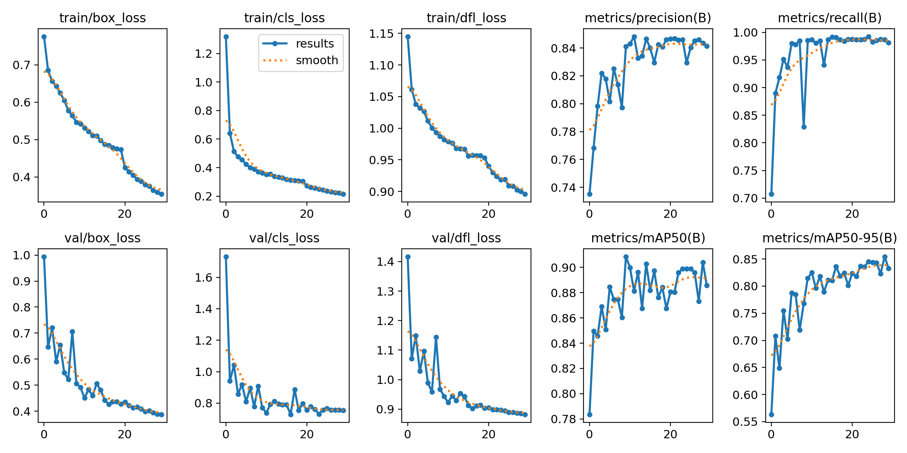

  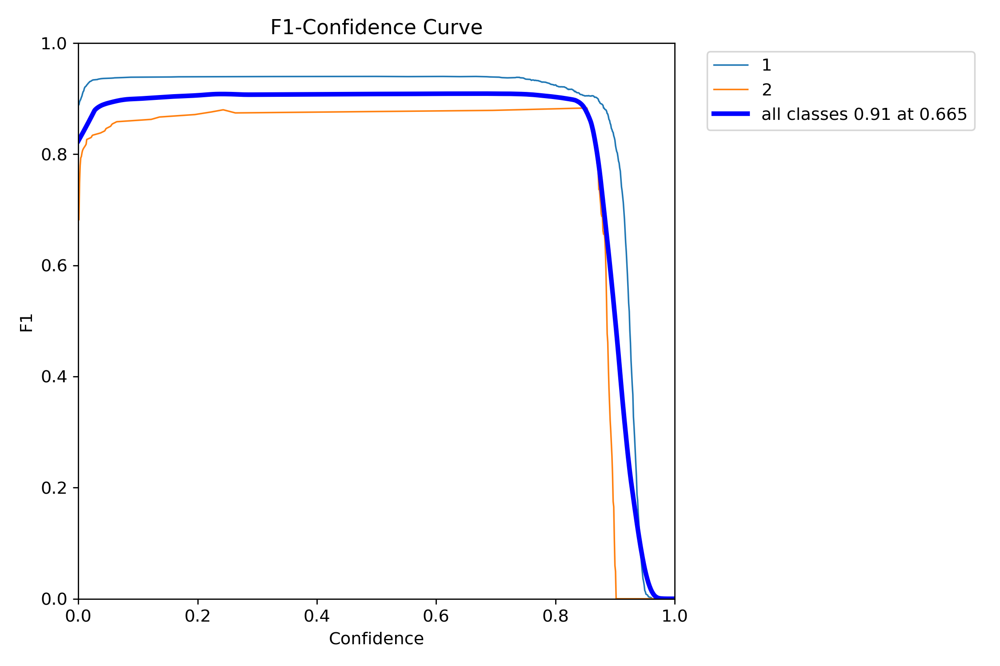
  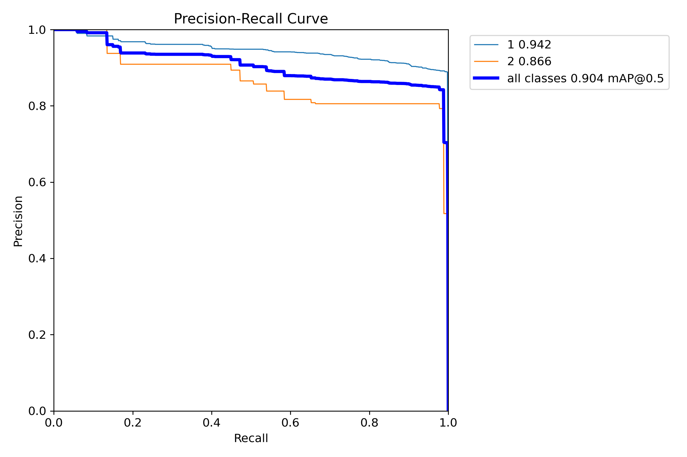

&nbsp;
## **📌** 2차 학습

- 약 1만2천개 가량 데이터를 가지고 학습을 진행시켰다.
    - yolov8n.pt
    - epoch: 30, batch-size: 32, img-size: 640
    - 1시간 30분 소요

  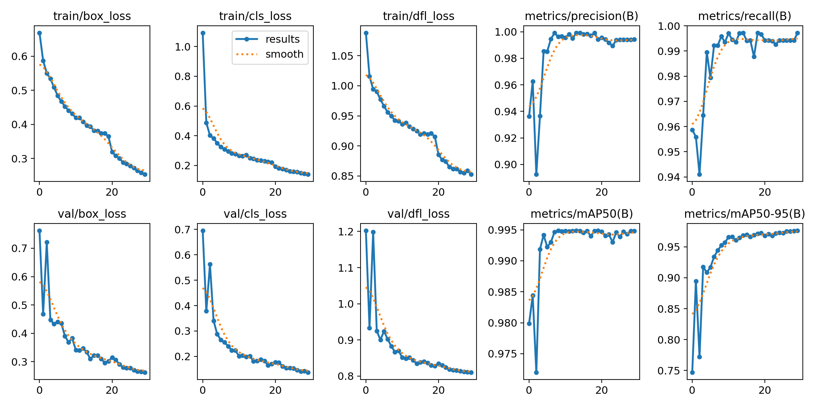

  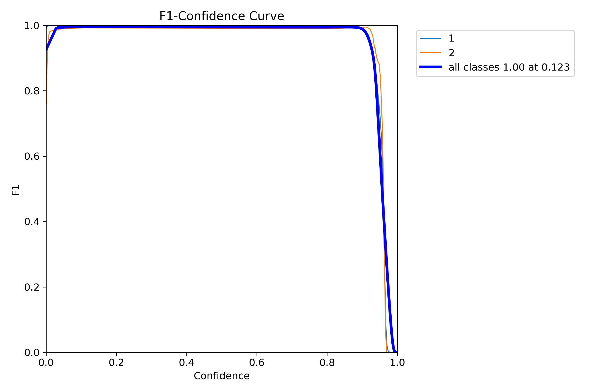
  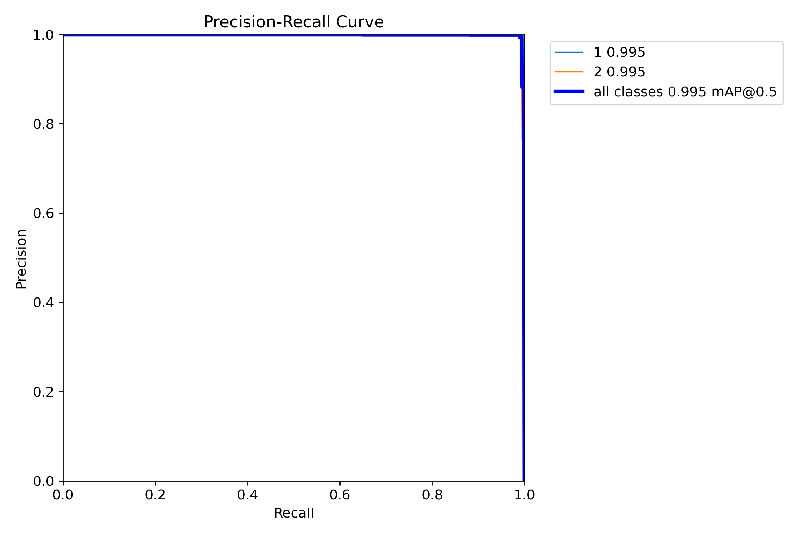

&nbsp;
- 다양한 각도와 밝기에서 높은 확률로 검출되고 있음을 확인할 수 있다.

  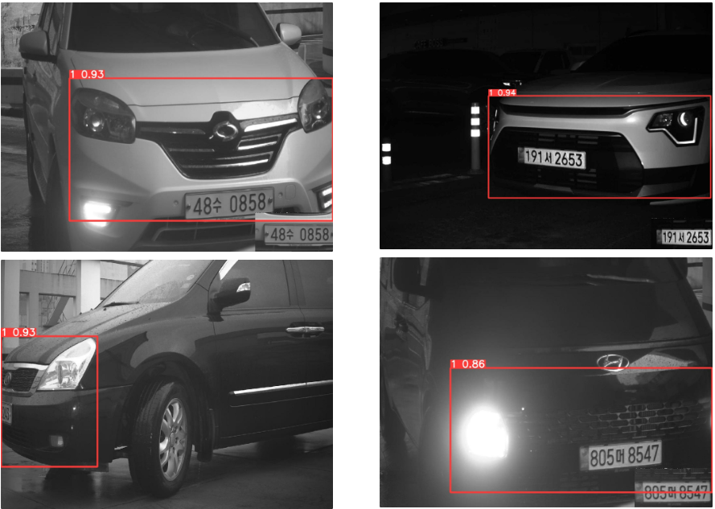

&nbsp;
- 흔하지 않은 소형 자동차 모델에도 헤드라이트 특성이 반영되어 잘 분류된 것을 확인할 수 있었다.
    - 사실 트럭이 워낙 독보적인 특성을 가지고 있어서 그럴 수 있다.

  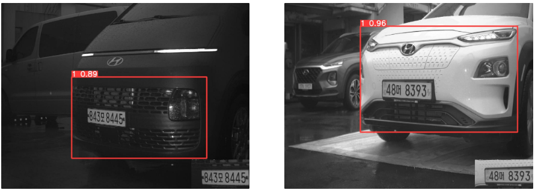

&nbsp;
- 잡음이 낀 영상에 대해서 인식이 가능한 것으로 확인되었다.

  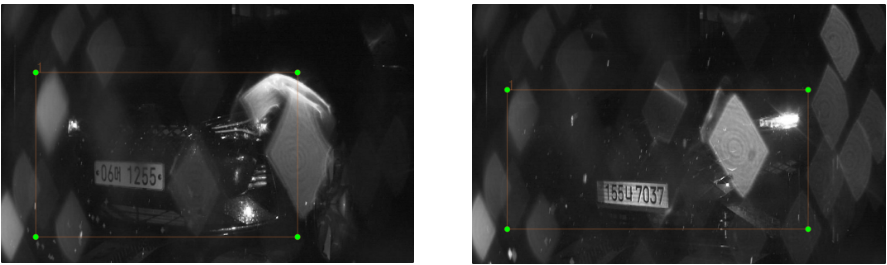

&nbsp;
- 전형적인 트럭의 형상은 거의 100%에 가깝게 인식되는 것을 확인할 수 있었다.

  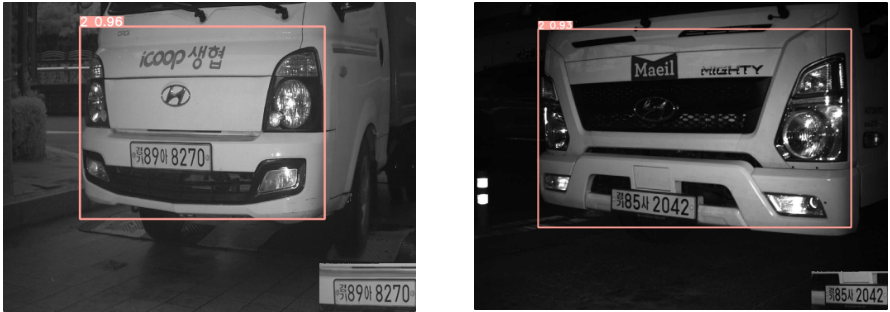

&nbsp;
## **📌 목표 설정**

- D class 높이 추정 방법에 대해서