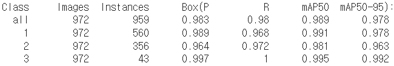
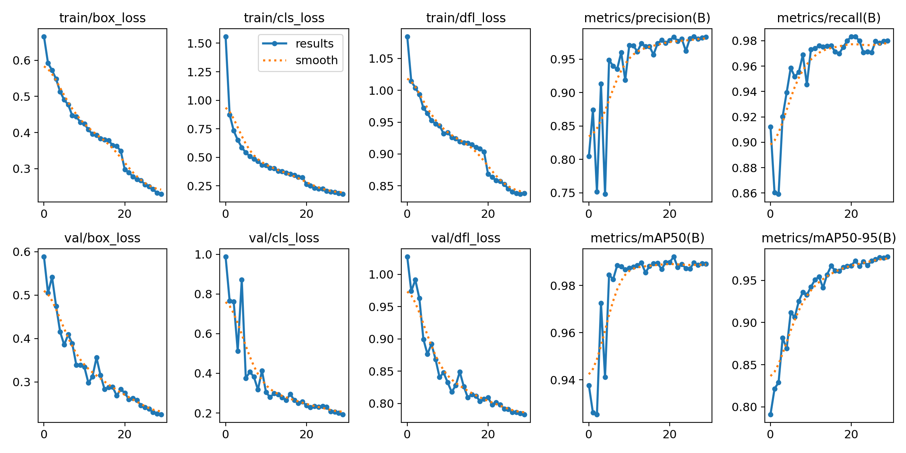
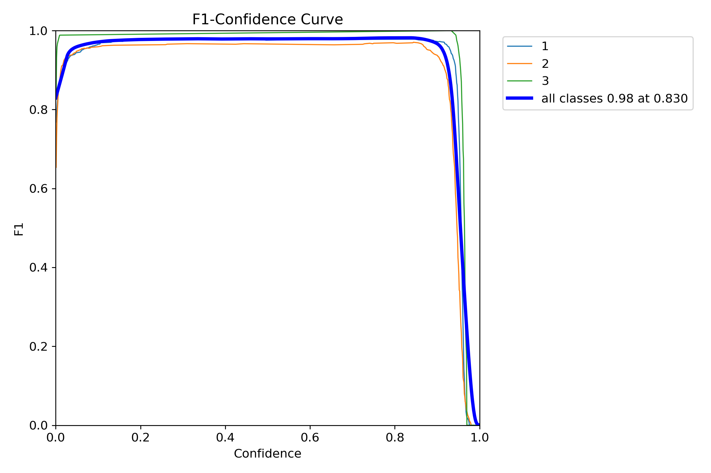
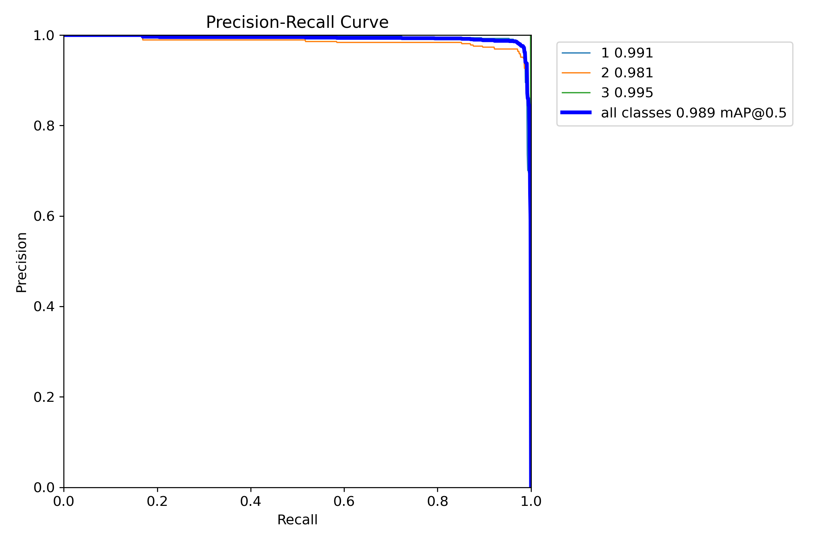
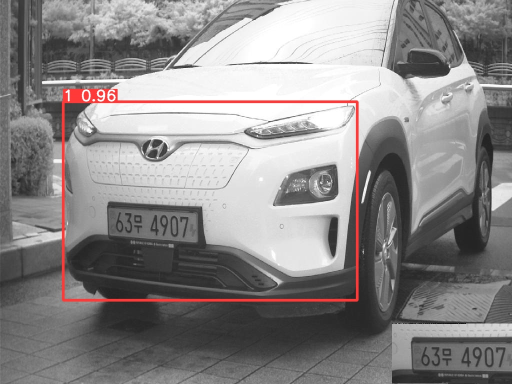
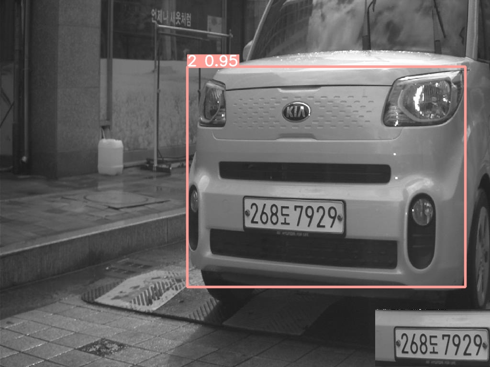

# 30일차

📅 2023년 8월 11일

## **📌 오늘 목표**

- 라벨링 마무리하고 5,000장 학습시키고 가능성 확인하기

&nbsp;
## **📌 학습 결과 분석**

- 약 5,000개의 학습 데이터를 생성하여 학습을 진행시켰다.
    - batch-size: 16
    - epochs: 30
    - img-size: 640
- 3단계인 트럭(화물차)는 완벽에 가깝게 분류해낼 수 있음을 검증 데이터에서 확인되었다.

  

  

  
  

&nbsp;
## **📌 차종 분류에 대한 가능성**

### 가능성 분석

원래 **세단의 차량 전면(A)** 형상과 **SUV의 차량 전면(B)** 형상을 기준으로 1~2단계로 나누려고 했다. 하지만 소형 SUV의 경우에는 세단과 전고 차이가 크게 없을 수 있다는 예외의 모델이 존재했기 때문에 전고를 기준으로 나눠야 좀 더 근거있는 분류가 되지 않을까 생각했다.

차량 전고 1,600mm를 기준으로 1~2단계로 분류 작업을 했다. 앞서 말했듯이 간혹 소형 SUV의 경우에 1,600mm에 못 미치는 경우가 있어 1단계로 분류했다.

라벨링을 하면서 과연 이 모델은 소형 SUV와 중대형 SUV의 형상을 잘 구분할 수 있을까 의심도 들었다. 하지만 생각보다 아래 그림과 같은 소형 SUV도 1단계로 잘 분류해내는 것을 볼 수 있었다.

  

&nbsp;

아래 그림은 기아에서 만든 레이라는 모델이다. 레이는 1,700mm의 전고를 가져 2단계로 분류했었다. 하지만 실제로 운전자석 높이를 재보지 못했기 때문에 확실한 분류인지는 장담하지 못하지만 이 모델은 **내가 원하는 것을 도출해낼 수 있다는 가능성**을 보여주었다.

  

&nbsp;

솔직히 차량 모델을 외워버렸다는 표현이 맞을지도 모른다. 완전 새로운 모델이 출시되면 인식이 잘 될 것 인지에 대해서는 부정적인 의견을 가지고 있다.

### 높이 분류의 재정리

전고에 따른 분류도 좋지만 제일 좋은 것은 운전자석 높이에 따른 분류일 것이다. 하지만 몇 백이나 되는 모델에 대해 친절하게 운전자석 높이까지 표기해준 제원표는 거의 없었다. 그냥 추측할 뿐이었다.

가장 무식한 방법은 쏘카와 같은 대여점에 양해를 구해 일일이 차량 운전자석 높이를 재보는 것이다.

혹은 1,600mm였던 임계값을 1,650mm나 1,700mm로 확실하게 올리는 것이다. 1,700mm이상은 애매할 것 없이 확실하게 높은 차량이기 때문이다.

&nbsp;
## **📌 목표 설정**

- 정확한 분류 기준 세우기
- 기준에 따른 라벨링 작업