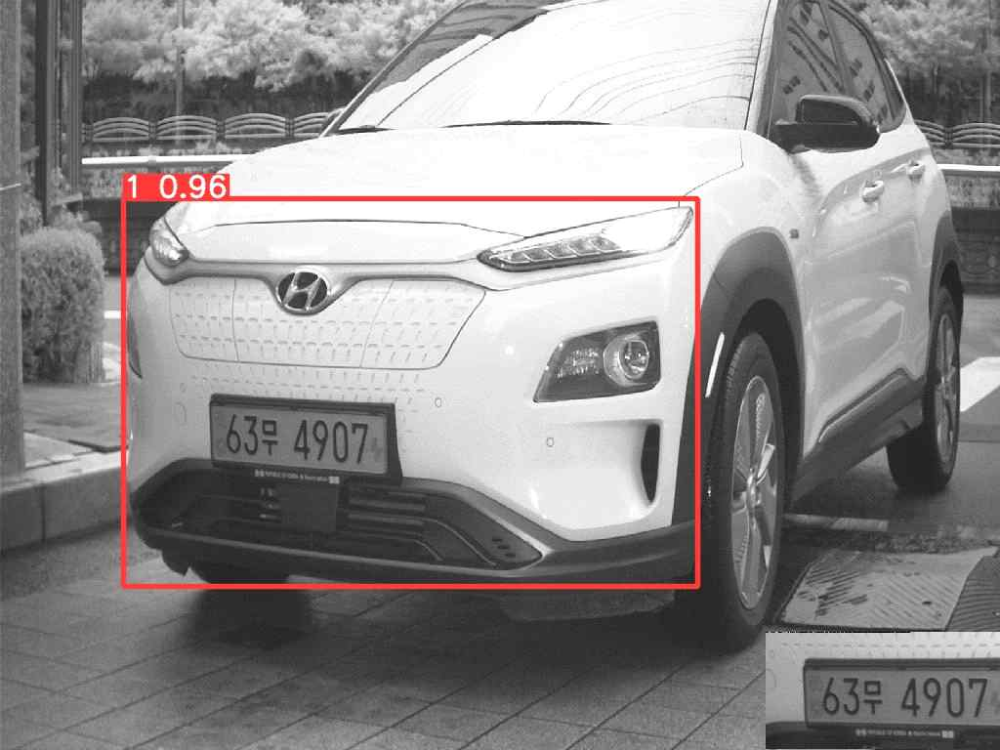
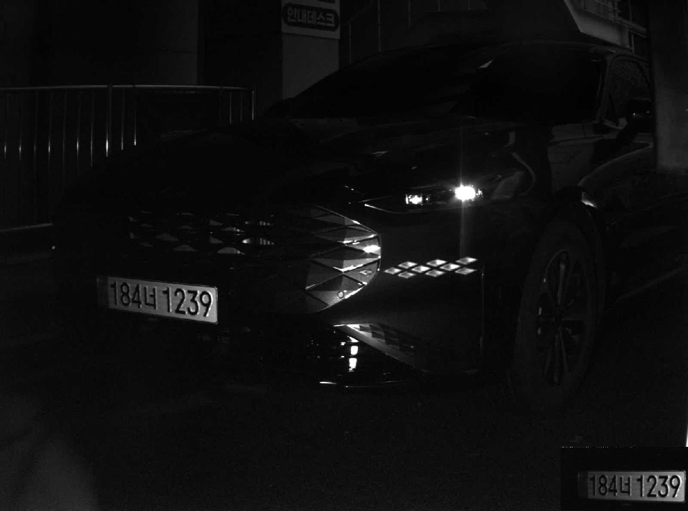
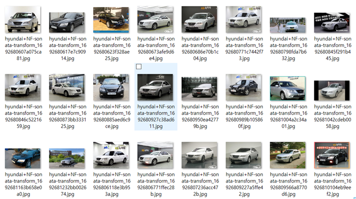
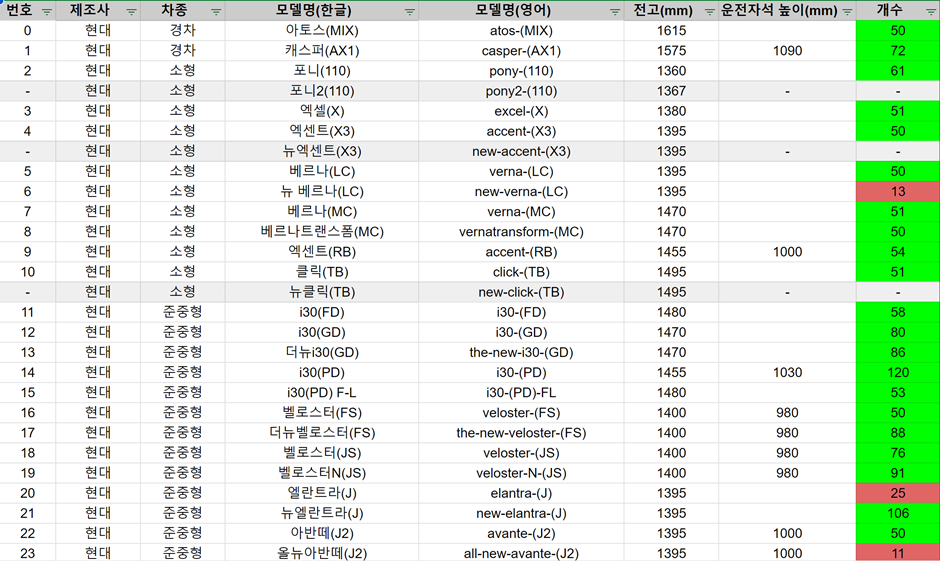
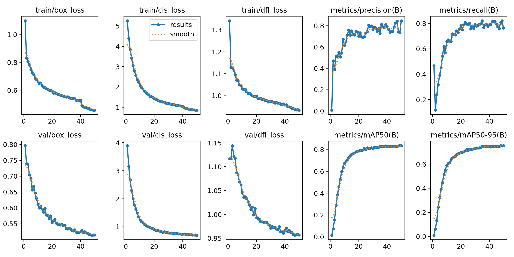
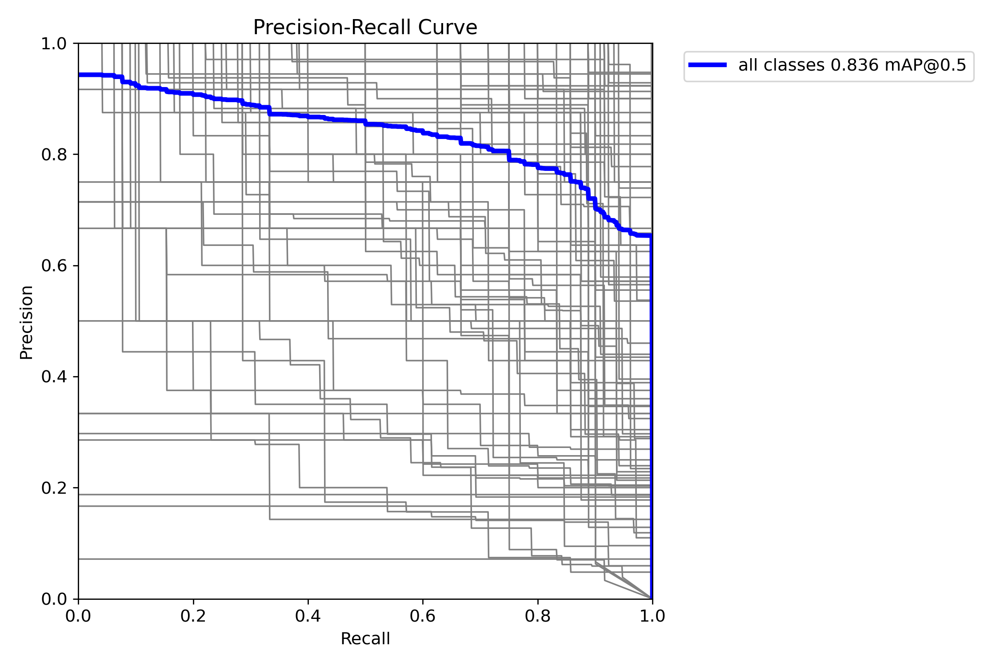
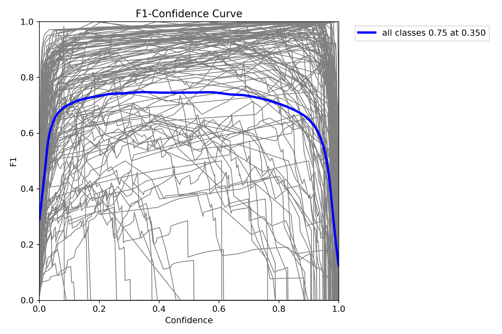
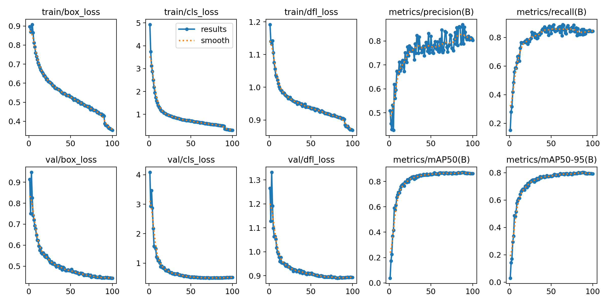
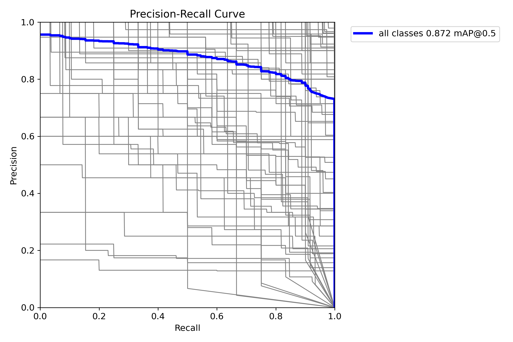
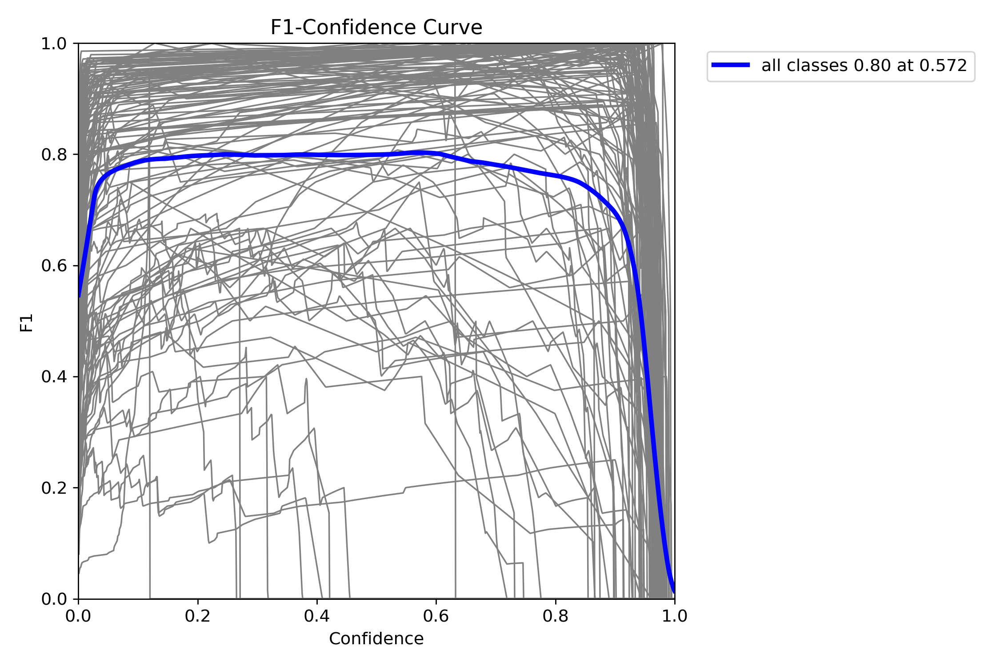

# 🚩 운전자석 높이 추정 방법

<div align="center">

|||
| :---: | :---: |
| 수행 기간 | 2023.08.07 ~ 2023.08.29 |
| 주제 | 딥러닝을 이용한 운전자석 높이 추정 방법 연구. |
| 수행 배경 | 주차 요금 정산 결제 태그 높이에 대해 운전자 불편 호소 |

</div>

### 📃 수행 조건

1. 현장에 설치되어 있는 LPR 시스템에서 최소의 비용으로 문제를 해결한다.
    - 카메라 위치 변동 없음.
    - 카메라 개수 추가 없음.
2. 차량번호인식에 사용되는 YOLO 아키텍처를 사용하여 문제를 해결한다.
    - 새로운 기술을 적용하여 설계 및 연구 비용을 늘리기 보다 기존에 사용되어 왔던 기술을 사용하여 가능성을 확인함으로써 비용을 줄인다.

### 🛠️ 실행 환경

- 컴퓨터(PC)
    - CPU - Intel(R) Core(TM) i5-8350U CPU @ 1.70GHz
    - RAM - 8.0GB, 24000MHz
    - SSD – SN530 SDBPNPZ-256G-1004
    - GPU – Intel(R) UHD Graphics 620
- IDE
    - Visual Studio Code
    - Google Colab
- requirements
    
    ```python
    python=3.8
    ultralytics>=8.0.x
    Pillow=9.3.0
    opencv-python=4.8.0.74
    selenium=4.11.2
    ```
    
&nbsp;
# 1️⃣ 첫 번째 시도: 3단계 높이 분류

가장 먼저 인간의 눈으로 보기에 구분이 가능하면서 높은 바닥 높이를 가지는 아래 3단계 분류를 기준으로 프로젝트를 수행했다. 3개의 객체로 구분만 가능하면 되기 때문에 아래 그림과 같은 결과를 만들어 낼 수 있었다.

1. 경차/소형차
2. SUV/대형차
3. 트럭/버스

<p align="center">
  
</p>

이 방법으로 진행하면서 느낀 점은 바닥 높이가 높은 소형 차량이 있을 수 있고, SUV라고 해서 바닥 높이가 낮다고 볼 수 없다는 것이었다. 따라서 ***3단계만으로 일반화하는 것은 큰 무리가 있다***고 판단했다.

&nbsp;
# 2️⃣ 두 번째 시도: 카테고리별 차종 분류

&nbsp;
## 🗨️ 개요

자동차 생산 경쟁이 치열한 현재 상황에서 새로운 형태의 차량이 계속 생산되고 있다. 첫 번째 방법에서 학습된 모델은 이러한 변화에 쉽게 적응하지 못하기 때문에 오인식률이 높을 수 밖에 없다. 이를 해결하기 위해서는 새롭게 납품되는 차량 데이터를 주기적으로 수집해야 하며, 이것을 학습 데이터로써 활용되어져야 한다. 이것은 곧 지속적인 유지보수 비용을 야기할 수 있다.

하지만 이 프로젝트를 수행하기 위해 YOLO 아키텍처를 사용하기로 한 이상 유지보수 비용을 피할 수 없다. 왜냐하면 새로 추가된 차종에 대해 학습 데이터를 주기적으로 추가해야 하기 때문이다. 결국 차종 별로 학습 데이터를 각각 모아야 한다면 첫 번째 방법과 같이 모호하게 객체를 분류하기 보다는 차라리 좀 더 세부적으로 카테고리를 분류해내는 것이 운전자석 높이에 대한 정확도와 이후 기술 확장 및 접목에 더욱 더 생산적일 것으로 판단했다.

전 세계적으로 납품되고 있는 차종은 천 단위이기 때문에 클래스를 잘 분류할 수 있을지 의문이 들 수 있다. 그리고 카메라 촬영 구도 상 차량 전면 이미지만으로 파악해야 하기 때문에 차종을 알아내기 위한 특징 정보가 부족할 수 있다. 

따라서 두 번째 방법에 대한 프로젝트의 가능성을 확인하고자 국내에서 유명한 현대 자동차의 136개 클래스를 대상으로 프로젝트를 진행한다.

&nbsp;
## 🌐 데이터 수집

### 문제점

현재 운용되고 있는 LPR 시스템의 특정 site에서 출몰하는 현대 자동차 2,000대 중에서 고작 63종 만이 검출되는 것을 확인했다. 

이 문제는 차량 연식이 너무 오래 되었거나 이미 단종된 차량에 대해서 ***데이터 획득 빈도가 너무 낮기 때문에*** 목표 개수를 채우기 위한 데이터 수집에 어려움이 있을 수 있다. 또한, 검출되지 않는 나머지 73종에 대해서 데이터를 획득할 수 있는 빈도가 너무 낮아 클래스 분산이 커지게 되고 결과적으로 ***데이터 불균형을 야기***할 수 있다.

뿐만 아니라 LPR 시스템에서 촬영된 이미지들 중에서 특히 아래 그림과 같이 어두운 환경에 대해서 인간의 실수로 인해 섣부른 라벨링을 할 수 있기 때문에 학습 데이터의 순도가 떨어질 수 있다. 

<p align="center">
  
</p>

### 해결 방법

이를 해결하기 위해서 획득 빈도가 낮은 데이터들은 외부에서 얻어오는 방법으로 해결한다. Chrome 웹 브라우저를 통해 Google과 Yandex 에서 떠돌아 다니는 방대한 차량 이미지를 대상으로 현대 자동차 136종의 모든 데이터들을 ***크롤링***하여 학습 데이터를 생성한다. 수집된 이미지들은 아래 조건에 맞게 수집되었다.

1. 차종 별로 50개 수집
2. width ≥ 640px, height ≥ 480px
3. 하나의 이미지에 오직 하나의 차량만이 존재해야 하며 중복 라벨링을 피할 수 있도록 한다.

<p align="center">
  
</p>

수집 목록과 카테고리별 차량제원은 아래와 그림과 같이 정리하였다.

<p align="center">
  
</p>

&nbsp;
## 🔄 데이터셋 튜닝

크롤링으로 얻은 데이터셋 만을 가지고 학습시킨 모델을 현장에서 사용되고 있는 LPR 시스템에 적용하는 것은 아래와 같은 원인으로 정확도 향상에 장애물이 될 수 있다.

1. 서로 다른 이미지 크기
2. 보정이 들어간 그래픽 이미지
3. 일정하지 않은 카메라와 관심 물체 사이의 거리

그렇기 때문에 학습된 모델이 더 높은 정확도를 가지게 하기 위해서는 크롤링 데이터를 LPR 시스템이 촬영한 이미지로 교체하는 데이터셋 튜닝 과정을 거쳐야 한다. 이 과정을 거쳐 일정 데이터를 교체한 후에 학습을 다시 하여 정확도 향상을 기대할 수 있다.

데이터 교체 작업은 손수 차종을 검색해가면서 진행할 수 있겠지만 가장 손쉽게 하기 위해서는 오토라벨링 프로그램을 이용해야 한다. 가장 먼저 크롤링 데이터만으로 학습된 가중치 파일을 통해 오토라벨링을 진행하고, 생성된 예측 라벨링 파일을 수작업으로 검증 및 수정한다. 수정된 라벨링 파일은 기존 데이터를 교체 및 추가하여 새로운 학습을 위한 데이터셋으로 버전을 업그레이드 한다.

이러한 데이터셋 튜닝 과정은 만족할 만한 학습 결과가 나올 때까지 지속적으로 반복해야 한다. 그렇기 때문에 데이터 학습을 통해 얻은 결과를 보고 적절한 판단이 요구된다.

&nbsp;
## 🚀 데이터 학습 - v1

### 데이터 학습

데이터셋 튜닝(1차적 오토라벨링)을 위해 YOLO 라이브러리를 사용하여 딥러닝을 진행했다.

- dataset: 크롤링 데이터 5000장
- model: yolov8n.pt
- epochs: 50
- batch: 16
- size: 640

<p align="center">
  
</p>

<p align="center">
  
  
</p>

<p align="center">
</p>

&nbsp;
### 학습 결과

학습 결과, 손실 그래프는 일정하게 잘 수렴하고 있다는 것을 확인할 수 있고, mAP@50-95은 약 75% 정도로 확인되었다. F1-score 그래프를 보면, 여전히 해결할 수 없는 ***데이터 불균형이 있다***는 것을 알 수 있다. 이러한 불균형은 크롤링으로도 부족한 차종이 몇몇 있기 때문이다. 

### 정확도 테스트

정확도 테스트는 간단하게 정답 라벨과 예측 라벨이 동일한지를 검사한다. 테스트 데이터는 총 500개로 진행하였다. 500개 데이터 안에는 LPR 시스템이 촬영한 실물 데이터이며, 현대 자동차 이외의 차량도 포함되어 있다.

테스트 결과, ***background가 없을 때 85.096%*** 의 정확도를 보였다. 반면에 ***background가 있을 때는 59.627%*** 의 낮은 정확도를 보였다.

&nbsp;
## 🚀 데이터 학습 - v2

### 데이터셋 튜닝

데이터 학습 1차시에서는 background 데이터를 포함하지 않은 상태로 학습을 진행하였기 때문에 낮은 정확도를 보였을 것으로 판단했다. 그래서 2차시 학습에서는 background 데이터 950장 정도를 추가하였다. 

또한, 크롤링 데이터와 LPR 시스템의 원본 이미지를 포함하여 데이터셋 튜닝을 거친 다음 학습을 다시 진행했다.

### 데이터 학습

학습 파라미터는 1차시 때의 epoch 보다 더 많이 설정하였다.

- dataset: 8000장(크롤링 데이터 + LPR 데이터 + background 데이터)
- model: yolov8n.pt
- epochs: 100
- batch: 16
- size: 640

<p align="center">
  
</p>

<p align="center">
  
  
</p>

&nbsp;
### 학습 결과

학습 결과, 1차 시도보다 더 이상적인 손실 그래프가 그려졌다.  손실 그래프 추이로 보면 epoch을 더 늘려줘도 과적합은 방지할 수 있을 것으로 예상된다. mAP@50-95는 약 80% 정도로 1차 시도보다 높아졌고, F1-socre를 볼 때, 데이터셋 튜닝을 통해 ***불균형이 조금 해소된 양상을 띄었다.***

### 정확도 테스트

테스트 결과, ***background가 없을 때 94.097%*** 의 정확도를 보였다. 반면에 ***background가 있을 때는 90.558%*** 로 1차 시도보다 더 높은 테스트 정확도를 가졌음을 확인하였다.

&nbsp;
# 💡 결론

이 프로젝트에서는 현대 자동차에 대해서 136종의 클래스 분류가 가능하다는 것을 확인할 수 있었다. 1만 장도 되지 않는 데이터셋만으로 이 정도 결과를 가져왔다는 것은 큰 수확이다.

하지만 여전히 전 세계의 몇 천 개의 차량을 분류할 수 있을 것인가에 대한 해결하지 못한 의문이 남아있다. 이 문제에 대해서는 추가적인 연구가 필요로 해 보인다.