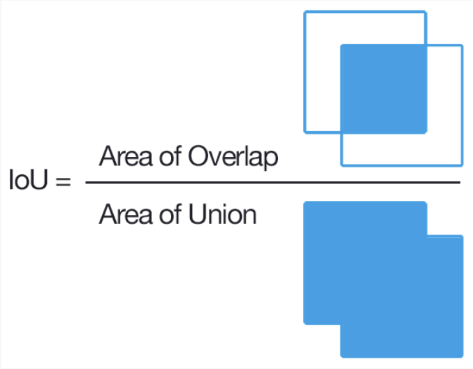

# 7. 모델 평가 및 하이퍼 파라미터 조정

학습된 모델에서 자신이 원하는 결과가 나오지 않을 확률이 높다. 평가 지표를 확인하여 학습된 모델이 얼마만큼의 성능을 발휘할 수 있는지를 평가하고 원하는 결과가 나올 때까지 하이퍼 파라미터 조정을 계속해서 반복한다.

수집한 데이터의 질이 안 좋았거나 데이터 분석에서 잘못된 특성 추출로 인해 성능이 낮아질 수 있으며, 현재 상황에 잘못된 알고리즘 선택으로 성능이 낮아질 수 있기 때문에 좋은 모델을 구한다는 것은 생각보다 많은 비용이 소요되게 될 것이다.

&nbsp;

# 🚀 모델 성능 평가

딥러닝 모델의 성능 평가에는 Loss와 Metric이라는 두 가지 주요 지표가 사용된다. 이들은 모델의 성능을 평가하는 데에 사용되는 지표로 서로 다른 측면을 나타낸다.

## 1. 손실(Loss)

- 손실은 주로 **모델의 학습 과정에서** 사용되는 지표로, 학습 데이터와 실제 값(레이블)과의 **오차를 최소화**하도록 학습된다.
- 손실은 이러한 오차를 계산하는 함수로, 모델의 예측과 실제 값 간의 차이를 측정한다.
    - 회귀: MSE(Mean Square Error), MAE(Mean Absolute Error) 등
    - 분류: BCE(Binary Cross Entropy), CE(Cross Entropy), Focal Loss
- 모델이 학습하는 동안 모델은 경사하강법과 같은 최적화 알고리즘을 사용하여 예측 값이 실제 값에 가깝도록 하는 최적의 가중치를 계속해서 업데이트한다.
- 모델이 학습 데이터에 대해 좋은 손실 값을 가지더라도, 모델이 실제로 예측하는 성능이 좋지 않을 수 있다. 이러한 경우, 손실만으로는 모델의 성능을 완전히 평가하기 어렵다.

### 과적합과 학습 중단 시점

- 손실 그래프를 보면 학습 데이터에 대한 손실은 계속해서 줄어들지만, 검증 데이터(또는 테스트 데이터)에 대한 손실은 일정 수준 이후 증가하는 경우가 있을 수 있다.
- 이러한 경우 모델이 학습 데이터에 지나치게 적합하여 검증 데이터에 대한 성능이 저하되는 과적합 상태일 수 있다.

<p align="center">
  
</p>

<p align="center">
  
</p>

- 손실 그래프를 보면 학습이 충분히 진행되어 최적의 성능에 도달한 시점을 파악할 수 있다.
- 만약 처음 학습을 진행한다면 에폭을 길게 하여 과적합을 직접 확인해보고 성능 향상이 멈췄다 싶은 지점을 학습 중단 시점으로 결정해보는 것이 좋다.

### Loss curve & Learning rate

<p align="center">
  
  
</p>

<div align="center">
  
| 손실 곡선 모양 | 해결방법 |
| --- | --- |
| curve가 선형적이다. | Learning rate를 더 높게 설정한다. |
| curve 감소 폭이 작다. | Learning rate를 더 낮게 설정한다. |
| curve 진동 폭이 크다. | Batch size를 더 높게 설정한다. |

</div>

&nbsp; 

<div align="center">
  
  
</div>

&nbsp;

### Learning rate & Batch size

1. 🔻 batch-size & 🔻 learning-rate
    
    → 한 번에 적은 데이터로 조금씩 학습하기 때문에 그 만큼 학습 수가 많아지므로 local minima에 빠져 optimal minima에 도달하기 힘들지만, 초기 방향은 쉽게 잡히고 수렴은 잘 될 것이다.
    
2. 🔻 batch-size & 🔺 learning-rate
    
    → 적은 데이터로 많은 학습을 바라기 때문에 잘 수렴하기 힘들 것이다.
    
3. 🔺 batch-size & 🔻 learning-rate
    
    → 많은 데이터로 조금씩 학습해나가기 때문에 과적합이 쉽게 될 것이다.
    
4. 🔺 batch-size & 🔺 learning-rate
    
    → 한 번에 많은 데이터로 많이 학습하기 때문에 초기 방향을 잡기 힘들어 learning-rate를 잘 조절해야 할 것이다. 그리고 과적합의 문제도 존재한다. 하지만 local minima에 걸릴 확률이 적고, optimal minima에 수렴할 수 있다.
    

```bash
model = YOLO("yolov8x") # yolov8n, yolov8s, yolov8m, yolov8l, yolov8x 등이 있음
results = model.train(
  data= "data.yaml",
  imgsz=640,
  epochs=50,
  batch=32,
  patience=5,
  workers=16,
  device=0,
  exist_ok=True,
  project=f"{data_path}/{MODEL}",
  name="train",
  seed=SEED,
  pretrained=False,
  resume=False,

  optimizer="AdamW",
  lr0=0.0005,
  mixup=0.3,
  cos_lr=True,
  flipud=0.0,
  fliplr=0.0,

  augment=False,
  val=True,
  cache=True
  )
```

<p align="center">
  
</p>

<p align="center">
  
</p>

## 2. 평가 지표(Metric)

<p align="center">
  
</p>

- 평가 지표는 어떤 모델을 평가 혹은 비교하기 위해 모델의 성능을 숫자로 표현하는 것을 말한다.
- 분류 문제에서 가장 자주 활용되는 평가 지표는 accuracy, auc, f1 score 등이 있다. 이것을 잘 이해하기 위해서 **혼동 행렬(confusion matrix)** 을 먼저 이해하는 것이 도움이 된다.

### 2.1 혼동 행렬

- 혼동 행렬은 분류 모델의 성능을 평가하는 데에 사용된다.

<p align="center">
  
</p>

### 2.2 정확도(Accuracy)

- 사실상 가장 많이 쓰이는 개념으로 타겟 대비 정확히 예측한 비율을 정의한다.
    - 얼마나 많이 틀린 것은 틀린 것으로, 맞는 것은 맞은 것으로 잘 예측하였는가
- 클래스 불균형이 심한 데이터에서는 활용하는 것이 적절하지 않다.
- 이진 분류의 경우 데이터의 구성에 따라 모델의 성능을 왜곡할 수 있기 때문에 정확도 수치 하나만 가지고 성능을 평가하지 않는다.

```python
Accuracy = (TP + TN) / (TP + FP + FN + TN)
```

### 2.3 정밀도(Precision)

- 모델이 True로 예측한 것 중에 실제로 True인 비율이다.
    - 정답이라고 생각한 것 중에서 얼마나 많이 맞았는가, 과연 실속이 있는가
    - 객체인식 문제에서 보면 잘못된 바운딩 박스를 그려놓은 상황.
    - **실제로 아닌데 맞다고 생각한 개수**에 따라 결과가 달라진다.
- Precision이 낮으면 거짓 양성이 많아 신뢰도가 떨어질 수 있다.
    - 검출능력이 뛰어나겠지만 실속이 없을 수 있다.
    - 실제로 스팸이 아닌데 스팸으로 오인해서 중요한 메일을 못받았다.
    - 실제로 재난이 일어나지 않았는데 재난 문자가 발송되었다. 밑져야 본전 사례
- Precision이 너무 높으면 확실한 경우에만 양성으로 예측하기 때문에 검출능력이 떨어질 수 있다.
    - 완벽주의
    - 스팸 차단을 놓칠 수 있다.
    - 실제 재난 상황을 놓칠 수 있다.

```python
Precision = TP / (TP + FP)
```

### 2.4 재현율(Recall, Sensitivity)

- 실제로 True인 것 중에서 모델이 True로 예측한 비율이다.
    - 객체인식 문제에서 보면 정답인 객체를 탐지해내지 못한 상황
    - **실제로 맞는데 아니라고 생각한 개수**에 따라 결과가 달라진다.
- Recall이 낮으면 정답이 아니라고 오인하는 경우가 많아진다.
    - 정답조차 잘 찾지 못할 것이다.
    - 진짜 스팸인데 스팸이 아니라고 해버리는 상황
    - 진짜 재난 상황인데 재난이 아니라고 판단해버리는 상황
- Recall이 너무 높으면 진짜라고 예측한 것이 필요 이상으로 많은 상황이다.
    - 몇 개 정도는 잘못 판단할지라도 정답은 잘 찾아낼 것이다.

```python
Recall = TP / (TP + FN)
```

### 2.5 Precision vs Recall

- Precision과 Recall은 모두 True라고 예측한 것과 관련이 있으나, 관점이 다르다고 볼 수 있다.
- 임계값을 조정해 Precision 또는 Recall을 높일 수 있지만 Precision과 Recall은 상호보완적이기 때문에, Recall을 올리면 Precision이 내려가고, precision을 올리면 recall이 내려갈 수 밖에 없다.
    1. 🔻 Precision & 🔺 Recall
        
        → 높은 확률로 정답을 잘 찾아내겠지만 많은 경우에 가짜도 포함될 수 있다.
        
        → 필요 없는 것을 뽑을 수 있다. (낮은 임계값)
        
    2. 🔺 Precision & 🔻 Recall
        
        → 정답만 뽑으려다 보니 미처 못 뽑힌 정답들도 많이 존재할 수 있다.
        
        → 필요한 것을 못 뽑을 수 있다. (높은 임계값)
        
- 이진 분류 문제에서 적절한 임계값을 찾는 메트릭은 ROC-curve와 AUC가 있다.

### 2.6 F1 Score

- Precision과 Recall의 상호보완적 관계를 이용하여 생겨난 것이 F1 score이다.
- F1 score는 Precision과 Recall의 **조화 평균**을 나타내는 것으로 분류기 등을 만들 때 Precision과 Recall 사이에서 절충이 이루어지며 특이값의 리스크를 회피할 수 있다.
- 보통 클래스 불균형이 있을 때 활용하는 지표이다.
- 1에 가까울 수록 좋은 모델이다.

```python
F1-score = 2 * ((Precision*Recall)/(Precision+Recall))

# 예1) 1, 0.1
2*(0.1/1.1) = 0.1818xxx
# 예2) 0.1, 0.1
2*(0.01/0.2) = 0.1
# 예3) 1, 1
2*(1/2) = 1
```

### 2.7 ROC 곡선

- ROC 곡선은 주로 **이진 분류 문제**에서 사용되는 평가 도구로, TPR(True Positive Rate)과 FPR(False Positive Rate)을 활용한다.
- 모델이 양성 클래스를 놓치지 않고 잘 예측하는 능력과 음성 클래스를 잘못하여 양성으로 잘못 예측하는 능력을 가지고 평가한다.
- ROC 곡선은 TPR과 FPR 값을 다양한 임계값에 대해 계산하여 그리고 각각의 임계값에 따른 TPR과 FPR을 연결하여 그림으로 나타낸 것이 ROC 곡선이다. 모델의 성능이 높을수록 ROC 곡선은 좌상단을 향한다.
- AUC(Area Under the Curve)는 ROC 곡선 아래 영역의 넓이이고, 1에 가까울 수록 좋다.

<p align="center">
  
</p>

<p align="center">
  
</p>

<p align="center">
  
</p>

&nbsp;

&nbsp;


# 🚀 객체 인식 모델 평가

## 1. mAP(mean Average Precision)

mAP는 Object Detection 분야에서 모델의 성능을 평가하는 지표이다. 객체 검출은 이미지 내에서 객체의 위치와 클래스를 예측하는 작업이므로, 정확도를 측정하기 위해 단순한 정확도보다는 mAP와 같은 특화된 지표가 사용된다.

### 1.1 IoU 계산

- IoU는 실제 Bounding box와 예측 Bounding box가 얼마나 일치하는지를 확인하기 위해 사용된다.
- 1에 가까울수록 좋고, 0에 가까울수록 나쁘다.
- IoU가 0.5 이상일 경우 일치하는 객체로 판단한다.

<p align="center">
  
</p>

### P1.2 Precision-Recall 곡선 그리기

<p align="center">
  
</p>

- PR 곡선은 confidence 임계값에 따른 precision과 recall의 변화를 그래프로 표현한 것이다.
- Recall이 높아져도 Precision이 유지되는 경우, 특정 class 검출을 위한 모델 성능이 좋을 것으로 평가된다. 즉, confidence 임계값을 변경하더라도, Precision과 Recall이 모두 높은 경우 모델 성능이 좋을 것으로 평가한다.
- 관련된 객체만 검출할 수 있는 모델. 즉, 거짓 양성 개수가 적은 경우(🔺Precision)도 좋은 모델로 평가할 수 있다.

### 1.3 AP(Average precision) 계산

- AP 곡선은 Pecision과 Recall을 고려한 종합적 평가 지표이며, 실제로 AP는 0~1 사이의 모든 Recall에 대응하는 평균 Precision이다.
- AP는 precision과 recall을 그래프로 나타냈을 때의 아래 면적이다. AP가 높을 수록 알고리즘의 성능이 좋다고 판단할 수 있다.
- 각 클래스마다 한 AP를 갖게 되는데 모든 class의 AP에 대해 평균값을 낸 것이 mAP(mean Average Precision)이다.

<p align="center">
  
</p>

## 2. YOLO 알고리즘 성능에 대해

<p align="center">
  
</p>

- YOLO에서 제공하는 잘 설계된 많은 모델이 있다.
    - 모델 구조 복잡도에 따라 n<s<m<l<x 순으로 나열할 수 있으며, 복잡할 수록 파라미터도 늘어나기 때문에 학습 시간도 늘어남을 인지해야 한다.

<p align="center">
  
</p>

- mAP가 높을 수록 검출 성능은 좋겠지만 검출 속도도 느려지는 것을 볼 수 있다.
    - 번호판 인식은 실시간성을 보장해야하기 때문에 검출 속도가 매우 중요하다.
    - YOLOv8x과 YOLOv8m 모델 중 어떤 것이 좋을지에 대해서는 상황에 따라 판단할 필요가 있다.