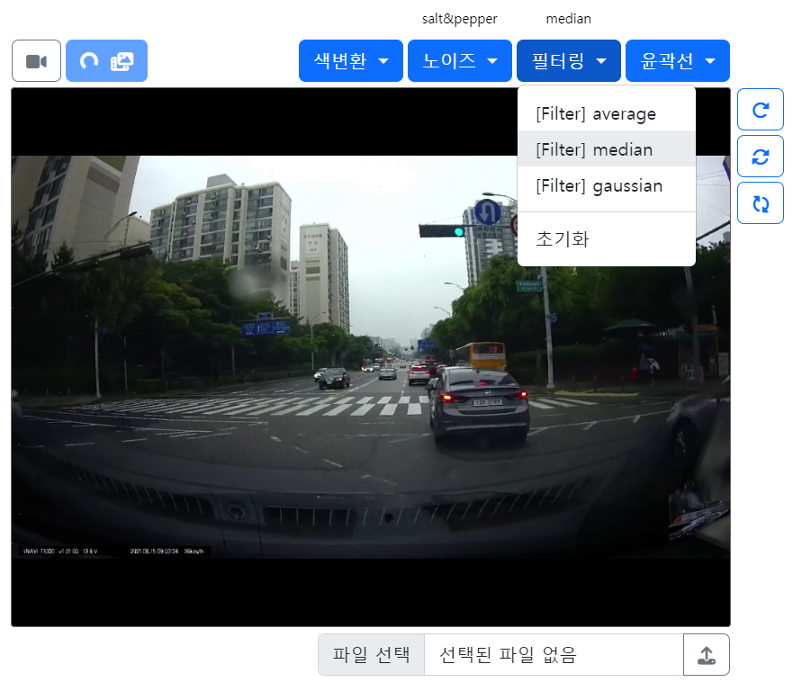
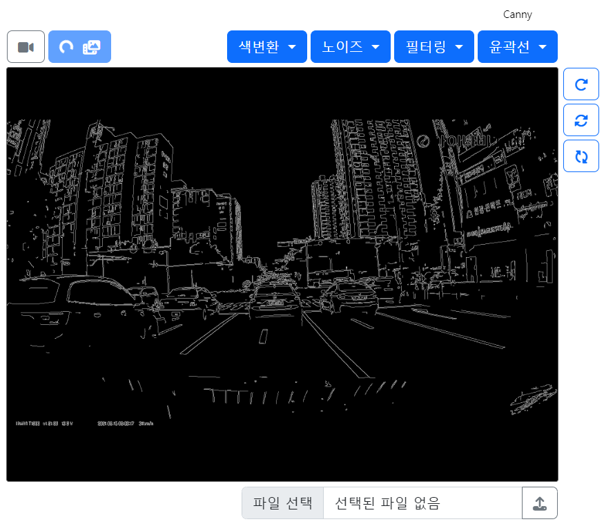
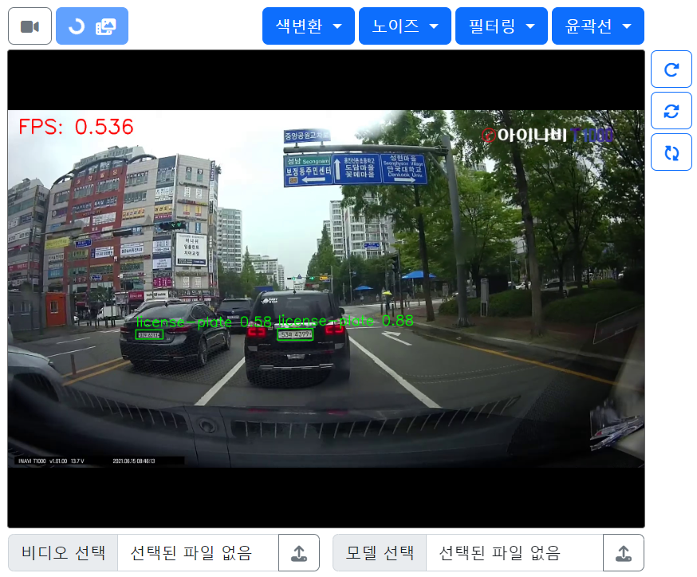

# 🌐 Opencv on Web
- OpenCV 기능들을 웹에서 실시간으로 확인하고자 하여 제작하였습니다.
- 자세한 설명: [8일차](/ShortTerm-Internship/diary/0712.md), [9일차](/ShortTerm-Internship/diary/0713.md)

### 🛠️ Requirements
```python
python=3.8
Flask=2.3.2
opencv-python=4.8.0.74
Pillow=9.3.0

# YOLO: object detection
ultralytics=8.0.133
```

### 🛠️ How to run 

```shell
python app.py
```
```
enter "your_IP:port" and connect.
```

### 📷 OpenCV Functions

<p align="center">
  
  
</p>

<p align="center">
  
  
</p>

### 📷 Applying the model

<p align="center">
  
  
</p>