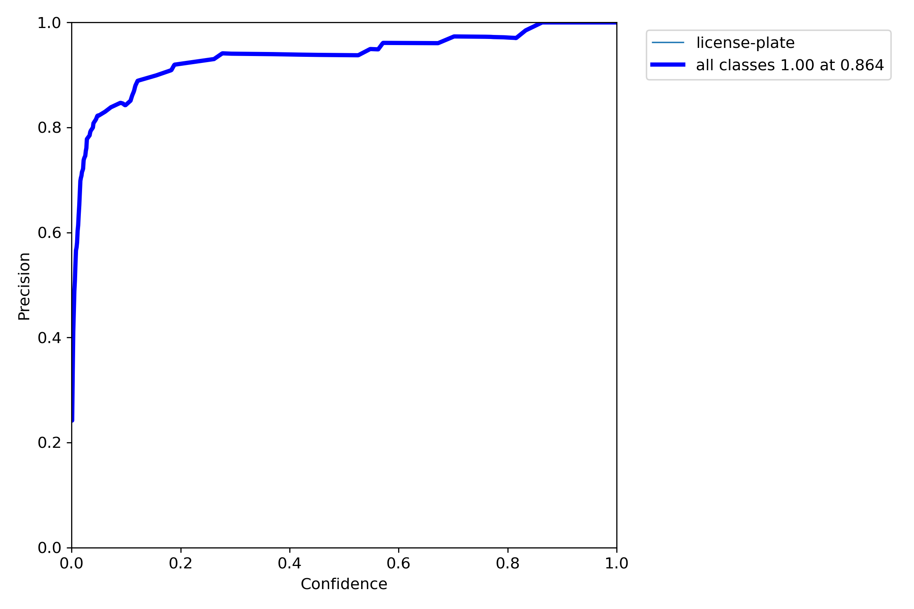
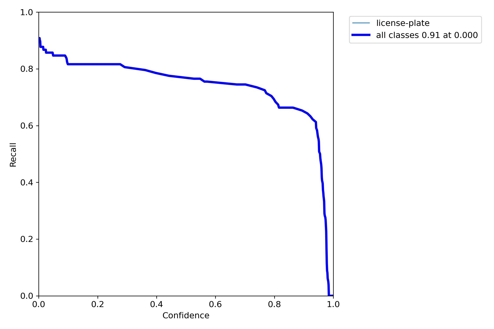
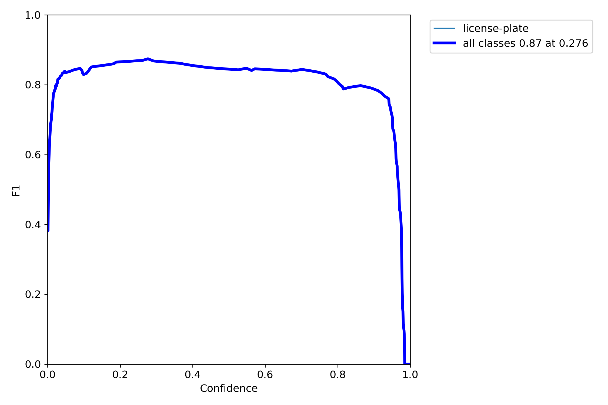
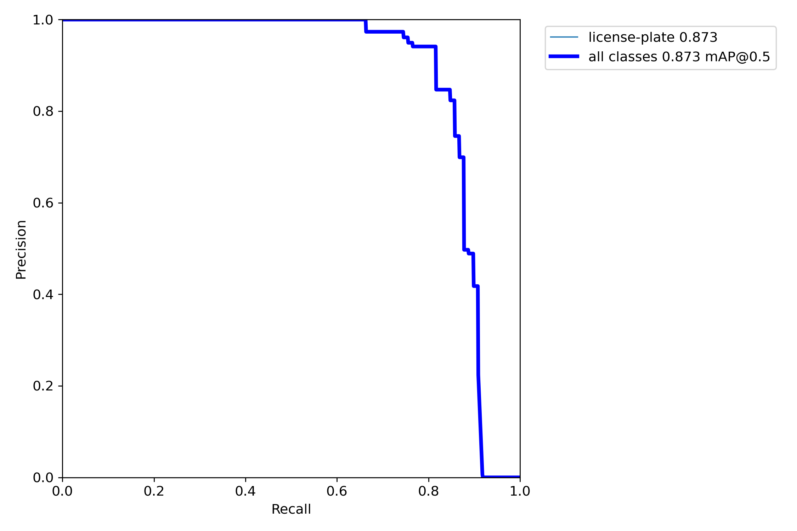

# 2일차

날짜: 2023년 7월 4일

## 목표

- 차량번호판 객체인식

## 데이터 전처리

1. kaggle에서 데이터 수집, 300장
2. roboflow에서 데이터 라벨링 및 데이터 증강, 300->600

## 학습 및 평가

- YOLOv7으로 학습(1시간 40분 소요)

[코드보기](https://colab.research.google.com/drive/1BVtAmJERK6Ee1MnJkt3ub2jHPjH2_yMc?usp=sharing)

- mAP: 87.3%

  
  

  
  

## 한국 도로 주행 영상 테스트

## 문제점

- 인식률 저조함.

## 해결방법

- 좀 더 확실한 라벨링 작업 필요
- 더 많은 데이터 수집 필요

## 목표 설정

- 인식 정확도 향상을 위한 양질의 데이터와 기존보다 더 많은 1000개의 데이터 수집.
- YOLOv7에서 YOLOv8로 모델 업그레이드 후 학습 결과 비교