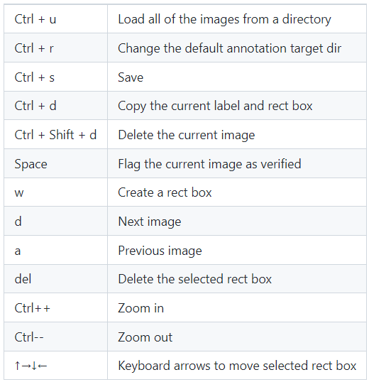
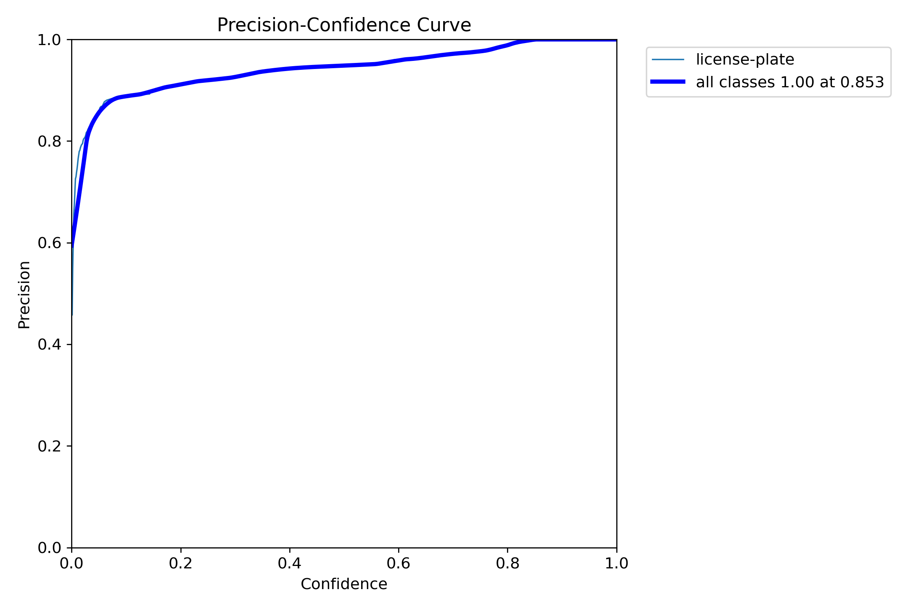
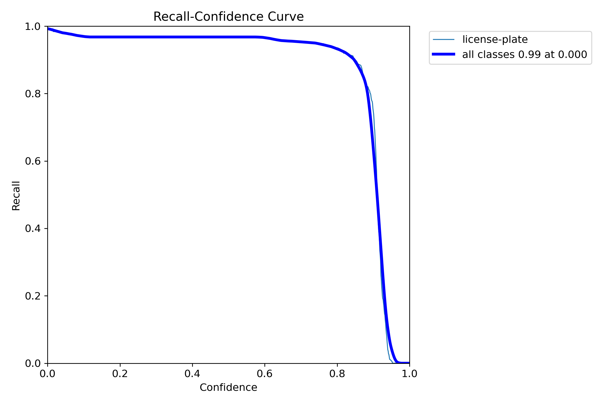
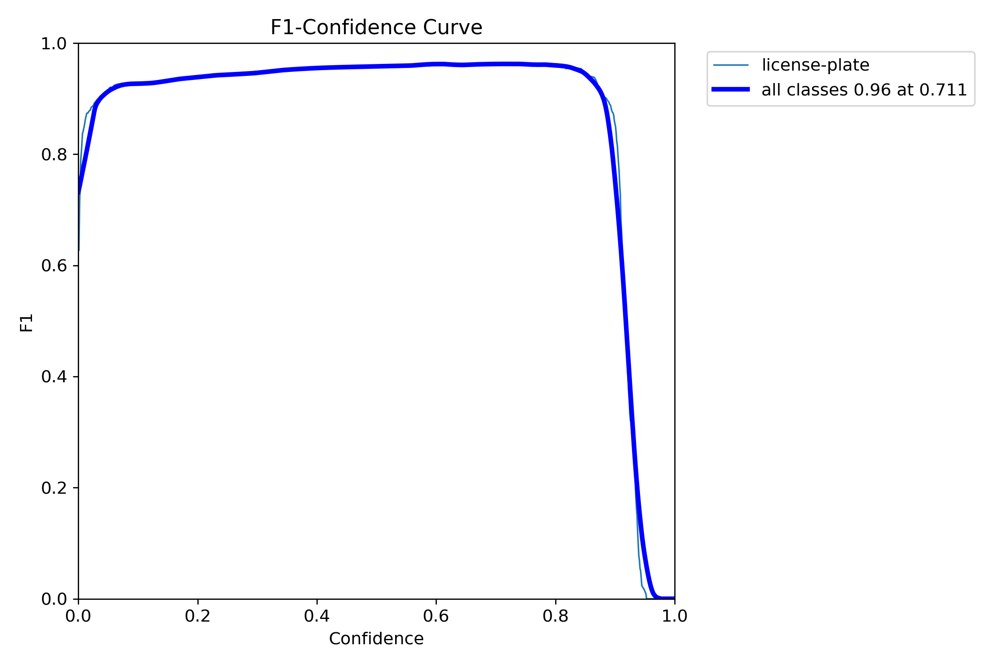
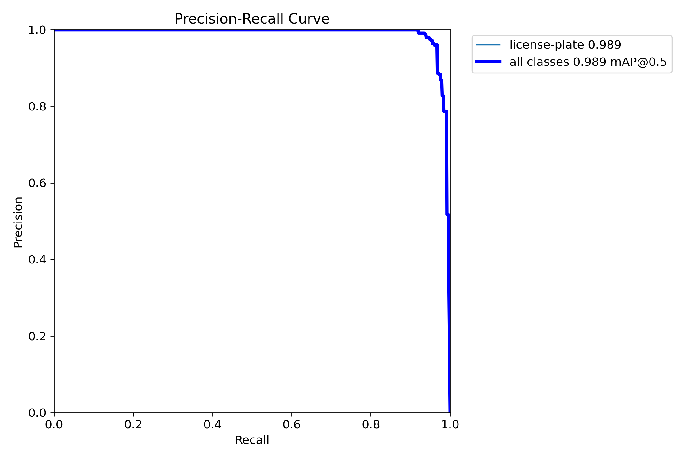

# 3일차

날짜: 2023년 7월 5일

## 목표

- 이미지 1000개 라벨링
- YOLOv8을 사용

## 데이터 라벨링 : labelimg

- roboflow 브라우저 기반 라벨링 툴의 메모리 낭비 문제 때문에 컴퓨터 렉이 심했음.
    
    → 무료 이미지 라벨링 툴인 labelimg 사용
    

```jsx
git clone https://github.com/heartexlabs/labelImg.git
cd labelImg
pip install pyqt5
pip install lxml
pyrcc5 -o libs/resources.py resources.qrc
python labelimg.py
```
<p align="center">
  
  <figcaption align="center">기본 단축키</figcaption>
</p>


- split-folder 사용하여 YOLO 학습 데이터 구조와 맞게 train/valid/test 폴더로 나눠야 한다.

```jsx
pip install split-folder
```

```python
import splitfolders

splitfolders.ratio(input="input", output="output", seed=1337, ratio=(.7,.2,.1))
```

## 학습 및 평가

- YOLOv8로 학습
    
    [Google Colaboratory](https://colab.research.google.com/drive/167cAbM_SpyiFLjmKhRr3IYI9fVLD5R6M?usp=sharing)
    
- mAP: 98.9%
<p align="center">
  
  
</p>
<p align="center">
  
  
</p>

## 한국 도로 주행 영상 테스트

- 인식률 자체로 좋아졌지만 거짓 양성의 비율이 증가하였음

## 문제점

- 차량번호판의 데이터 개수와 질이 여전히 좋지 못했다.
- 불규칙적인 색, 모양, 크기에 대해 고려하지 않았다.
- 실시간 영상에 대한 인식률이 저조하다.
    - 국내 데이터를 사용하지 않은 탓일 수도 있다.

## 해결방법

- 일관된 데이터 필요
- 국내 차량번호판 데이터가 필요
- 더 많은 데이터 필요

## 목표 설정

- 국내에서 운영하는 AI-Hub 사이트에서 제공하는 국내 데이터를 대상으로 재도전
    
    [AI-Hub](http://www.aihub.or.kr)
    
- 10만장 이상의 데이터가 있으므로 라벨링 자동화 작업이 필요
    -