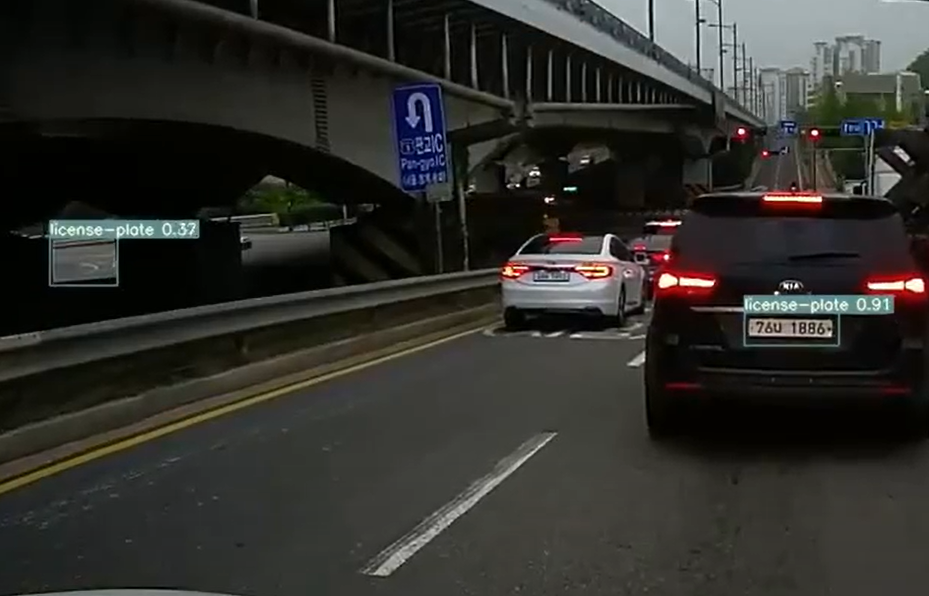
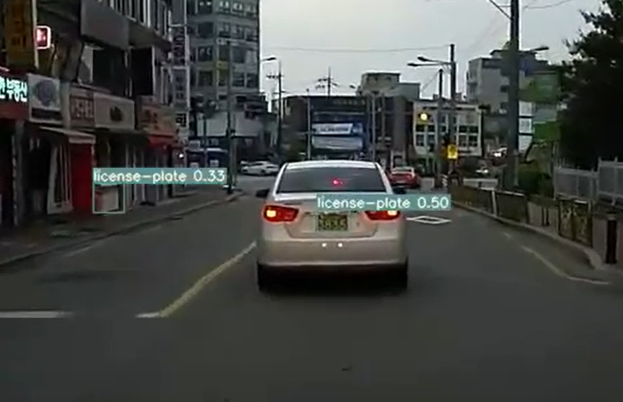
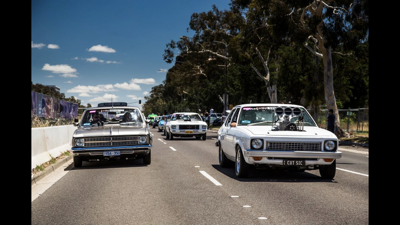
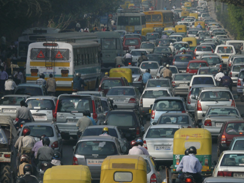
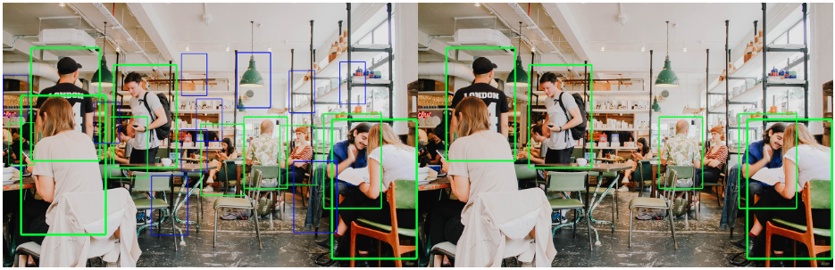
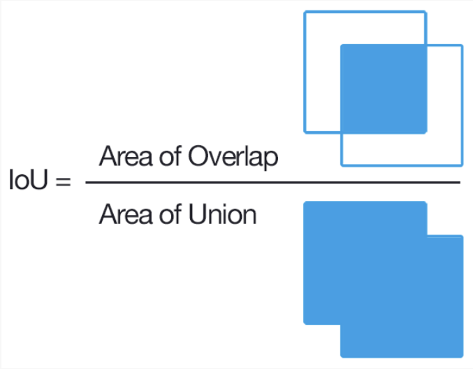
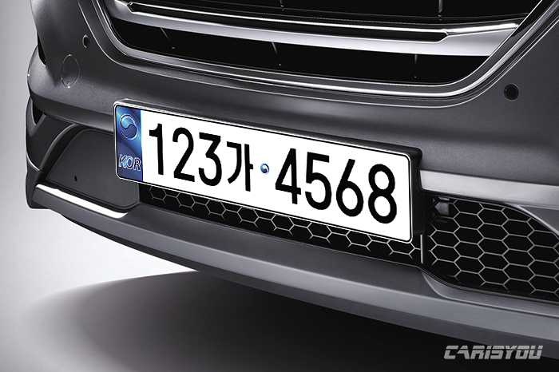
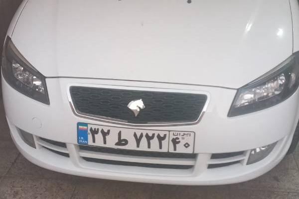
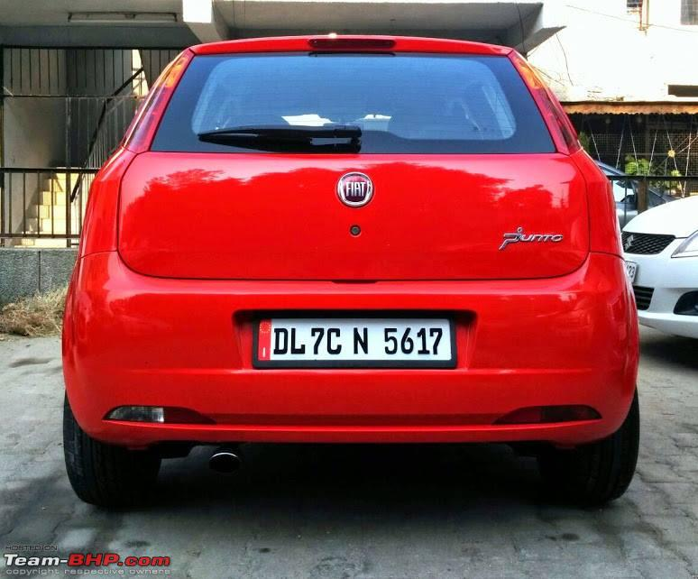

# 4일차

📅 2023년 7월 6일

## **📌** 목표

- 거짓 양성을 줄이기 위한 데이터 수집

  
  

## **📌** 잘못된 데이터 선정

- 차량번호판 인식의 궁극적 목표가 차량번호 인식임을 간과했다.
    - 번호판이 휘거나 잘려있고, 카메라로부터 너무 멀거나 노이즈로 인해 흐릿해서 차량번호가 잘 보이는 않는 경우.
- 지금까지 차량번호판 자체를 인식해야한다는 목적을 가지고 아래 그림과 같이 일반적이지 않은 번호판들을 라벨링 했었다.

  
  

  
  

- 이러한 하자(휨, 잘림, 뒤집힘, 화질문제)가 있는 번호판 이미지들은 차량번호 인식의 정확도 향상에 있어서 많은 문제를 야기할 수 있기 때문에 엄격한 데이터 선정을 한다.

## **📌** 검출 성능에 대해

  

- 검출율이 99%, 오검출율이 10%인 A 알고리즘과 검출율이 50%, 오검출율이 0%인 B 알고리즘 중에 어느 것이 더 좋다고 판단할 수 있을까?
- 상황에 따라 사용해야 하는 알고리즘이 다를 수 있다. 예를들어, 재난을 예방하기 위한 프로젝트에는 밑져야 본전인 A 알고리즘이 좋을 것이고, 차량번호 인식과 같은 신뢰도 기반 프로젝트에는 B 알고리즘이 좋을 것이다.

### IoU

- IoU는 실제 Bounding box와 예측 Bounding box가 얼마나 일치하는지를 확인하기 위해 사용된다.
    - 1에 가까울수록 좋고, 0에 가까울수록 나쁘다.
    - IoU가 0.5 이상일 경우 일치하는 객체로 판단한다.
    

    

    

### Precision, Recall, P-R 곡선

- Precision: 모델이 True라고 분류한 것 중 실제 True인 것의 비율.
- Recall: 실제 True인 것 중 모델이 True라고 예측한 것의 비율.
- PR 곡선은 confidence 임계값에 따른 precision과 recall의 변화를 그래프로 표현한 것이다.

### mAP

- AP는 서로 다른 알고리즘과 성능을 비교하기 위해 도입된 개념이다.
- 대표적인 Object detection의 평가지표인 mAP에는 IOU와 Precision, Recall의 개념이 베이스로 깔려있다.
- AP는 precision과 recall을 그래프로 나타냈을 때의 아래 면적이다. AP가 높을 수록 알고리즘의 성능이 좋다고 판단할 수 있다.
- 각 클래스마다 한 AP를 갖게 되는데 모든 class의 AP에 대해 평균값을 낸 것이 mAP이다.

### YOLO 알고리즘 성능에 대해

    

- YOLO에서 제공하는 잘 설계된 많은 모델이 있다.
    - 모델 구조 복잡도에 따라 n<s<m<l<x 순으로 나열할 수 있으며, 복잡할 수록 파라미터도 늘어나기 때문에 학습 시간도 늘어남을 인지해야 한다.

  

- mAP가 높을 수록 검출 성능은 좋겠지만 검출 속도도 느려지는 것을 볼 수 있다.
    - 번호판 인식은 실시간성을 보장해야하기 때문에 검출 속도가 매우 중요하다.
    - YOLOv8x과 YOLOv8m 모델 중 어떤 것이 좋을지에 대해서는 상황에 따라 판단할 필요가 있다.

## **📌** 더 나은 데이터 선정

1. 차량번호가 잘 보이는가에 대한 조건 하에 아래와 같은 데이터를 선정하여 거짓 양성 비율을 줄일 수 있도록 한다.
2. 먼 거리의 차량번호판은 애초에 번호를 식별할 수 없을 정도의 거리이기 때문에 고려 대상이 되지 않았다.
3. 되도록 최대한 흰 바탕과 비슷한 형태의 차량번호판을 선정했다.
    1. 한국의 경우에는 녹색도 있지만 일단은 고려하지 않았다.

  
  

  
  

- 약 1000개의 데이터를 수집하였다.

## **📌** 과적합에 대해서

- 지나치게 엄격하고 일관된 데이터가 과적합을 발생할지 모른다고 생각한다.
    - 과적합은 데이터의 양이 적을 경우, 모델이 너무 복잡한 경우 발생한다고 한다.
    - 과적합은 정확도가 높을지라도 새로운 데이터에 대한 검출 융통성을 잃을 수 있다.
- 다행히도 차량번호판은 대부분 국가가 지정해주는 양식이 존재하기 때문에 괜한 걱정일지도 모른다.

## **📌** 목표 설정

- 데이터 라벨링
- YOLOv8 혹은 YOLO NAS를 사용하여 테스트한다.