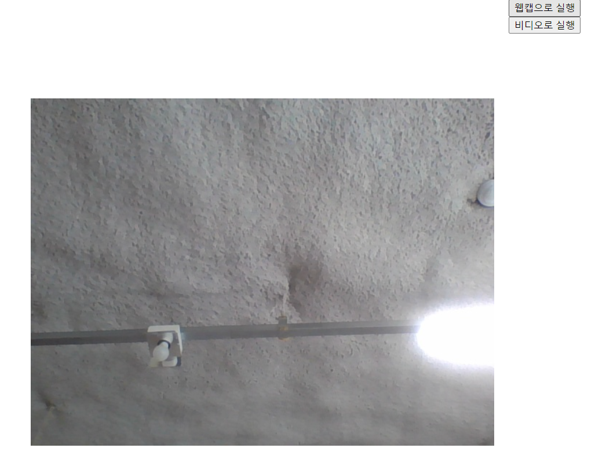
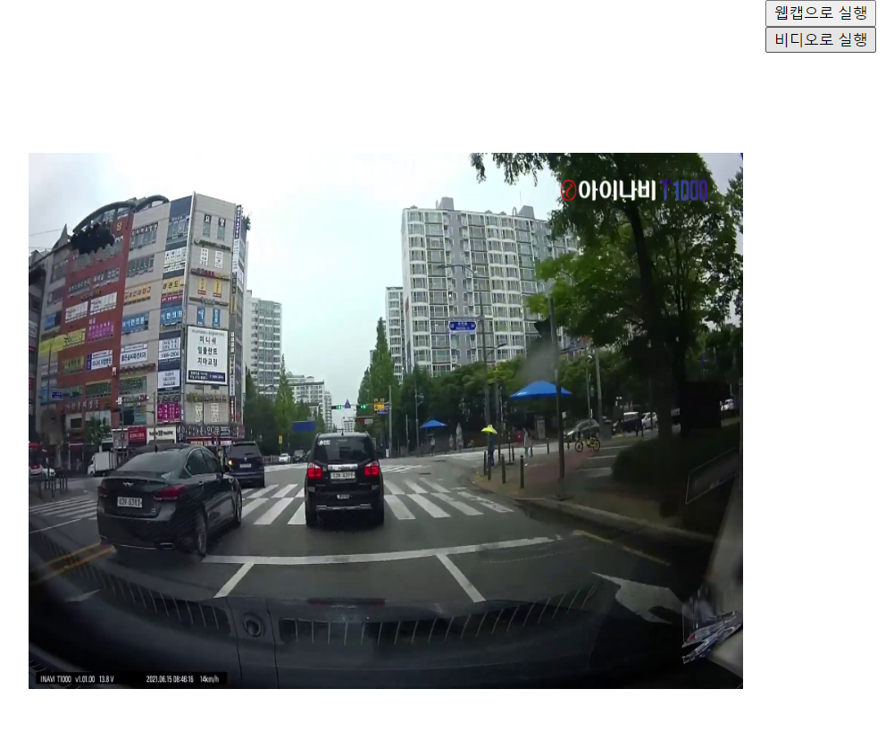

# 6일차

날짜: 2023년 7월 10일

## **📌 목표**

1. 약 400개의 데이터 라벨링
2. YOLOv8로 데이터 학습
3. 구체적인 프로젝트 주제 선정

## **📌 학습 결과**

- 검출율이 너무 낮아짐
- 오검출율 증가

→ 너무 일관적인 데이터 사용.

## **📌 하이퍼파라미터(Hyperparameter)에 대해**

<aside>
💡 알고리즘 사용자가 경험에 의해 직접 세팅하는 값.

</aside>

- 정해진 최적의 값인 Hyperparameter는 ****모델의 parameter 값을 측정하기 위해 알고리즘 구현 과저에서 사용된다.
- Hyperparameter는 모델에서 외적인 요소나 데이터 분석을 통해 없어지는 값이 아니다.
- 알고리즘 모델리의 문제점 해소를 위해 조절된다.
- Learning rate(학습률), SVM에서의 코스트 값, KNN에서의 K 개수, epoch 등

### **Hyperparameter 튜닝 방법**

<aside>
💡 최적의 값을 찾기 위한 과정.

</aside>

- Manual Search, Grid Search, Random Search, Bayesian Optimization, Non-Probabilistic, Evolutionary Optimization, Gradient-based Optimization, Early Stopping

### 네트워크 구조 관련 Hyperparameter

- 은닉층의 뉴런 개수
    - 훈련 데이터에 대한 학습 최적화 결정 변수
    - 첫 은닉층의 뉴런 수가 입력층보다 큰 것이 효과적이다.
- Dropout
    - 과적합을 피하기 위한 정규화 기법
    - 학습데이터에 과적합하게 학습된 model을 실제로 사용하기 위해 범용성을 위한 기법으로 은닉층의 뉴런들을 일정 비율로 배제하고 학습을 한다.
- 가중치 초기화
    - 학습 성능에 대한 결정 변수

### Training 관련 Hyperparameter

- 학습률 (learning rate)
    - gradient의 방향으로 얼마나 빠르게 이동할 것인지 결정하는 변수
    - 너무 작으면 학습의 속도가 늦고, 너무 크면 학습이 불가하다.
- 모멘텀 (momentum)
    - 학습 방향을 유지하려는 성질
    - 모멘텀을 사용하면 학습 방향이 바로 바뀌지 않고, 일정한 방향을 유지하며 움직인다. (운동량)
    - 같은 방향의 학습이 진행된다면 가속을 가지며 더 빠른 학습을 기대할 수 있다.
- 에포크 (epoch, training epochs)
    - 전체 트레이닝 셋이 신경망을 통과한 횟수를 의미한다.
    - ex. 1-epoch는 전체 트레이닝 셋이 하나의 신경망에 적용되어 순전파와 역전파를 통해 신경망을 한 번 통과했다는 것을 의미
- 배치 사이즈 (batch size)
    - 미니 배치 크기(Mini-batch Size)
    - 배치셋 수행을 위해 전체 학습 데이터를 등분하는 크기 (전체 트레이닝 셋을 작게 나누는 이유는 트레이닝 데이터를 통째로 신경망에 넣으면 비효율적인 리소스 사용으로 학습 시간이 오래 걸리기 때문이다.)
    - 가용 메모리 크기와 epoch 수행 성능을 고려
    - 최소 사이즈는 32이고 GPU의 물리적인 구조로 인해 항상 2의 제곱으로 설정한다.
- 반복 (iteration)
    - 1-epoch를 마치는데 필요한 미니배치 갯수를 의미한다. 즉, 1-epoch를 마치는데 필요한 파라미터 업데이터 횟수이다. 각 미니 배치 마다 파라미터 업데이터가 한번씩 진행되므로 iteration은 파라미터 업데이트 횟수이자 미니배치 개수이다.
    - ex. 700개의 데이터를 100개씩 7개의 미니배치로 나누었을때, 1-epoch를 위해서는 7-iteration이 필요하며 7번의 파라미터 업데이트가 진행된다.
- 손실함수 (Cost Function)
    - 입력에 따른 기대 값과 실제 값의 차이를 계산하는 함수
    - 평균 제곱 오차
    - 교차 엔트로피 오차
- 정규화 파라미터 (Regularization parameter)
    - [L1 또는 L2 정규화 방법](https://niniit.tistory.com/47) 사용
    - 사용하는 일반화 변수도 하이퍼 파라미터로 분류된다.

---

---

## **📌 새로운 프로젝트에 대해**

- 기존에 하고 있던 차량번호판 인식 프로젝트는 잠시 멈추고 새로운 프로젝트를 진행한다.
- 차종에 따른 운전자석 높이에 관한 프로젝트
- 프로젝트 시작 전에 영상처리 관련 공부 진행.

## **📌 개발환경**

- python=3.8
- Flask 웹 프레임워크
- opencv≥4.xx

## **📌 비디오 출력**

- opencv를 사용하여 영상출력
- Flask를 사용하여 HTTP 통신
- 딥러닝 연산을 위한 스트리밍 방법
    - Jinja 템플릿을 사용하여 HTML 동적 프로그래밍
    
    [[FLASK] 4. 웹 페이지에 동영상 띄우기(+ YOLOv5)](https://95mkr.tistory.com/entry/FLASK4)
    

```python
def gen_frames(file_path):    
  cap = cv2.VideoCapture(file_path)
  
  while True:
    _, frame = cap.read()
    if not _:
      break
    else:
      # results = model(frame)
      # annotated_frame = results.render()
      
      ret, buffer = cv2.imencode('.jpg', frame)
      frame = buffer.tobytes()

    yield (b'--frame\r\n'
           b'Content-Type: image/jpeg\r\n\r\n' + frame + b'\r\n')
```

### 웹캠으로 실행

```python
@app.route('/cam')
def cam():
    return Response(gen_frames(0), mimetype='multipart/x-mixed-replace; boundary=frame')
```

```html
<div class="video-container">
  
</div>
```

<p align="center">
  
</p>

### 비디오로 실행

```python
@app.route('/video')
def video():
    return Response(gen_frames('./resources/uploaded_video.mp4'), mimetype='multipart/x-mixed-replace; boundary=frame')
```

```html
<div class="video-container">
  
</div>
```

<p align="center">
  
</p>

## **📌 내일 목표**

1. HTML 구조 정리
    - 파일 업로드 부분
    - CSS 적용
2. 영상처리 개인학습
    - 이미지 색상 표현/변환/분리
    - 이미지 연산
    - 에지검출
    - 노이즈 필터링
    - 어파인 변형(회전, 어파인, 원근변환)