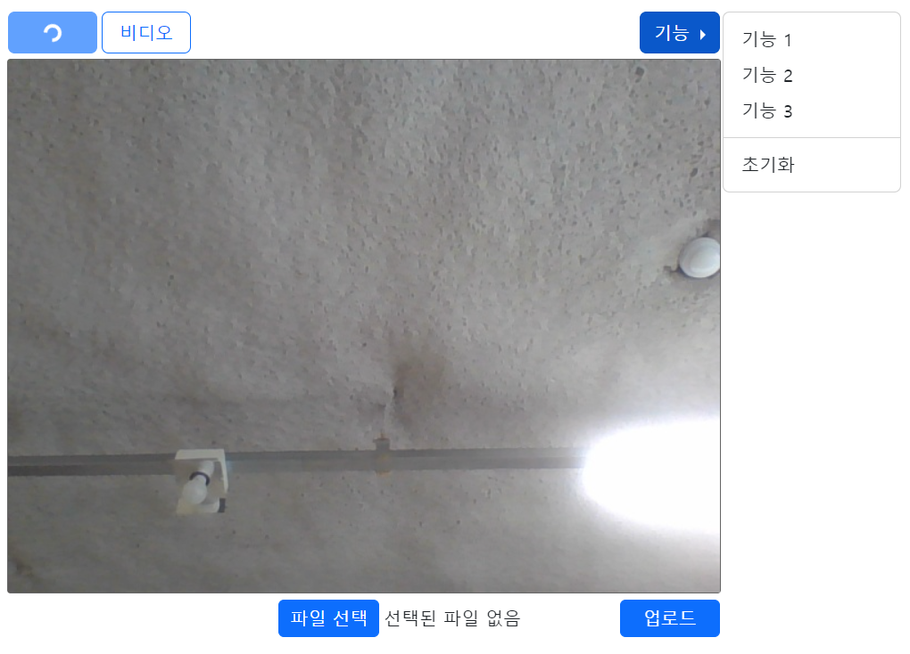
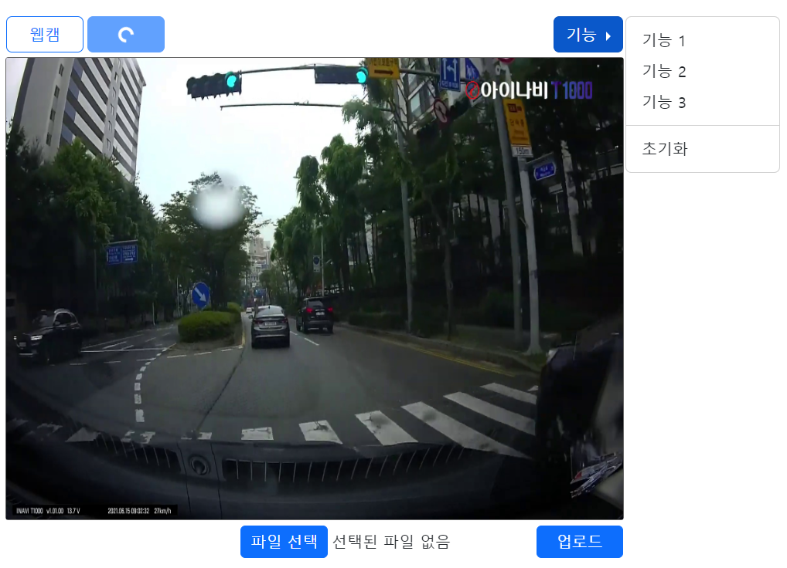

# 7일차

📅 2023년 7월 11일

## **📌 오늘 목표**

1. 1 주차 주간 보고서 작성 및 발표
2. HTML 구조 정리
    - 파일 업로드 부분
    - CSS 적용

## **📌 1 주차 주간 보고서 작성**

- 0703~0707 활동 내용 요약
    
    [1주차_주간보고서.pdf](./report/week1_weekly-report.pdf)
    

## **📌 HTML 구조 수정**

### 웹캠으로 실행

  

### 비디오로 실행

  

## **📌 내일 목표**

- 영상처리 개인학습
    - 이미지 색상 표현/변환/분리
    - 이미지 연산
    - 에지검출
    - 노이즈 필터링
    - 어파인 변형(회전, 어파인, 원근변환)