# 8일차

📅 2023년 7월 12일

## **📌 오늘 목표**

- 영상처리 기능들을 웹에 구현하기
    - 이미지 색상 표현/변환/분리
    - 이미지 연산
    - 에지검출
    - 노이즈 필터링
    - 어파인 변형(회전, 어파인, 원근변환)

## **📌 달성도**

⭕ 이미지 그레이스케일 변환

⭕ 에지검출 (Robert cross, Sobel, Prewitt, Canny, Laplacian)

⭕ 필터링 (Average Filtering, Median Filtering, Gaussian Filtering)

⭕ 회전 (90 degree)

❌ 어파인 변환

❌ 원근 변환

## **📌 웹 설계**

<p align="center">
  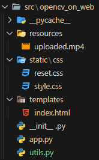
</p>

- Python의 Flask 웹 프레임워크를 사용하였고, CSS 스타일은 [부트스트랩](https://getbootstrap.kr/docs/5.2/components/dropdowns/)의 도움을 받았다.
    
- 웹캠을 실행하여 여러 Opencv 메소드들을 실험해볼 수 있다.

<p align="center">
  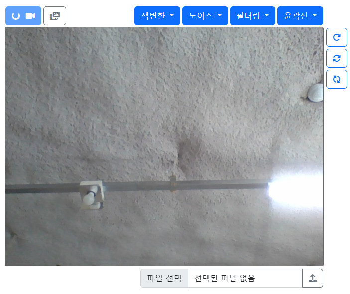
</p>

- 이미 저장된 영상 또는 새로운 영상을 업로드하여 메소드들을 실험해 볼 수 있다.

<p align="center">
  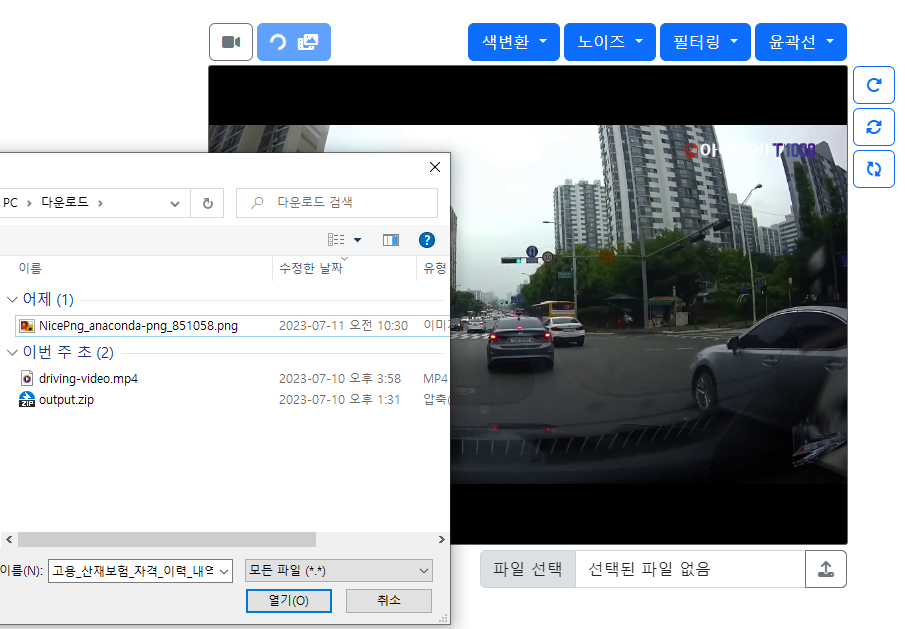
</p>

- 적용할 Opencv 기능들은 Ajax를 통해 서버로 기능 정보를 전송한다.

```jsx
$(...).click((e) => {
  $.ajax({ 
    url: "/cv",
    type: "POST",
    data: JSON.stringify(parmas),
    contentType: "application/json",
    success: function(result) { ... },
    error: function() { ... }
  })
})
```

- 구현된 Opencv 메소드들을 적용하려면 상단 카테고리에서 원하는 기능들을 선택하면 된다.

<p align="center">
  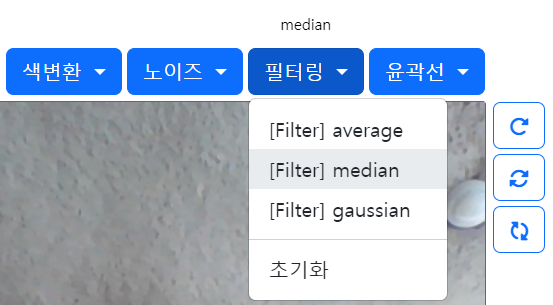
</p>

- 상단의 4개의 기능 그룹들은 서로 독립적이며 중첩이 가능하다.
    - 기능 그룹 아래 상세 기능들은 한 번에 하나씩만 적용해 볼 수 있다.
    - 어떤 기능들이 적용되고 있는지 버튼 바로 위에 새겨진다.
- 우측 기능들은 시계방향으로 90도 회전과 상하-좌우 반전 기능들로 이루져있다.
    - 회전 기능의 회전 각도는 클릭 시 계속 중첩되며, 각 90도씩 총 4번 클릭 시 0도가 된다.
    - 상하-좌우 반전 기능은 토글 형식이다.

## **📌 상세 기능**

### 그레이스케일 변환

```python
frame = cv2.cvtColor(frame, cv2.COLOR_BGR2GRAY)
```

<p align="center">
  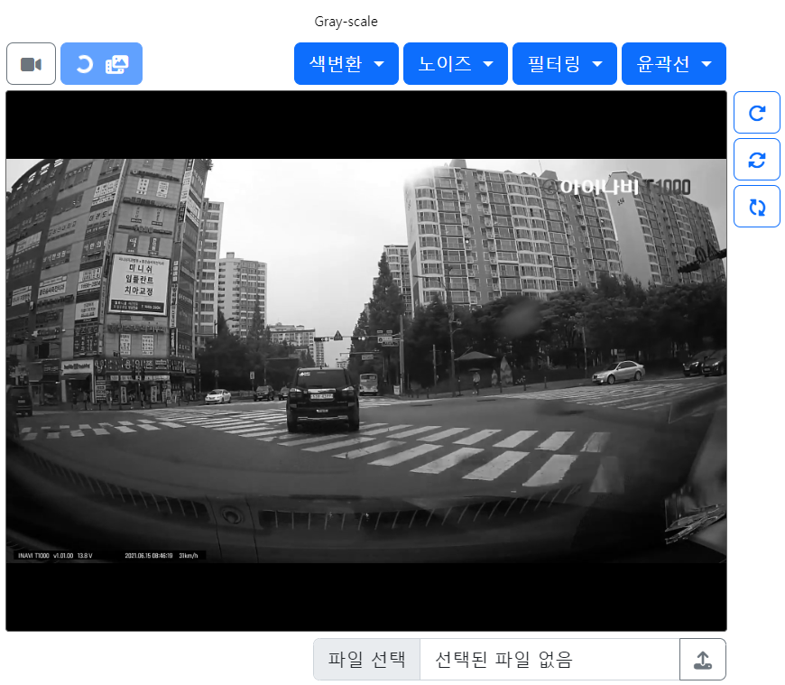
</p>

### 노이즈 추가

- 대표적인 노이즈는 ‘Salt&Pepper’와 ‘Gaussian’ 노이즈가 있다.
- 소금과 후추 잡음은 영상의 중간 중간에 검거나 흰 픽셀이 나타나는 잡음이다.
    - 잡음의 픽셀의 밝기 값이 주변 값과 차이가 큰 것이 특징이다.
- 가우시안 노이즈는 잡음의 확률 분포가 가우시안 분포를 따른다.
    - 소금과 후추 잡음과 달리 갑자기 튀는 잡음이 아니고 계속 같은 레벨의 잡음도 아니다. 어느 정도 랜덤하면서 자연계에서 쉽게 볼 수 있는 분포를 가져 화질에 많은 영향을 미칠 수 있다.
    - 영상의 지글거림이 대표적인 가우시안 노이즈의 예이다.

<p align="center">
  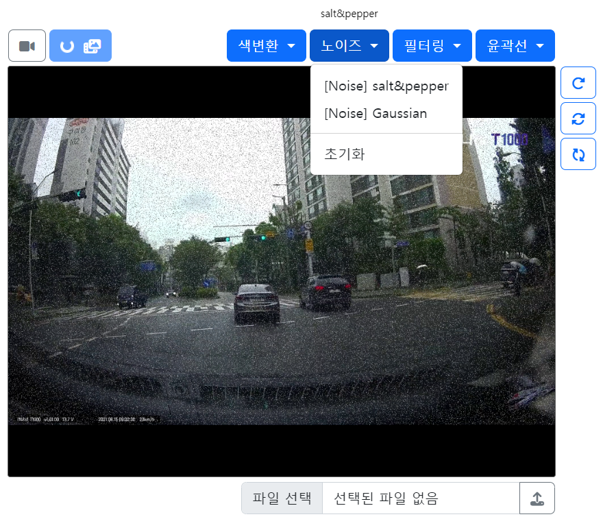
</p>

### 노이즈 제거

- 노이즈 제거는 저주파 필터(LPF)를 사용하여 영상을 스무딩 시켜 영상을 스무딩 시켜 잡음을 감소시킨다.
1. 평균값 필터는 주변 픽셀의 밝기 값을 평균으로 대체하며 가우시안 잡음에 효과적이다.
2. 중간값 필터는 주변 픽셀의 발기 값을 기준으로 정렬하여 중간에 위치한 값으로 대체하는 방법이다.
    - 주변 픽셀의 밝기값을 그대로 이용하기 때문에 이미지 선명도를 유지할 수 있지만 커널 사이즈가 증가할수록 선명도는 떨어진다.
    - 중간값 필터는 소금과 후추 잡음 제거에 효과적이다.
3. 가우시안 필터는 가우시안 분포르 사용하여 중심 픽셀을 대체하며 가우시안 잡음에 효과적이다.
    - 원래의 신호를 잘 유지하는 특징이 있어 에지 정보를 잘 유지하기 때문에 자연스럽게 스무딩을 적용할 수 있다.

```python
frame = cv2.blur(frame, (3,3))     # 평균값 필터링
frame = cv2.medianBlur(frame, 3)   # 중간값 필터링
frame = cv2.GaussianBlur(frame, (5,5), 1)   # 가우시안 필터링
```

<p align="center">
  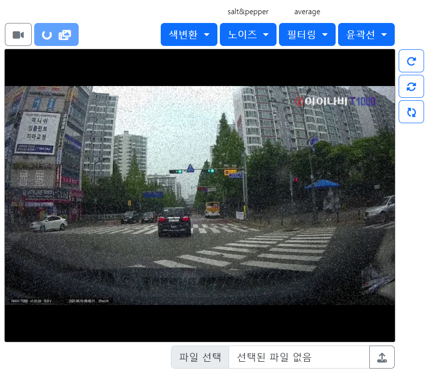
</p>

<p align="center">
  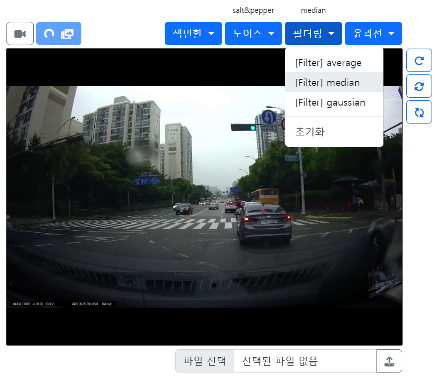
</p>

### 윤곽선 검출

- 윤곽선(edge)는 어두운 영역에서 갑자기 밝아지거나 또는 반대로 밝은 영역에서 급격하게 어두워지는 부분. 즉, 픽셀이 급격하게 바뀌는 부분을 에지라고 판단한다.
- 에지 검출은 픽셀 변화율을 측정하여 변화율이 큰 픽셀을 선택하는데, 이때 변화율은 미분을 통해 구해진다.

1. **소벨 마스크**
- 소벨 마스크는 모든 방향의 에지를 추출한다.
- 돌출한 화소값을 비교적 평균화하기 때문에 잡음에 강하다.
- 커널 사이즈가 커질수록 에지는 두꺼워지고 선명해진다.

```python
frame = cv2.cvtColor(frame, cv2.COLOR_BGR2GRAY)

# Sobel operator
x = cv2.Sobel(frame, -1, 1, 0, ksize=3, delta=0)
y = cv2.Sobel(frame, -1, 0, 1, ksize=3, delta=0)

frame = x+y
```

<p align="center">
  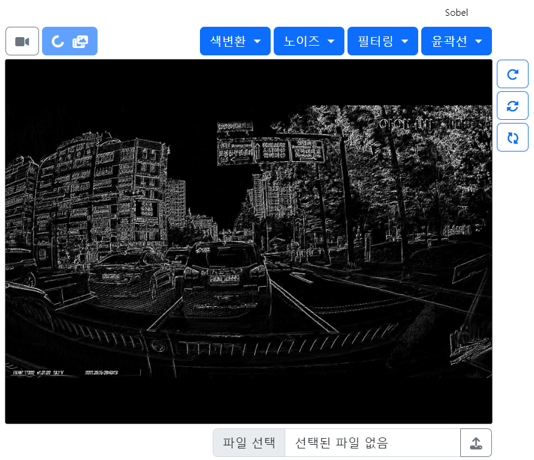
</p>

1. **프리윗 마스크**
- 소벨과 거의 같은 결과를 가진다.
- 커널을 정의하는 부분에서 변화에 대한 비중을 적게 주었기 때문에 소벨 보다는 대체로 옅은 에지가 검출된다.
- 응답시간이 비교적 빠르다는 장점이 있다.

```python
frame = cv2.cvtColor(frame, cv2.COLOR_BGR2GRAY)

# 프르윗 필터
gx = np.array([[-1,0,1],[-1,0,1],[-1,0,1]],dtype=int)
gy = np.array([[1,1,1],[0,0,0],[-1,-1,-1]],dtype=int)

# 프르윗 필터 컨벌루션
x = cv2.filter2D(frame, -1, gx, delta=0)
y = cv2.filter2D(frame, -1, gy, delta=0)

frame = x+y
```

<p align="center">
  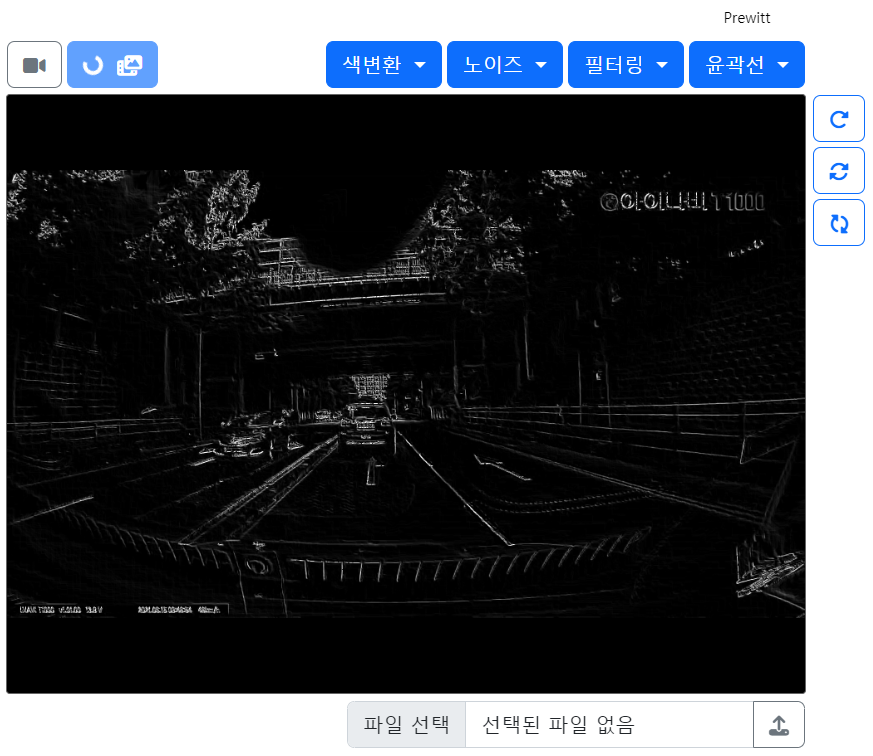
</p>

1. **로버트 크로스 마스크**
- 소벨과 프리윗 마스크에 비해 매우 빠른 계산 속도를 자랑한다.
- 에지를 확실하게 추출할 수 있지만 소벨과 프리윗에 비해 에지가 훨씬 가늘며, 마스크가 매우 작아 도출한 화소값을 평균화할 수 없는 관게로 잡음에 매우 민감하다.

```python
frame = cv2.cvtColor(frame, cv2.COLOR_BGR2GRAY)

# 로버트 크로스 필터
gx = np.array([[-1, 0], [0, 1]], dtype=int)
gy = np.array([[0, -1], [1, 0]], dtype=int)

# 로버트 크로스 컨벌루션
x = cv2.filter2D(frame, -1, gx, delta=0)
y = cv2.filter2D(frame, -1, gy, delta=0)

frame = x+y
```

<p align="center">
  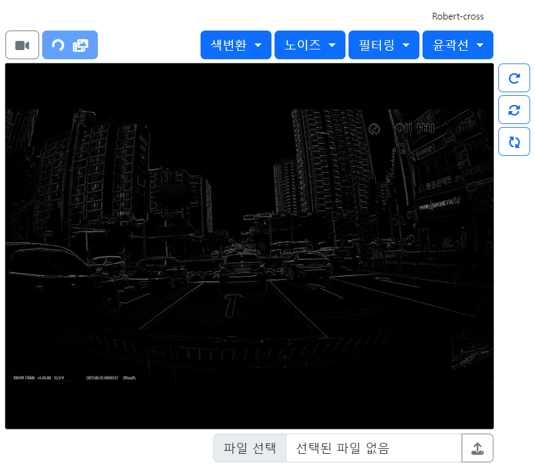
</p>

1. **캐니 에지 검출기**
- 잡음에 의한 잘못된 에지 검출을 방지하기 위해 개발되었다.
- 다른 에지 검출기들 보다 우월하고, 에지를 가장 잘 찾아내면서 원래 영상의 회색물질과 관련된 모든 에지들을 제거할 수 있는 유일한 방법이다.

```python
frame = cv2.cvtColor(frame, cv2.COLOR_BGR2GRAY)

frame = cv2.Canny(frame,100,200)
```

<p align="center">
  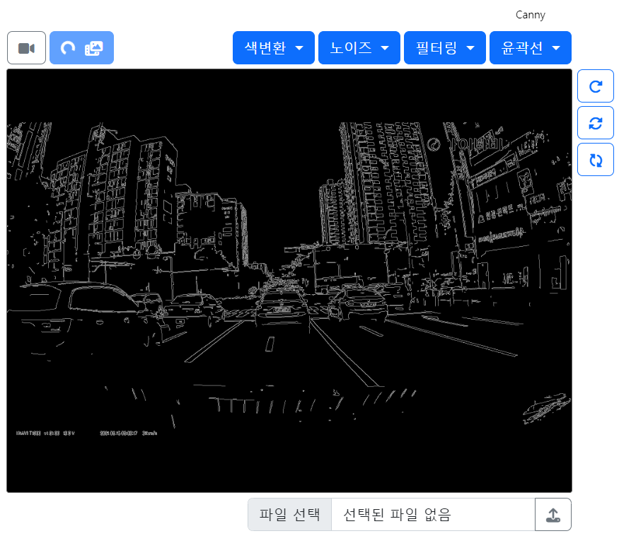
</p>

1. **OTSU-캐니 알고리즘**
- OTSU 알고리즘은 임계값을 임의로 정해 픽셀을 두 부류로 나누고 두 부류의 명암 분포를 구하는 작업을 반복한다.
- 모든 경우의 수 중에서 두 부류의 명암 분포가 가장 균일할 때의 임계값을 선택한다.

```python
frame = cv2.cvtColor(frame, cv2.COLOR_BGR2GRAY)

# 2. Global OTSU-Canny
otsu_th, otsu_binary = cv2.threshold(frame, -1, 255, cv2.THRESH_BINARY_INV | cv2.THRESH_OTSU)

# 임계값 수동 설정의 번거로움 극복, 불필요한 윤곽선
frame = cv2.Canny(frame, otsu_th, otsu_th)
```

<p align="center">
  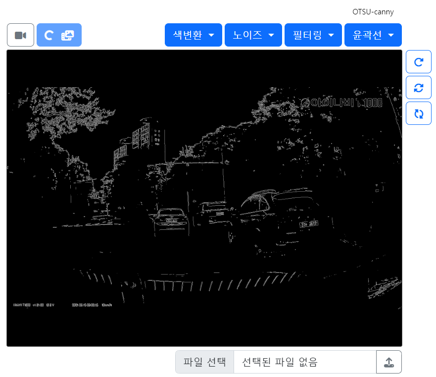
</p>

1. **라플라시안**
- 라플라시안 필터는 두 번의 공간적인 미분을 수행하여 영상의 변화량을 추출하는 방식으로 작동한다.
- 중앙 픽셀을 중심으로 주변 픽셀과의 차이를 계산하고, 그 차이를 중앙 픽셀에 대입하여 새로운 값으로 대체한다.
- 노이즈에 민감하게 반응하므로 노이즈 제거 전처리 과정이 반드시 필요하다.
- 경계선을 강조하는 동시에 블러링하는 효과도 가지고 있어 윤곽선이 흐릿하게 나타날 수 있다.

```python
frame = cv2.cvtColor(frame, cv2.COLOR_BGR2GRAY)

frame = cv2.Laplacian(frame, -1)
```

<p align="center">
  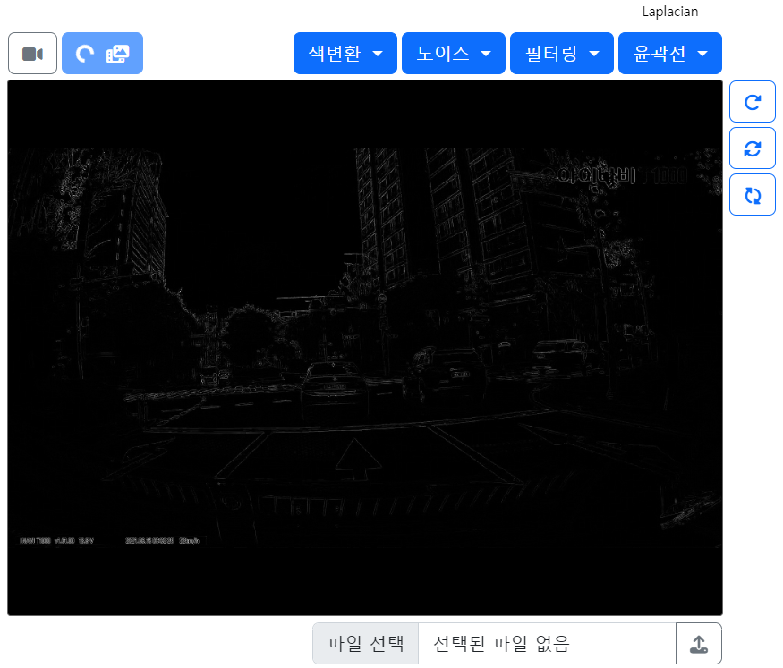
</p>

### 회전과 반전

1. 회전은 한 번 수행마다 0~360도 까지 90도씩 총 4번까지 중첩된다.

```python
height, width = frame.shape[:2]
rotation_matrix = cv2.getRotationMatrix2D((width / 2, height / 2), -angle, 1.0)
output_width = int(height * (width / height))
frame = cv2.warpAffine(frame, rotation_matrix, (output_width, height))
```

<p align="center">
  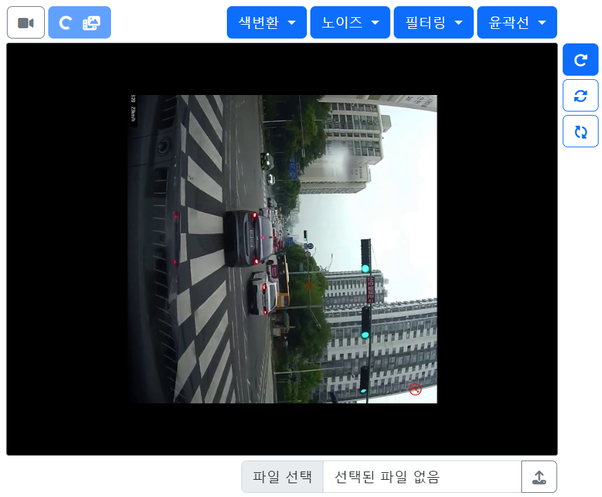
  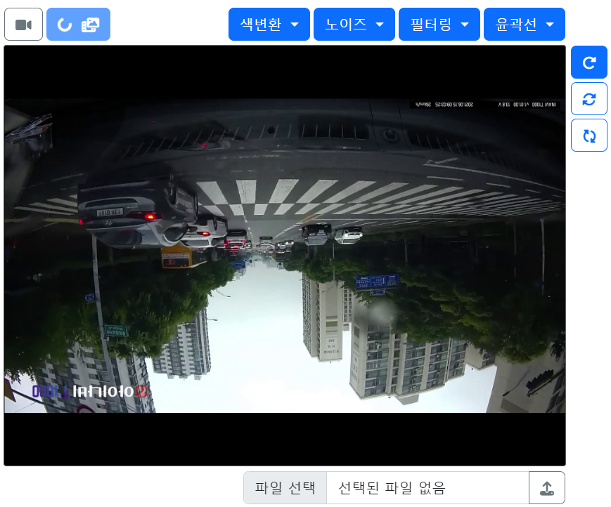
</p>
<p align="center">
  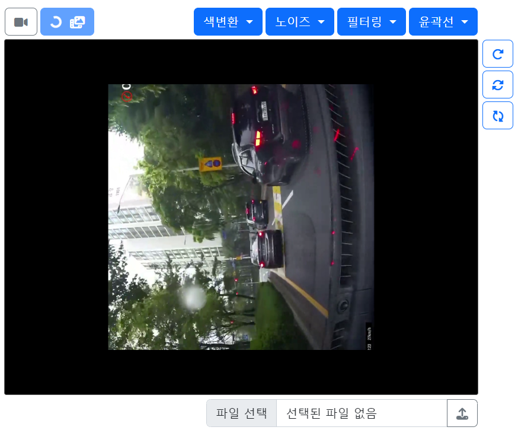
  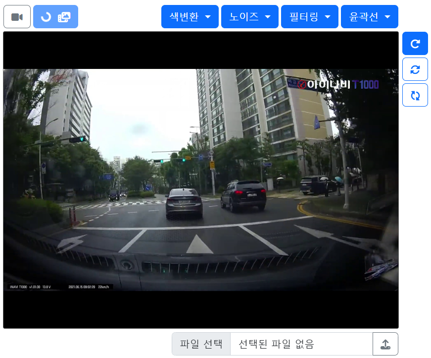
</p>

1. 반전 기능은 좌우 반전과 상하 반전으로 2개 버튼으로 구성되어 있다.

```python
frame = cv2.flip(frame, 1)   # 좌우 반전
frame = cv2.flip(frame, 0)   # 상하 반전
```

<p align="center">
  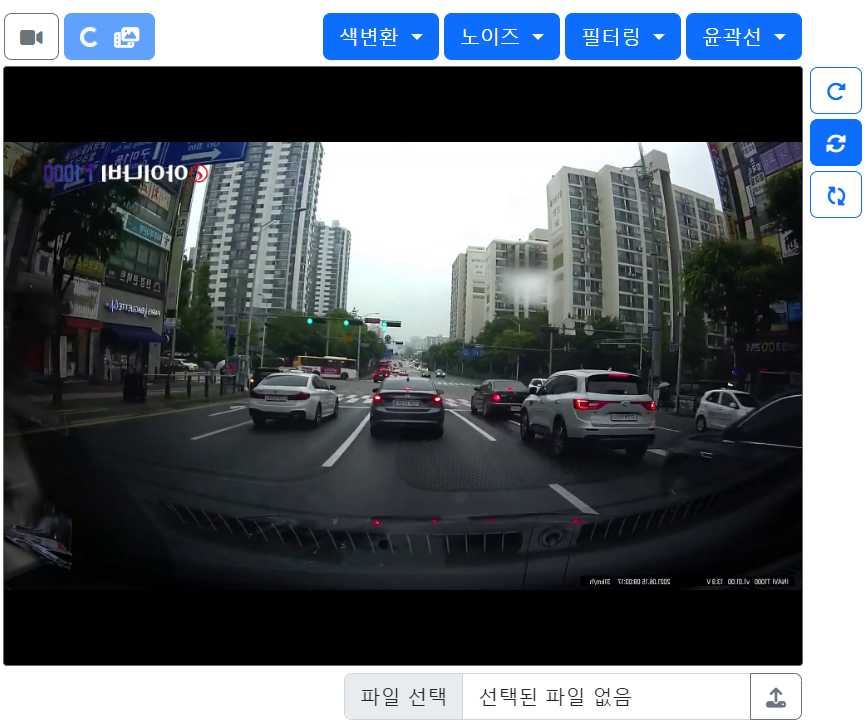
  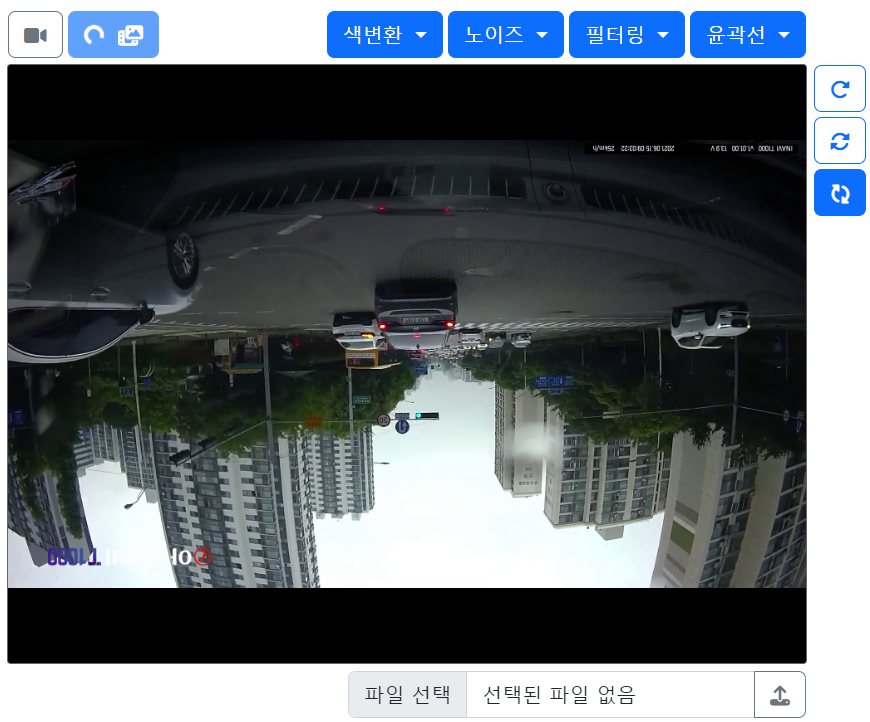
</p>

## **📌 내일 목표**

- 딥러닝 모델 적용하여 스트리밍 하기