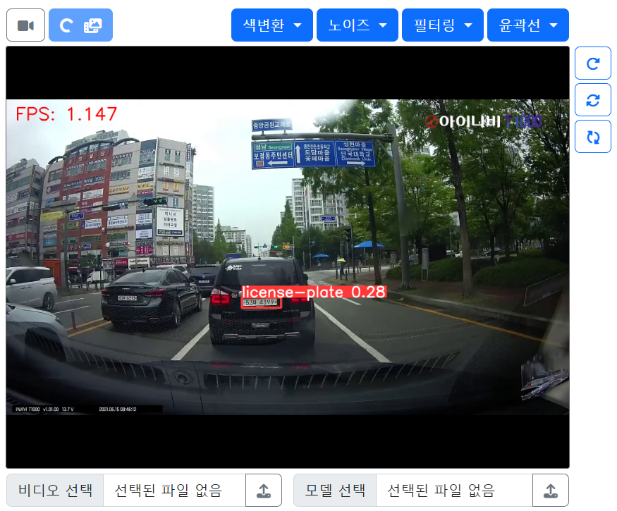

# 9일차

📅 2023년 7월 13일

## **📌 오늘 목표**

1. [8일차](./0712.md) 정리
2. YOLO 모델을 적용한 실시간 객체인식 → 웹캠 | 비디오

## **📌 YOLO 모델 적용하기**

- 사전에 학습된 [**YOLOv5**](https://github.com/ultralytics/yolov5) 가중치 파일을 사용하여 스트리밍하였다.

```python
model = torch.hub.load('./yolov5', 'custom',  '/path/my/weights.pt', source='local')
```

<p align="center">
  
</p>

- [2일차](./0704.md) 때 [**YOLOv7**](https://github.com/WongKinYiu/yolov7)로 차량번호판을 학습시킨 결과로 얻은 가중치 파일을 사용하여 스트리밍하였다.

```python
model = torch.hub.load('./yolov7', 'custom',  '/path/my/weights.pt', source='local')
```

<p align="center">
  
</p>

- [3일차](./0705.md) 때 [**YOLOv8**](https://github.com/ultralytics/ultralytics)로 학습시킨 가중치 파일을 사용하여 스트리밍 하였다.

<p align="center">
  
</p>

## **📌 상세 기능**

```python
# OpenCV 이미지를 PIL 이미지로 변환
pil_image = Image.fromarray(cv2.cvtColor(frame, cv2.COLOR_BGR2RGB))

# 객체 인식
results = model(pil_image)

# bounding box 처리
boxes = results.xyxy[0]  # (x1, y1, x2, y2) 형식의 bounding box 좌표
confidences = results.xyxy[0][:, 4]  # bounding box의 신뢰도

for box, confidence in zip(boxes, confidences):
    x1, y1, x2, y2 = map(int, box[:4])
    label = f'{results.names[int(box[5])]} {confidence:.2f}'  # 객체 클래스와 신뢰도

    # bounding box 그리기
    cv2.rectangle(frame, (x1, y1), (x2, y2), (0, 255, 0), 2)
    cv2.putText(frame, label, (x1, y1 - 10), cv2.FONT_HERSHEY_SIMPLEX, 1.4, (0, 255, 0), 2)
```

## **📌 문제점**

- FPS를 대략적으로 볼 때 추론 속도가 느리다는 것을 알 수 있다.
    - YOLOv5s 가중치 파일을 적용할 때는 비교적 낫지만 YOLOv7x 가중치 파일은 확실히 느렸다.
    - YOLOv5s → 3.5 frame/s
    - YOLOv7x → 0.5 frame/s
    - YOLOv8m → 1.1 frame/s
- YOLO 버전마다 다른 프로그래밍 방법
    - 버전을 특정 짓거나 조건문 혹은 예외처리하기

## **📌 목표 설정**

- 추론 속도를 향상시킬 수 있는 대책 마련
- [사용자 범위 컨트롤](https://getbootstrap.kr/docs/5.2/forms/range/)을 사용하여 동적인 영상처리 파라미터 적용